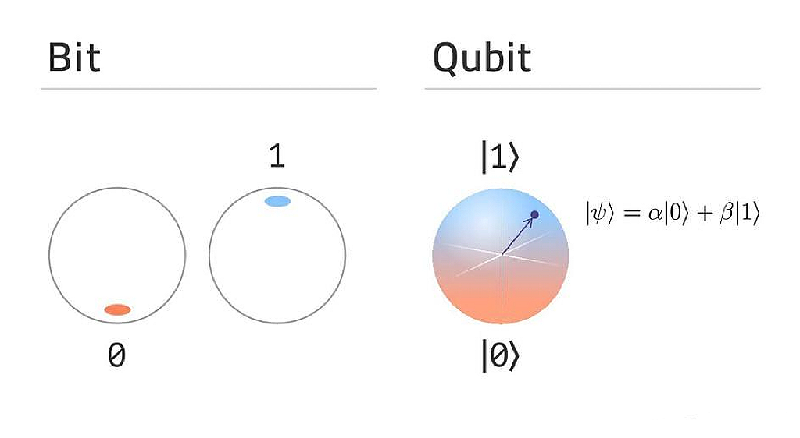
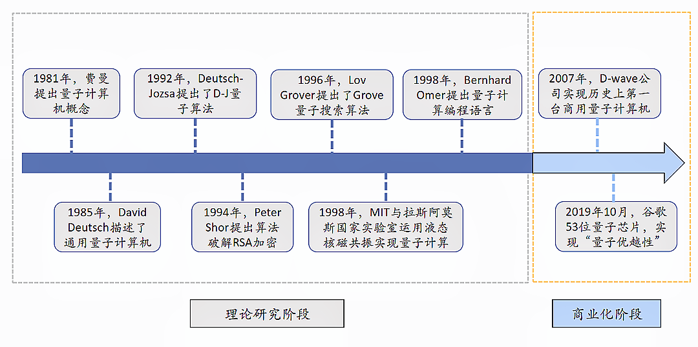
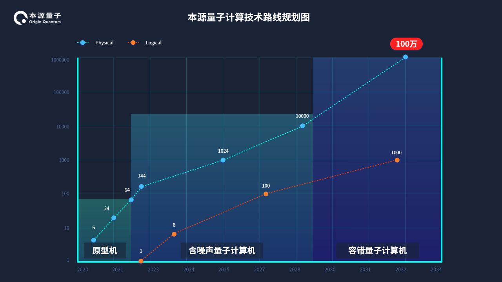

量子计算背景
=========================

什么是量子计算
>>>>>>>>>>>>>>>>>>

量子计算是一种遵循量子力学规律调控量子信息单元进行计算的新型计算模式，在理解量子计算的概念时，通常将它和经典计算相比较。

如图，经典计算使用2进制的数字电子方式进行运算，而二进制总是处于0或1的确定状态。

量子计算和现有的计算模式完全不同，它借助量子力学的叠加特性，能够实现计算状态的叠加，它不仅包含0和1，还包含0和1同时存在的叠加态。

普通计算机中的2位寄存器在某一时间仅能存储4个二进制数（00、01、10、11）中的一个，而量子计算机中的2位量子位寄存器可同时存储这四种状态的叠加状态。

随着量子比特数目的递增，对于n个量子比特而言，量子信息可以处于2种可能状态的叠加，配合量子力学演化的并行性，可以展现比传统计算机更快的处理速度。

加上量子纠缠等特性，理论上，量子计算机相较于当前使用最强算法的经典计算机，在一些具体问题上，有更快的处理速度和更强的处理能力。

量子计算的发展
>>>>>>>>>>>>>>>>>

早在 1981 年，物理学家理查德·费曼（Richard Feynman）就提出了量子计算机的概念，他设想如果拓展一下计算机的工作方式，不使用逻辑门来建造计算机，而是一些其他的东西，比如分子和原子。
如果使用这些量子材料，它们具有非常奇异的性质，尤其是波粒二象性，是否能建造出模拟量子系统的计算机？于是他提出了这个问题并做了一些验证性实验，然后他推测，这个想法也许可以实现。由此，基于量子力学的新型计算机的研究被提上了科学发展的历程。

此后，计算机科学家们一直在努力攻克这一艰巨挑战。伴随时代发展的趋势，在20世纪90年代，量子计算机的算法发展得到了巨大的进步。

1992年Deutsch和Jozsa提出了D-J量子算法，开启了如今量子计算飞速发展的大幕。

1994年Peter Shor提出了Shor算法，这一算法在大数分解方面比目前已知的最有效的经典质因数分解算法快得多，因此对RSA加密极具威胁性，该算法带来巨大影响力的同时也进一步坚定了科学家们发展量子计算机的决心。

1996年Lov Grover提出了Grover量子搜索算法，该算法被公认为继Shor算法后的第二大算法。

2009年MIT三位科学家联合开发了一种求解线性系统的HHL量子算法。众所周知，线性系统是很多科学家和工程领域的核心，由于HHL算法在特定条件下实现了相较于经典算法有指数加速效果，这是未来能够在机器学习，人工智能科技得以突破的关键性技术。

随着上述量子计算理论的探索，硬件也在飞速发展，2013年加拿大D-Wave系统公司发布了512比特的量子计算设备。

2016年，IBM发布了6量子比特的可编程量子计算机。

2017年本源量子发布了32位量子计算虚拟系统，同时还建立了以32位量子计算虚拟系统为基础的本源量子计算云平台。

2018年初Intel和Google分别测试了49位和72位量子芯片。

2018年12月6日，本源量子发布了第一款测控一体机Origin Quantum AIO，不仅提高了综合量子测控能力，更节约了量子测控环节各种大型设备的空间，为量子计算行业的高精尖仪器带来了更多的可能。

2019年1月，IBM发布了世界上第一台独立的量子计算机IBM Q System One。

2020年9月12日，本源量子完全自主开发的超导量子计算云平台正式向全球用户开放，该平台基于本源量子自主研发的超导量子计算机——本源悟源（搭载6比特超导量子处理器夸父 KF C6-130）。

量子计算机的发展目标
>>>>>>>>>>>>>>>>>>>>>

根据量子计算机的发展趋势，目前量子计算机的发展可以大致分为 3 个阶段：

第一阶段：能够对大约 50 个量子比特进行有效操纵，并且在实验上可以在特定问题的求解上展现出“量子优越性”，这一阶段目前已经实现；

第二阶段：由于量子计算机在运算过程中极易受到外界的干扰，因此需要大量冗余的量子比特来实现运算中的量子纠错，人们预计需要对几百个量子比特进行有效操纵，从而实现量子纠错的关键技术，并且进一步探索量子计算的实际应用场景；

第三阶段：需要对大约 10~100 万量级的量子比特进行有效操纵，从而构建可编程的通用量子计算机，并且最终实现加密密钥破解以及最佳优化搜索等。

9月10日，在国内量子计算领域占据重要一席的本源量子发布未来五年量子计算技术规划路线图。

>>>>>>>>>>>>>>>>>>>>>>>>>>>>>>>>>>>>>>>>>>

路线图显示，到2025年，本源量子将突破1000位量子比特，达到1024位量子比特，这将意味着专用量子计算机的形成，并将实际运用到一些行业领域中。
