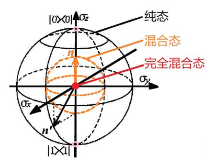

量子计算理论基础
=========================

对于一个非物理专业的人而言，量子力学概念晦涩难懂。鉴于此，本章节仅介绍量子力学的一些基础概念加之部分数学的相关知识，甚至不涉及薛定谔方程，就足够开始量子计算机的应用。
这如同不需去了解CPU的工作原理以及经典计算机的组成原理，但仍能在日常生活中使用经典计算机或者编写经典程序一样。

量子态
>>>>>>>>>>>>

量子（quantum）是现代物理学的重要概念. 即一个物理量如果存在最小的不可分割的基本单位，此最小单位称为量子. 量子具有四个基本特性，了解其特性也有助于我们更好地理解量子的本质.

量子具有如下特性:
 * 量子化: 描述物体长度时，一定会遇到最小的不可分割的基本单位，这一现象也称为量子化
 * 跃迁:当一个原子中的电子获得来自原子外的能量时，它就有可能克服能级之间的能量差距，跳到另外一个态上面
 * 量子叠加态：对于量子本身，它能同时存在于很多状态的叠加上
 * 测量和坍塌： 测量会影响这个粒子本身的状态

量子态是一个微观粒子的状态. 可用线性代数中的向量来描述量子态.在量子理论
中，描述量子态的向量称为态矢，态矢分为左矢和右矢

.. math::

    \begin{align*}
    \text{右矢(ket)} : & |\psi\rangle =[c_{1},c_{2},\cdots, c_{n}]^{T}\\
    \text{左矢(bra)} : & \langle\psi| =[c_{1}^{*},c_{2}^{*},\cdots, c_{n}^{*}]
    \end{align*}

相应地，内积与外积定义为：设 :math:`|\alpha\rangle=[a_{1},a_{2},\cdots, a_{n}]^{T}` ， :math:`|\beta\rangle=[b_{1},b_{2},\cdots, b_{n}]^{T}` ，

.. math::

    \begin{align*}
    \text{内积} : & \langle\alpha \vert\beta\rangle =\sum_{i=1}^{n}a_{i}b_{i}\\
    \text{外积} : & |\alpha\rangle \langle\beta| =\left[a_{i}b_{j}^{*}\right]_{n\times n}
    \end{align*}

量子比特
>>>>>>>>>>>>

量子比特是量子计算中的基本单元. 一个量子比特（qubit）就是二维复向量空间 :math:`\mathbb{C}^{2}` 中一个单位向量.设 :math:`|0\rangle=[1,0]^{T}` , :math:`|1\rangle=[0,1]^{T}` 为 :math:`\mathbb{C}^{2}` 的一组基，则一个量子比特可以表示为

.. math::

    \begin{equation}\label{equ:Psi}
        |\psi\rangle=\alpha|0\rangle+\beta|1\rangle,
    \end{equation}

其中，:math:`\alpha,\beta\in\mathbb{C}` 且 :math:`(\alpha,\beta)\ne (0,0)` ， :math:`\vert\alpha\vert^2+\vert\beta\vert^2=1` ， :math:`\alpha,\beta` 称为振幅。
并且 :math:`\vert\alpha\vert^2+\vert\beta\vert^2=1` 。

纯态和混合态
>>>>>>>>>>>>

我们看到的具有精确已知状态的量子系统均是纯态（pure state）。
所以纯态 :math:`|\psi\rangle` 可以用向量表示，且其密度矩阵表示为 :math:`\rho=|\psi\rangle\langle\psi|` ，以100%的概率处在状态 :math:`|\psi\rangle` 。

如果系统并非处于一个态中，而是以 :math:`p_{i}` 的概率处于 :math:`|\psi_{i}\rangle(i=1,\cdots,n)` ，这种状态无法用一个态矢量来描述，称之为混合态. 其密度矩阵表示为：

.. math::

    \begin{equation*}
        \rho_{mix}=\sum_{i} p_{i}|\psi_{i}\rangle\langle\psi_{i}|.
    \end{equation*}

综上所述，对于纯态它可以借助向量和密度矩阵两种形式进行描述；但是对于混合态，只能借助密度矩阵的形式进行描述。易知混合态不是叠加态，叠加态不是混合态；纯态可以是本征态，也可以是叠加态.

纯态具有如下性质：

 - 1.密度矩阵 :math:`\rho` 是幂等的，即 :math:`\rho^{2}=|\psi\rangle\langle\psi|\psi\rangle\langle\psi|=\rho` 
 - 2.在任意正交基下的 :math:`\rho` 的迹 :math:`tr(\rho)=\sum_{i}\langle i|\rho|i\rangle=\sum_{i}\langle i|\psi\rangle\langle\psi|i\rangle=\langle\psi|\psi\rangle=1` ，进而 :math:`tr(\rho^{2})=1` 
 - 3.厄米特性：:math:`\rho^{\dagger}=\rho` 
 - 4.半正定性：:math:`\langle\phi|\rho|\phi\rangle=\langle\phi|\psi\rangle\langle\phi|\psi\rangle=|\langle\phi|\psi\rangle|^2\ge 0`

混合态具有如下性质：

 - 1.密度矩阵 :math:`\rho_{mix}` 是非幂等的，即 :math:`\rho_{mix}^{2}\ne\rho_{mix}`
 - 2.在任意正交基下的 :math:`\rho_{mix}` 的迹 :math:`tr(\rho_{mix})=1` （所有可能的测量结果的相加）
 - 3.满足 :math:`tr(\rho_{mix}^{2})< 1` (证明过程中用Schwartz不等式即可证得)
 - 4.厄米特性与半正定性.

通过布洛赫球，可以更直观地理解纯态与混合态。球面上每一个点都能映射到一个纯态, 球内每一个点都能映射到混合态，完全混合
态（也称为最大混合态）是球心，它意味着这里不存在任何量子叠加性，具体可见下图

酉变换
>>>>>>>>>

酉变换是一种矩阵，也是一种操作，它作用在量子态上得到的是一个新的量子态。使用 :math:`U` 来表达酉矩阵, :math:`U^{\dagger}` 表示酉矩阵的转置复共轭矩阵，二者满足运算关系 :math:`UU^{\dagger}=I` ，所以酉矩阵的转置复共轭矩阵也是一个酉矩阵，说明酉变换是一种可逆变换。

一般酉变换在量子态上的作用是变换矩阵左乘以右矢进行计算的。例如一开始有一个量子态 :math:`|\psi_{0}\rangle` , 经过酉变换 :math:`U` 之后得到 :math:`|\psi\rangle=U\left|\psi_{0}\right\rangle`

或者也可以写为

.. math::

    \langle\psi|=\left\langle\psi_{0}\right| U^{\dagger}

由此可见，两个矢量的内积经过同一个酉变换之后保持不变。

.. math::

    \langle\varphi \mid \psi\rangle=\langle\varphi|U^{\dagger}U| \psi\rangle

类似地，也可以通过酉变换表示密度矩阵的演化；

.. math::

    \rho=U{\rho_{0}} U^{\dagger}

这样就连混合态的演化也包含在内了。

量子态的测量
>>>>>>>>>>>>

对量子态进行测量会导致坍塌，即测量会影响到原来的量子态，因此量子态的全部信息不可能通过一次测量得到.  

下面，我们给出测量的通用计算表达式。

假设：量子测量是由测量算子（measurement operators）的集合 :math:`\{M_{i}\}` 
来描述，这些算子可以作用在待测量系统的状态空间（state space）上。
指标i表示在实验上可能发生的结果. 如果测量前的量子系统处在最新状态 :math:`|\psi\rangle` ，那么测量结果i发生的概率为

.. math::

    \begin{equation}
        p(i)=\langle \psi|M_{i}^{\dagger}M_{i}|\psi\rangle
    \end{equation}

并且测量后的系统状态转变为

.. math::

    \begin{equation}
        \dfrac{M_{i}|\psi\rangle}{\sqrt{\langle\psi|M_{i}^{\dagger}M_{i}|\psi}\rangle}
    \end{equation}

由于所有可能情况的概率和为1，即

.. math::

    \begin{equation}
      \sum_{i}p(i)=\sum_{i}\langle \psi|M_{i}^{\dagger}M_{i}|\psi\rangle=1
    \end{equation}

则测量算子需满足

:math:`\sum_{i}M_{i}^{\dagger}M_{i}=I` 。该方程被称为完备性方程(completeness equation).

量子测量有多种方式，如投影测量（projective measurements）、正算子值测量
（Positive Operator-Valued Measure）.
投影测量要求测量算子为投影算子 :math:`\{P_{i}\}` ，且满足 :math:`P_{i}^{\dagger}P_{i}=P_{i}^{2}=P_{i}` 。
正算子值测量并非全新的概念，对于任意的测量算子 :math:`\{M_{i}\}` ，我们记 :math:`E_{i}=M_{i}^{\dagger}M_{i}` ，可以看出E是正定的，且是完备的( :math:`\sum_{i}E_{i}=I` )，然后我们把 :math:`\{E_{i}\}` 叫做正算子值测量.
可以说，投影测量与正算子值测量是一般测量的特例. 当测量算子具有酉矩阵时，投影测量和一般测量等价. 当测量算子是酉矩阵时，投影测量和一般测量等价. 

这里介绍一下投影测量. 投影测量由一个可观测量（observable） :math:`\Lambda` 来描述，可观测量是一个待观测系统
的状态空间上的自伴算子. 对可观测量 :math:`\Lambda` 作谱分解

.. math::

    \begin{equation}
      \Lambda=\sum_{i}\lambda_{i}P_{i}
    \end{equation}

这里 :math:`\Lambda_{i}` 是 :math:`\Lambda` 在特征值 :math:`\lambda_{i}` 对应的特征空间上的投影. 在对状态 :math:`|\psi\rangle` 
测量之后，得到结果i的概率为

.. math::

    \begin{equation}
        p(i)=p(\lambda=\lambda_{i})=\langle\psi|P_{i}|\psi\rangle
    \end{equation}

若测量后，结果i发生，则量子系统最新的状态为

.. math::

    \begin{equation}
        \dfrac{\Lambda_{i}|\psi\rangle}{\sqrt{p_{i}}}
    \end{equation}

投影测量有一个重要的特征就是很容易计算投影测量的平均值以及标准差：

.. math::

  E(\Lambda)=\sum_{i}\lambda_{i}p_{i}= \sum_{i}\lambda_{i}\langle\psi|P_{i}|\psi\rangle=\langle\psi|\Lambda|\psi\rangle
  
.. math::

  \Delta(\Lambda)^{2}= E(\Lambda^{2})- E(\Lambda)^{2}=\langle\psi|\Lambda^{2}|\psi\rangle-\langle\psi|\Lambda|\psi\rangle^{2}

若对量子态 :math:`|\psi\rangle` 进行测量，测量结果为0的概率为

.. math::

    p(0)=\langle\psi|M_{0}^{\dagger}M_{0}|\psi\rangle=\langle\psi|M_{0}|\psi\rangle=\vert \alpha \vert^{2}.

对应测量后的状态为

.. math::

    \dfrac{M_{0}|\psi\rangle}{\sqrt{\langle\psi|M_{0}^{\dagger}M_{0}|\psi}\rangle}=\dfrac{M_{0}|\psi\rangle}{|\alpha|}=\dfrac{\alpha}{|\alpha|}|0\rangle.

同理可得到以概率 :math:`\vert \beta \vert^2` 处于 :math:`|1\rangle` ，对应测量后的状态为 :math:`\frac{\beta}{|\beta|}|1\rangle` 。

对于投影测量，若可观测量是 :math:`X=\begin{bmatrix}0 & 1\\ 1 &  0 \end{bmatrix}` ，现对待观测量 :math:`|\psi\rangle=\alpha|0\rangle+\beta|1\rangle` 进行投影测量。

对X作谱分解得到 :math:`\Lambda=\lambda_{1}P_{1}+\lambda_{2}P_{2}` ，其中 :math:`\lambda_{1}=1,\lambda_{2}=-1` 以及投影算子 :math:`P_{1}=\begin{bmatrix} \frac{1}{2} & \frac{1}{2}\\ \frac{1}{2} & \frac{1}{2} \end{bmatrix},P_{2}=\begin{bmatrix} \frac{1}{2} & -\frac{1}{2}\\  -\frac{1}{2} &  \frac{1}{2} \end{bmatrix}` 。

在对状态 :math:`|\psi\rangle` 测量，可得到概率为 :math:`p(1)=p(\lambda=\lambda_{1})=\langle\psi|P_{1}|\psi\rangle=\frac{1}{2}(\alpha+\beta)^{2}` 以及 :math:`p(2)=p(\lambda=\lambda_{2})=\langle\psi|P_{2}|\psi\rangle=\frac{1}{2}(\alpha-\beta)^{2}` 。

若测量后，结果1发生，则量子系统最新的状态为

.. math::

    \begin{equation*}
        \dfrac{P_{1}|\psi\rangle}{\sqrt{p_{1}}}=\frac{\sqrt{2}}{2}(|0\rangle+|1\rangle)=|+\rangle.
    \end{equation*}

结果2发生，则量子系统最新的状态为

.. math::

    \begin{equation*}
        \dfrac{P_{2}|\psi\rangle}{\sqrt{p_{2}}}=\frac{\sqrt{2}}{2}(|0\rangle-|1\rangle)=|-\rangle.
    \end{equation*}