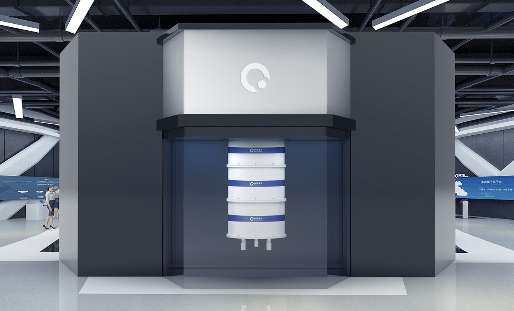

量子计算机
=========================

目前主流的量子计算芯片技术研发路线有超导量子计算机和半导体量子计算机两种。

超导量子芯片
>>>>>>>>>>>>>>>>>>>>>

超导量子计算是基于超导电路的量子计算方案，其核心器件是超导约瑟夫森结。超导量子电路在设计、制备和测量等方面，与现有的集成电路技术具有较高的兼容性，对量子比特的能级与耦合可以实现非常灵活的设计与控制，极具规模化的潜力。

由于近年来的迅速发展，超导量子计算已成为目前最有希望实现通用量子计算的候选方案之一。超导量子计算实验点致力于构建一个多比特超导量子计算架构平台，解决超导量子计算规模化量产中遇到的难题。

超导电路类似于传统的电子谐振电路，这种谐振电路产生了谐振子的能级。超导约瑟夫森效应使得超导电路在不发生损耗和退相干的情况下产生非线性，非线性导致谐振子的能级间隔不再等同，其中最低的两个能级可以用来实现量子比特的操控。

超导量子计算的研究始于2000年前后，后来在美国耶鲁大学Schoelkopf和Devoret研究组的推动下，将超导比特和微波腔进行耦合，实现了量子比特高保真度的读出和纠缠，加速了超导量子比特的研究。微波腔是一种容纳微波光子的谐振腔，比特的两个能级会对微波腔的光子产生扰动，这一信号的扰动就可以用来实现比特信号的读出。比特和比特之间还可以通过微波腔相连，当两个比特和腔是强耦合状态的时候，两个比特就会通过腔发生相互作用，物理学家通过这一相互作用实现了两比特操作。在2009年，基于超导比特和腔的耦合，实现了两比特的高保真度量子算法，使得超导量子计算得到了世界的广泛关注。

从2014年开始，美国企业界开始关注超导量子比特的研究，并加入了研究的大潮中。2014年9月，美国Google公司与美国加州大学圣芭芭拉分校合作研究超导量子比特，使用X-mon形式的超导量子比特

2017年，Google发布了实现量子计算机对经典计算机的超越——“量子霸权”的发展蓝图。2018年年初，其设计了72比特的量子芯片，并着手进行制备和测量，这是向实现量子霸权迈出的第一步。在Google公司加入量子计算大战的同时，美国国际商用机器有限公司（IBM）于2016年5月在云平台上发布了他们的五比特量子芯片。  

2017年，IBM制备了20比特的芯片，并展示了用于50比特芯片的测量设备，同时也公布了对BeH2分子能量的模拟，表明了在量子计算的研究上紧随Google的步伐，不仅如此，IBM还发布了QISKit的量子软件包，促进了人们通过经典编程语言实现对量子计算机的操控。

2020年，本源量子发布自主研发、自主可控的的新一代超导量子计算机——本源悟源（搭载6比特超导量子处理器夸父 KF C6-130）。

>>>>>>>>>>>>>>>>>>>>>>>>>>>>>>>>>>>>>>>>>>>>>>>>>>>>>>>>>>>>

除了美国Google公司和IBM公司外，美国Intel公司和荷兰代尔夫特理工大学也合作设计了17比特和49比特超导量子芯片，并在2018年的CES大会上发布，不过具体的性能参数还有待测试；美国初创公司Rigetti发布了19比特超导量子芯片，并演示了无人监督的机器学习算法，使人们见到了利用量子计算机加速机器学习的曙光。

半导体量子芯片
>>>>>>>>>>>>>>>>>>>>>

由于经典计算机主要基于半导体技术，基于半导体开发量子计算也是物理学家研究的重点领域。相比超导量子计算微米级别的比特大小，量子点量子比特所占的空间是纳米级别，类似于大规模集成电路一样，更有希望实现大规模的量子芯片。现在的主要方法是在硅或者砷化镓等半导体材料上制备门控量子点来编码量子比特。编码量子比特的方案多种多样，在半导体系统中主要是通过对电子的电荷或者自旋量子态的控制实现。

与超导量子计算类似，半导体量子计算也正在从科研界转向工业界，2016年，美国芯片巨头Intel公司开始投资代尔夫特理工大学的硅基量子计算研究，目标是在五年内制备出第一个二维表面码结构下的逻辑量子比特；2017年，澳大利亚也组建了硅量子计算公司，目标是五年内制备出第一台10比特硅基量子计算机。

在国内，中国科学技术大学的郭国平研究组在传统的GaAs基量子比特方面积累了成熟的技术，实现了多达3个电荷量子比特的操控和读出，并基于电荷量子比特制备了品质因子更高的杂化量子比特，实现对国际水平的追赶，并为进一步的超越做准备。
