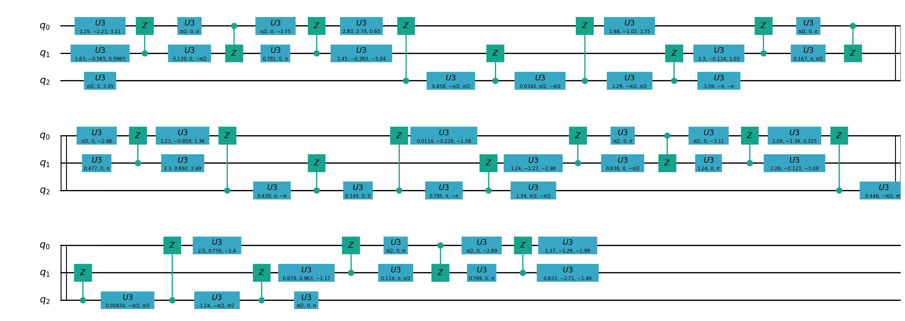

基础逻辑门转换
=================

简介
--------------
在NISQ时代，量子计算机无法做到任意逻辑门的运行。因此需要将其转化为量子芯片所支持的基础逻辑门集合以实现通用计算。在本源量子芯片中所支持的单双门组合则为  :math:`U_3` 和 :math:`CZ` 。
因此，在编译量子程序时，QPanda会对非基础逻辑门进行转换。

原理
--------------

首先，定义 :math:`\phi` 为 :math:`XY` 平面内某一旋转轴与 :math:`X` 正向的夹角，则对任意 :math:`XY` 旋转门，有：

.. math::

    \begin{aligned}
    R_\phi(\theta) = cos\frac{\theta}{2}I - i sin\frac{\theta}{2}(cos\phi\sigma_x + sin\phi\sigma_y) =
    \begin{pmatrix} cos\frac{\theta}{2} & -i sin\frac{\theta}{2}e^{-i\phi}  \\  -isin\frac{\theta}{2}e^{i\phi} & cos\frac{\theta}{2}  \end{pmatrix} 
    \end{aligned}

Z旋转门的形式如下：

.. math::

    \begin{aligned}
    R_Z(\theta) = cos\frac{\theta}{2}I - i sin\frac{\theta}{2}\sigma_Z =
    \begin{pmatrix} 1 & 0  \\
    0 & e^{i\theta}  \end{pmatrix} 
    \end{aligned}

易证：

.. math::

    \begin{aligned}
    R_X(\theta_X)R_Z(\theta_Z) = R_Z(\theta_Z)R_{-\theta_Z}(\theta_X)
    \end{aligned}

.. math::

    \begin{aligned}
    R_Z(\theta_{Z2})R_Z(\theta_{Z1}) = R_Z(\theta_{Z1} + \theta_{Z2})
    \end{aligned}

.. math::

    \begin{aligned}
    CZ[R_Z(\theta_{Z1}) \otimes R_Z(\theta_{Z2})] = [ R_Z(\theta_{Z1} \otimes R_Z(\theta_{Z2}) ]·CZ
    \end{aligned}

以上公式是Virtual Z 门的基础。它意味着，我们可以将线路中已有的Z操作转移到XY操作之后，作为替代，原XY操作的旋转轴将随之变换。而被转移到线路后排的Z操作可以合并，并继续转移，以此类推。

这里我们用单比特的SU(2)门来举例证明：

.. math::

    \begin{aligned}
    U(\theta , \phi ,\lambda) = \begin{bmatrix}
    cos\frac{\theta}{2} & -isin\frac{\theta}{2}e^{i\lambda} \\
    -isin\frac{\theta}{2}e^{i\phi} & cos\frac{\theta}{2}e^{i(\lambda + \phi)} 
    \end{bmatrix}
    \end{aligned}

利用

.. math::

    \begin{aligned}
    R_X(\theta) = R_Z(-\frac{\pi}{2})R_X(\frac{\pi}{2})R_Z(\pi - \theta)R_X(\frac{\pi}{2})R_Z(-\frac{\pi}{2})
    \end{aligned}

最终得到

.. math::

    \begin{aligned}
    U(\theta , \phi ,\lambda) = R_Z(\phi - \frac{\pi}{2})R_X(\frac{\pi}{2})R_Z(\pi - \theta)R_X(\frac{\pi}{2})R_Z(\lambda - \frac{\pi}{2}) = R_Z(\phi + \lambda - \theta)R_{\frac{\pi}{2} + \lambda - \theta}(\frac{\pi}{2})R_{\lambda - \frac{\pi}{2}}(\frac{\pi}{2})
    \end{aligned}

可见，任意的SU(2)门都可以轻易转化成两个任意旋转轴的 :math:`\pi/2` 门，以及一个Vritual Z 门。

代码示例
---------

这里我们对前一节QSD分解之后的线路使用Vritual Z 门进行转换,只需要执行下面这行代码即可。

.. code-block:: python

    from pyqpanda import *
    import numpy as np
    from scipy.stats import unitary_group

    if __name__ == "__main__":
        machine = CPUQVM()
        machine.init_qvm()
        q = machine.qAlloc_many(3)
        c = machine.cAlloc_many(3)

        # 生成任意酉矩阵
        unitary_matrix = unitary_group.rvs(2**3,random_state=169384)

        # 输入需要被分解的线路
        prog = QProg()
        prog<<matrix_decompose(q,unitary_matrix,mode=DecompositionMode.QSDecomposition)
        virtual_prog = virtual_z_transform(prog, machine)
        draw_qprog(prog, "pic")

基础逻辑门转换
--------------

在量子计算的量子线路设计中，基础逻辑门的标准表示形式是量子门集合的一种形式。这些基础门包括Hadamard门（H门）、Pauli门（X门、Y门、Z门）、CNOT门等。然而，在实际的量子线路设计和优化过程中，经常需要进行基础逻辑门的转换，以便更好地适应特定的硬件或算法需求。

一个常见的转换任务是将带有角度参数的单比特门（例如相位门）转换为通用的单比特门形式，如U3门。U3门是一个通用的单比特量子门，可以表示任意的单比特旋转操作。这样的转换可以提高线路的灵活性，使得线路更容易优化和映射到不同的量子硬件上。

作为基础逻辑门转换的接口，我们提供了一组功能强大的工具，用于将不同形式的基础门相互转换。用户可以使用这些接口来实现自定义的门转换策略，以满足其特定的设计需求。这些接口支持将门转换为等效的门序列，同时保留线路的功能等效性。这样的门转换工具对于量子编译器和量子线路优化的各个阶段都具有重要的作用。

我们使用 **transform_to_base_qgate** 进行基础门转换，接口定义如下

transform_to_base_qgate
--------------

.. function:: transform_to_base_qgate(qprog: QProg, machine: QuantumMachine, convert_single_gates: List[str], convert_double_gates: List[str]) -> QProg

   Basic quantum gate conversion

   Args:
       qprog (QProg): Quantum program
       machine (QuantumMachine): Quantum machine
       convert_single_gates (List[str]): List of quantum single gates to convert
       convert_double_gates (List[str]): List of quantum double gates to convert

   Returns:
       QProg: A new quantum program after the transformation

    
    This function performs basic quantum gate conversion on the given quantum program using the specified quantum machine. It allows the conversion of specific sets of single and double gates, as defined by the lists `convert_single_gates` and `convert_double_gates`, respectively.

    Usage Example
    -------------

    .. code-block:: python

        from pyqpanda import *
        import numpy as np
        from scipy.stats import unitary_group

        machine = CPUQVM()
        machine.init_qvm()

        q = machine.qAlloc_many(3)
        c = machine.cAlloc_many(3)

        unitary_matrix = unitary_group.rvs(2**3,random_state=169384)

        prog = QProg()
        prog << matrix_decompose(q, unitary_matrix, mode=DecompositionMode.QSDecomposition)

        convert_single_gates = ["H", "T", "RX", "RY", "RZ"]
        convert_double_gates = ["CNOT", "CZ"]

        # Perform quantum gate conversion
        new_qprog = transform_to_base_qgate(prog, machine, convert_single_gates, convert_double_gates)

        # Print the new quantum program
        print(new_qprog)

