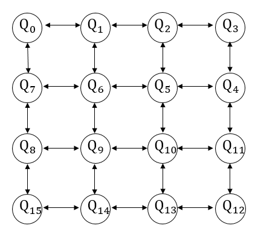
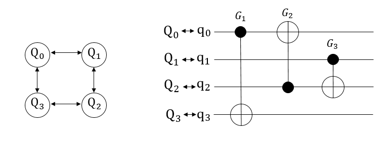
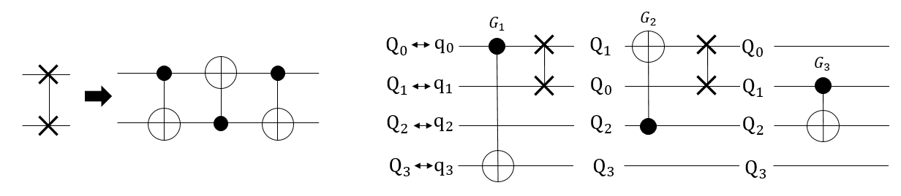
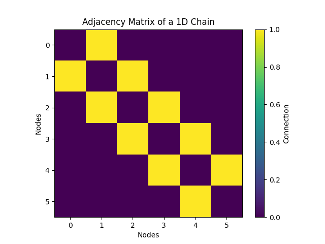
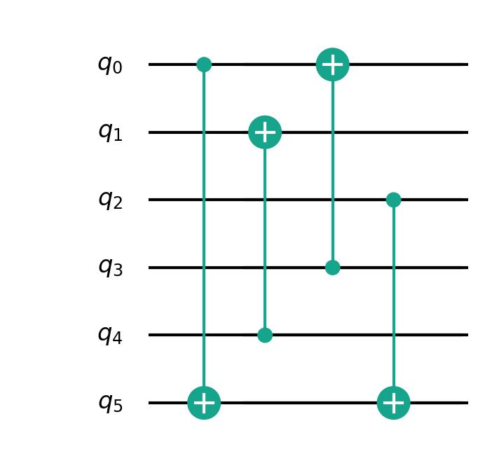
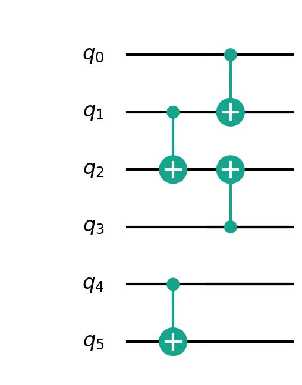
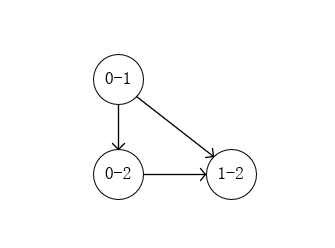
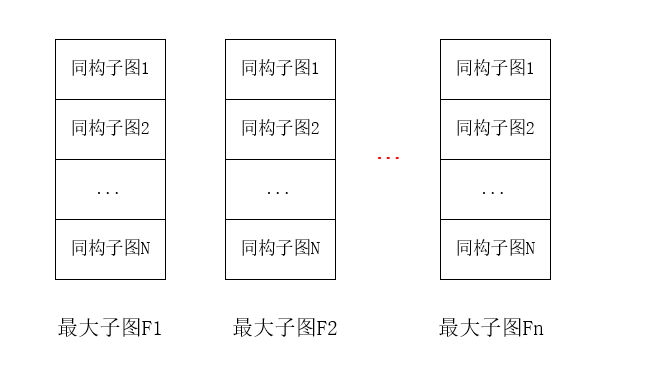

量子比特映射
===============

简介
---------------

量子比特映射是指在量子计算中，将抽象的量子逻辑比特（qubit）映射到物理系统中的实际量子比特上的过程。由于量子计算机的构建涉及物理层面的限制和噪声，因此需要将抽象的量子逻辑转化为在实际量子硬件上可以操作的形式。
在量子计算中，一个量子逻辑比特是抽象的计算单元，通常被建模为一个复数的线性组合。然而，实际的量子硬件（比如量子比特在量子芯片上的物理实现）可能受到噪声、耦合等因素的影响，因此需要将量子逻辑比特映射到物理比特上。这个映射通常是一个复杂的过程，涉及硬件架构、噪声特性、量子门的实现等。
其中最为受限的则是纠缠映射，如果计算中需要纠缠操作，那么需要将逻辑上的纠缠映射到物理上的纠缠，同时考虑硬件的限制。

算法原理
---------------

Sabre算法
++++++++++++++

Sabre算法是一种适用于任意比特之间连接的量子拓扑结构，引入衰减效应来优化搜索步骤减少生成线路的深度，最后将逻辑比特映射到物理比特上。接下来介绍该算法在量子线路上的实际应用。
下图展示本源量子计算机中一种量子拓扑结构，我们用双向箭头来表示两个直接相邻的量子比特。

由于在物理层面上存在量子比特排布的限制，只能允许两个相邻的量子比特之间进行计算。例如在这个图中，:math:`Q_0` 和 :math:`Q_1` ， :math:`Q_7` 通过耦合器直接相连，我们可以在 :math:`\{ Q_0,Q_5\}` , :math:`\{ Q_0,Q_7\}` 这两组量子比特之间插入CNOT门。
但是如果我们想要在 :math:`\{ Q_0,Q_6\}` 之间插入CNOT门的话，是无法直接实现的，因为 :math:`Q_0` 和 :math:`Q_6` 不直接相连。也就是说，我们无法直接在两个不相连的量子比特之间插入一个CNOT门。

接下来，我们使用下图中一个简单4比特的量子线路来说明量子比特映射中的问题。在这个结构中，被允许直接进行计算的量子对有：:math:`\{ Q_0,Q_1\}`, :math:`\{ Q_1,Q_2\}`, :math:`\{ Q_2,Q_3\}`, 
:math:`\{ Q_3,Q_0\}` ，不能直接进行计算的有：:math:`\{ Q_0,Q_2\}` , :math:`\{ Q_1,Q_3\}` 。对于给出的含有三个CNOT门的量子线路中，我们假定初始逻辑比特和物理比特的映射关系是 :math:`\{ q_0 \mapsto Q_0, q_1 \mapsto Q_1, q_2 \mapsto Q_2, q_3 \mapsto Q_3,\}` 。

在图中，我们发现门 :math:`G_2` 连接的两个量子比特是 :math:`Q_0` 和 :math:`Q_2` ，但是这样的CNOT门在实际的计算机中无法实现，因此我们通过使用SWAP门，
来移动 :math:`Q_0` 或者 :math:`Q_2` 的位置，使它们相邻并可以计算。通过在下图中，插入两个SWAP门，就可以使线路中所有的SWAP门可以进行计算。

Sabre算法就是通过寻找可以插入SWAP门的位置，来对线路进行优化，使得原本不可以在量子计算机上运行的量子门，通过动态的改变量子比特的邻接位来使得所有的量子门都能够进行计算。
以前的工作通常采用基于映射的穷举式搜索来寻找有效的映射转换。Sabre通过设计一个启发式成本函数，通过限制生成线路的深度，来帮助找到插入SWAP门的位置。

pyqpanda中基于sabre映射算法的接口是 ``sabre_mapping`` 。

.. function:: sabre_mapping(prog: QProg, quantum_machine: QuantumMachine, init_map: List[int], max_look_ahead: int = 20, max_iterations: int = 10, config_data: str = 'QPandaConfig.json') -> QProg

    该函数执行 Sabre 映射算法，用于对给定量子程序进行映射以优化其执行,支持多种重载形式。

    :param prog: 目标量子程序。
    :type prog: QProg
    :param quantum_machine: 量子计算机。
    :type quantum_machine: QuantumMachine
    :param init_map: 初始映射列表。
    :type init_map: List[int]
    :param max_look_ahead: Sabre 映射的最大前瞻步数。默认为 20。
    :type max_look_ahead: int, optional
    :param max_iterations: Sabre 映射的最大迭代次数。默认为 10。
    :type max_iterations: int, optional
    :param config_data: 配置数据，用于加载配置。默认为 'QPandaConfig.json'。
    :type config_data: str, optional
    :param arch_matrix: 拓扑结构矩阵，用于特定重载。
    :type arch_matrix: numpy.ndarray[numpy.float64[m,n]], optional
    :return: 映射优化后的量子程序。
    :rtype: QProg

    示例用法::

        # 使用初始映射和默认参数进行 Sabre 映射
        mapped_prog = sabre_mapping(my_prog, my_quantum_machine, init_map=[0, 1, 2])

        # 使用自定义拓扑结构矩阵进行 Sabre 映射
        custom_arch_matrix = numpy.array(...)  # 自定义拓扑结构矩阵
        mapped_prog = sabre_mapping(my_prog, my_quantum_machine, init_map=[0, 1, 2], arch_matrix=custom_arch_matrix)

我们以一维链的邻接矩阵为例，首先构建一维链的邻接矩阵并输出

.. code-block:: python

    import numpy as np
    import matplotlib.pyplot as plt

    # 创建一个6个节点的邻接矩阵
    num_nodes = 6
    chain_graph = np.zeros((num_nodes, num_nodes), dtype=np.double)

    for i in range(num_nodes - 1):
        chain_graph[i, i + 1] = 1
        chain_graph[i + 1, i] = 1

    # 绘制邻接矩阵
    plt.imshow(chain_graph, cmap='viridis', interpolation='nearest')
    plt.title("Adjacency Matrix of a 1D Chain")
    plt.xlabel("Nodes")
    plt.ylabel("Nodes")
    plt.colorbar(label="Connection")
    plt.show()

可以看到一维链的结构如下图

我们需要对如下量子程序进行映射

示例代码为

.. code-block:: python

    from pyqpanda import *
    import numpy as np

    if __name__ == "__main__":
            
        machine = CPUQVM()
        machine.init_qvm()

        q = machine.qAlloc_many(6)

        prog = QProg()
        prog << CNOT(q[0],q[5])<< CNOT(q[4],q[1])<< CNOT(q[3],q[0])<< CNOT(q[2],q[5])

        num_nodes = 6
        chain_graph = np.zeros((num_nodes, num_nodes), dtype=np.double)

        for i in range(num_nodes - 1):
            chain_graph[i, i + 1] = 1
            chain_graph[i + 1, i] = 1

        sabre_result = sabre_mapping(prog, machine, 20, 10, chain_graph)
        draw_qprog(sabre_result,'pic')

由于sabre算法具备随机性，因此映射结果并不固定，此次结果为：

BMT算法
++++++++++++++

除了Sabre算法，BMT拓扑映射算法通过将量子程序转换称DAG(有向无环图)数据结构，通过对线路重构来生成新的量子程序。因为每次插入一个SWAP门，都相当于插入了3个CNOT门，SWAP门过多会影响线路的保真度，因此这种做法能够减少SWAP门的使用。

用一个简单的线路举例，对于一个含有3个CNOT门的线路中， :math:`CNOT_{0,1}` , :math:`CNOT_{1,2}` , :math:`CNOT_{0,2}` ，我们可以构建如下图所示的DAG：

然后遍历DAG获取最大子图序列，循环处理执行入度为0的节点（入度为0即为该节点中逻辑门所需的比特处于空闲情况，可以执行当前节点中逻辑门），执行的节点用于构建最大子图，执行完则需要将该节点从DAG去除。处理下一个入度为0的节点。直至DAG中无节点为止。

遍历由量子程序构建的DAG，最终获得以下格式数据，多个最大子图数据和每个对应的同构子图数据和映射关系：

结合Token-Swapping技术，寻找最短消耗的映射方法。固定路径：这里主要考虑拓扑结构的最短距离，这里通过BFS算法确定拓扑结构两点间的固定成本。
最大子图都有着自己的映射方法，相邻的最大子图就需要各自映射方法并结合SWAP达到效果。我们就是要将每个最大子图间的SWAP最小化，同时由于每个最大子图有着多种同构情况，所以这里便是一个排列组合问题。我们要做的就是将消耗成本最低的组合情况选择出来。最后生成新的量子程序。

pyqpanda中基于bmt映射算法的接口是 ``OBMT_mapping`` 。

.. function:: OBMT_mapping(prog: QProg, quantum_machine: QuantumMachine, b_optimization: bool = False, max_partial: int = 4294967295, max_children: int = 4294967295, config_data: str = 'QPandaConfig.json') -> QProg

    该函数用于进行BMT映射，将目标量子程序映射到指定的拓扑结构上，以获得一个映射后的量子程序。可以选择是否开启优化，并可以配置一些映射相关的参数。返回映射后的量子程序。

    :param prog: 目标量子程序。
    :type prog: QProg
    :param quantum_machine: 量子计算机。
    :type quantum_machine: QuantumMachine
    :param b_optimization: 是否开启优化。默认为 False。
    :type b_optimization: bool, optional
    :param max_partial: 每一步的最大部分解数量限制，默认为 4294967295（无限制）。
    :type max_partial: int, optional
    :param max_children: 每个双量子门的最大候选解数量限制，默认为 4294967295（无限制）。
    :type max_children: int, optional
    :param config_data: 配置数据文件路径
    :type config_data: str, optional
    :return: 映射后的量子程序。
    :rtype: QProg

.. function:: OBMT_mapping(prog: QProg, quantum_machine: QuantumMachine, b_optimization: bool, arch_matrix: numpy.ndarray[numpy.float64[m,n]]) -> QProg

    该函数用于进行BMT映射，将目标量子程序映射到指定的拓扑结构上，以获得一个映射后的量子程序。可以选择是否开启优化，并可以配置一些映射相关的参数。返回映射后的量子程序。

    :param prog: 目标量子程序。
    :type prog: QProg
    :param quantum_machine: 量子计算机。
    :type quantum_machine: QuantumMachine
    :param b_optimization: 是否开启优化。
    :type b_optimization: bool
    :param arch_matrix: 架构图矩阵。
    :type arch_matrix: numpy.ndarray[numpy.float64[m,n]]
    :return: 映射后的量子程序。
    :rtype: QProg

    示例用法::

        # 使用初始映射和默认参数进行BMT映射
        mapped_prog_default = OBMT_mapping(my_prog, my_quantum_machine, b_optimization=True)

        # 使用自定义参数进行BMT映射
        custom_max_partial = 100  # 自定义每步最大部分解数量
        custom_max_children = 50   # 自定义每个双量子门的最大候选解数量
        custom_config_data = 'my_config.json'  # 自定义配置数据文件路径
        mapped_prog_custom = OBMT_mapping(my_prog, my_quantum_machine, b_optimization=True, max_partial=custom_max_partial, max_children=custom_max_children, config_data=custom_config_data)

        # 使用初始映射和自定义拓扑结构矩阵进行BMT映射
        custom_arch_matrix = numpy.array(...)  # 自定义拓扑结构矩阵
        mapped_prog_custom_arch = OBMT_mapping(my_prog, my_quantum_machine, b_optimization=True, arch_matrix=custom_arch_matrix)

我们同样以上述的一维链和输入参数为例：

.. code-block:: python

    from pyqpanda import *
    import numpy as np

    if __name__ == "__main__":
            
        machine = CPUQVM()
        machine.init_qvm()

        q = machine.qAlloc_many(6)

        prog = QProg()
        prog << CNOT(q[0],q[5])<< CNOT(q[4],q[1])<< CNOT(q[3],q[0])<< CNOT(q[2],q[5])

        num_nodes = 6
        chain_graph = np.zeros((num_nodes, num_nodes), dtype=np.double)

        for i in range(num_nodes - 1):
            chain_graph[i, i + 1] = 1
            chain_graph[i + 1, i] = 1

        obmt_mapping_result = OBMT_mapping(prog,machine,True,chain_graph)

映射后的结果为：

.. image:: ./images/obmt_mapping.jpg
    :width: 400
    :align: center
