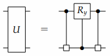
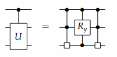
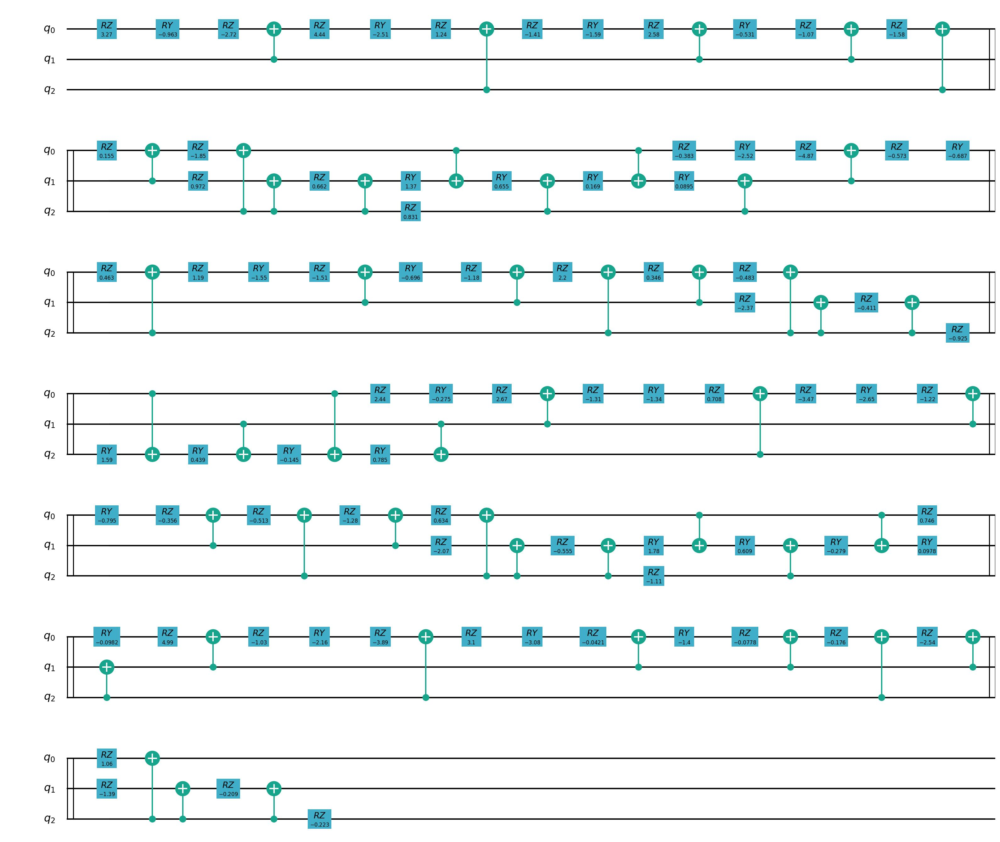
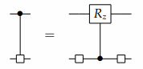
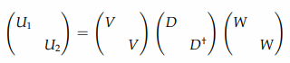
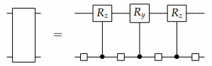
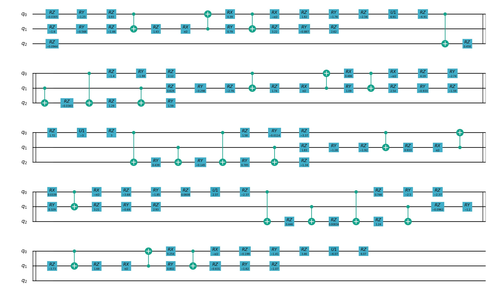
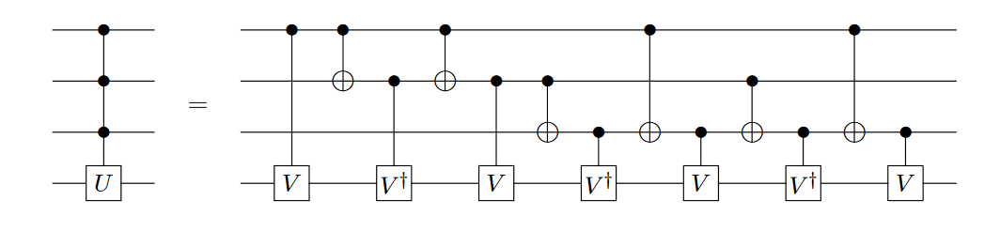
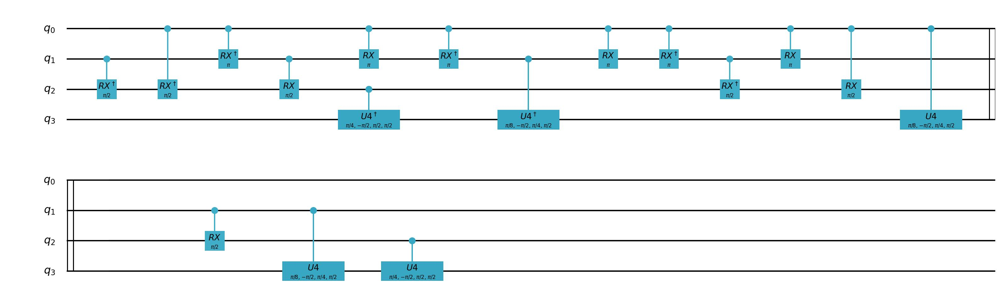

量子逻辑门分解
===============

简介
--------------

量子逻辑门分解是指将一个复杂的量子逻辑门拆解成一系列基本的量子逻辑门的组合。在量子计算中，量子逻辑门是用于对量子比特进行操作和计算的基本单元。通过将复杂的逻辑门分解成基本的逻辑门，可以更容易地实现复杂的量子计算任务。量子逻辑门分解通常遵循一些特定的量子门集合，例如单量子比特门（如Hadamard门、相位门、旋转门等）和双量子比特门（如CNOT门、SWAP门等）。通过使用这些基本门，可以将任意的量子逻辑门拆解成一系列的基本门序列。
这个分解的过程类似于在经典计算中，将复杂的逻辑函数分解成基本的逻辑门（例如AND、OR、NOT等）的组合。量子逻辑门分解在量子算法设计、误差校正和量子编程中起着重要作用，因为它允许我们将复杂的问题分解成更易于实现和控制的部分。

CS 分解
--------------

Cosine-Sine Decomposition，我们称为CS分解，或者CSD。首先我们回顾以下在矩阵计算中的CS(Cosine-Sine)分解，在CS分解中，对于一个偶数维度的酉矩阵 :math:`U \in  \mathbb{C}^{l\times l}` 能被分解成更小的矩阵 :math:`A_1, A_2, B_1, B_2` 和实数对角矩阵 :math:`C, S` , 
其中 :math:`C^2 + S^2 = I_{l/2}`

.. math::

    \begin{aligned}
    U = \begin{pmatrix} A_1 &  \\  & B_1 \end{pmatrix}\begin{pmatrix} C & -S \\ S & C \end{pmatrix}\begin{pmatrix} A_2 &  \\  & B_2 \end{pmatrix}  
    \end{aligned}

对于一个矩阵U，左右两部分 :math:`A_j \oplus B_j` 是由最重要的量子比特控制的量子多路器，它决定了 :math:`A_j, B_j` 是否被应用到低位的比特上。中间部分与 :math:`R_y` 门的结构相同,
仔细观察可以发现 对于低位比特的每一个经典配置，将 :math:`R_y` 门应用在最有效位上。因此CS分解可以写成以下形式：

对于多路CS分解，我们可以通过MEP(多路拓展特性)来增加更多的量子比特。
如下图所示。

代码示例
===============

.. code-block:: python

    from pyqpanda import *
    from scipy.stats import unitary_group

    if __name__ == "__main__":
        machine = CPUQVM()
        machine.init_qvm()
        q = machine.qAlloc_many(3)
        c = machine.cAlloc_many(3)

        # 生成任意酉矩阵
        unitary_matrix = unitary_group.rvs(2**3,random_state=169384)
        
        # 输入需要被分解的线路
        prog = QProg()
        prog<<matrix_decompose(q,unitary_matrix,mode=DecompositionMode.CSDecomposition)
        draw_qprog(prog, "pic")

QS 分解
--------------

QS(Quantum Shannon)分解中涉及到多路分解，对于一个多路分解，我们有：

令 :math:`U = U_0 \oplus U_1` 为可选多路器，我们根据U的实现来设立并解决这个方程，让酉矩阵 :math:`V,W` 和酉对角矩阵 :math:`D` 满足 :math:`U = (I \otimes V)(D \oplus D^\dagger)(I \otimes W)` ,或者写成：

将 :math:`U_1,U_2` 相乘，消去含 :math:`W` 的相关项，得到 :math:`U_1U_2^\dagger = VD^2V^\dagger` 。我们能通过这个方程利用对角化从 :math:`U_1U_2^\dagger` 中得到 :math:`D` 和 :math:`V` 。此外 :math:`W = DV^\dagger U_2` 。
标记 :math:`D` 的对角线，矩阵 :math:`D \oplus D^\dagger` 在线路中对应 :math:`R_z` 门。

利用新的分解，我们在CS分解中的两边的多路器在进行分解，就能得到递归应用的通用算符分解：

因此，一个任意的n量子比特操作算子可以由三个复合R门和四个通用 :math:`n - 1` 比特的操作算子来实现，这些算子可以被看作是原始算子的辅助因子。

代码示例
===============

.. code-block:: python

    from pyqpanda import *
    from scipy.stats import unitary_group

    if __name__ == "__main__":
        machine = CPUQVM()
        machine.init_qvm()
        q = machine.qAlloc_many(3)
        c = machine.cAlloc_many(3)

        # 生成任意酉矩阵
        unitary_matrix = unitary_group.rvs(2**3,random_state=169384)
        
        # 输入需要被分解的线路
        prog = QProg()
        prog<<matrix_decompose(q,unitary_matrix,mode=DecompositionMode.QSDecomposition)
        draw_qprog(prog, "pic")

多控门分解
--------------

目前，由于量子计算的发展受到芯片的运行逻辑门集的限制，无法执行多比特量子逻辑门，因此针对多比特门，需要进行量子线路的重新表征。

而在多比特门中最为常用的则是多比特控制门，例如Grover算法中所需的数据索引空间表示，HHL算法中的uncompute模块的构建等

同时，为了使量子程序保真度达到所需阈值之上，降低线路深度则是一种有效的方法。

通常我们使用量子虚拟机来模拟多控门量子线路，对于某些量子虚拟机而言，含有多控门的量子线路通常线路深度较深，无法满足模拟要求，下图是一种常用的多控门分解方案，其中 :math:`V^4=U`。

不同的分解算法效果天差地别，量子线路的有效分解可以降低量子计算的时间和噪声产生的影响。而由于有噪声的影响，量子线路的大小就受到了限制；那么最小化量子线路的深度在实现量子算法起到 
至关重要的作用。 

分解方案的核心目的是提高量子线路分解的有效性，分解有效性的衡量标准有： 
 - 1. 分解后量子线路的深度
 - 2. 分解的单量子逻辑门和双量子逻辑门的数量
 - 3. 是否需要辅助量子比特等

在更加复杂的量子算法场景下，将会出现更多的、受控维度更高的多控门。目前实现的物理量子计算机基本都不支持多控门，并且我们无法保证所有的受控物理qubit都处于连通状态（目前的物理量子芯片都有固定的拓扑结构），所以想要在真实物理量子计算机上运行量子算法，首先要对多控门进行拆解，使其转换成N个量子芯片支持的逻辑门的组合，以适配目标量子芯片。

方案细节
----------

这里我们是用一种基于线性深度的多控门分解方案，其基本思想是，将控制位的数量逐次分解递减，多控门逐步分解为受控比特递减的多控门组合，然后这些多控门再一次递归分解，直到控制比特为1，

其中线性深度的含义是针对量子线路深度随量子比特线性增长的分解方案，而不是分解复杂度线性增加，得到的最终产物是多个单比特控制位单门集合，具体步骤如下：

 - **1.** 对于任意符合n个控制比特的多控门，均可用如下形式表示

    .. math::

        \large C^{n}U=Q_{n}^{\dagger}P_n(U)^{\dagger}Q_{n}(a_1\sqrt[2^{n-1}]{U}a_{n+1})P_n(U)

    其中 :math:`a_jU_{a_k}` 表示一个由单量子位控制的单门，控制比特是 :math:`{a_j}` ，目标比特是 :math:`a_k` ，同时 :math:`C^{n}U` 表示多量子位控制，控制比特是 :math:`{a_1,···,a_n}` ，目标比特是 :math:`{a_{n+1}}` 。

 - **2.** 第一次分解会得到四个子式，相当于四个子量子线路或量子逻辑门，其中：

    :math:`\large Q_n=\prod_{k=1}^{n-1}C^kR_x(\pi)` 

    :math:`\large P_n(U)=\prod_{k=2}^na_k\sqrt[2^{n-k+1}]{U}a_{n+1}` 

    在上述式子中， :math:`\large P_n(U)` 是多个单控制位量子逻辑门组合， :math:`\large Q_n` 是控制位数量-1的多控门组合，具体地可以推导出，即每次分解后依然存在多控门，但是多控门的控制位数量递减，即

    .. math::

        \large Q_n=Q_{n-1}C^{n-1}R_x(\pi)

 - **3.** 继续重复上述过程，知道控制比特为1

上述方案适用于所有单门受控比特情形，双量子逻辑门的控制场景下，可以先做进一步转化，转化为一个或多个多控制位的的单量子逻辑门集合，对于CNOT、CZ、CR、CU等，可以依次看作X、Z、U1、U4的单门控制形式，对于交换门，如SWAP，ISWAP和SQISWAP等，可以转化为上述支持的基础单双门组合。

多控门分解接口
===============

.. function:: ldd_decompose(qprog: QProg) -> QProg

    该函数用于分解多控制量子门，以得到一个新的量子程序，其中多控制量子门被分解成更基本的单比特和双比特门的序列。

    :param qprog: 要进行分解的量子程序。
    :type qprog: QProg
    :return: 经过分解后的新量子程序。
    :rtype: QProg

我们以上图的四比特控制门为例，

.. code-block:: python

    from pyqpanda import *
    import numpy as np

    if __name__ == "__main__":
        machine = CPUQVM()
        machine.init_qvm()
        q = machine.qAlloc_many(4)
        c = machine.cAlloc_many(4)

        # 输入需要被分解的线路
        prog = QProg()
        prog << X(q[3]).control([q[0],q[1],q[2]])

        #执行多控门分解操作
        after_prog = ldd_decompose(prog)
        draw_qprog(after_prog, "pic")

可以得到分解的结果为：

