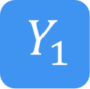
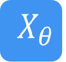
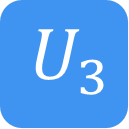

量子逻辑门
====================
----

经典计算中，最基本的单元是比特，而最基本的控制模式是逻辑门。我们可以通过逻辑门的组合来达到我们控制电路的目的。类似地，处理量子比特的方式就是量子逻辑门。
使用量子逻辑门，我们有意识的使量子态发生演化。所以量子逻辑门是构成量子算法的基础。

量子逻辑门由酉矩阵表示。最常见的量子门在一个或两个量子位的空间上工作，就像常见的经典逻辑门在一个或两个位上操作一样。

单比特的门可以用以下形式表达：

.. math::
   \begin{aligned}
      |\psi\rangle=\alpha|0\rangle+\beta|1\rangle
   \end{aligned}

其中 :math:`\alpha` 和 :math:`\beta` 是复数，在测量中，比特出现在 :math:`|0\rangle的概率是|\alpha|^2` ， :math:`|1\rangle的概率是|\beta|^2` 。作为向量表示为：

.. math::
   \begin{aligned}
      |\psi\rangle=\left(\begin{array}{l}\alpha \\ \beta\end{array}\right)
   \end{aligned}

由于概率守恒 :math:`|\alpha|^2+|\beta|^2=1` ，并且因为无法检测到全局相位 :math:`|\psi\rangle:=e^{i\delta}|\psi\rangle` 。 我们只需要两个实数就能描述单量子比特量子态。

一个便捷的表示方法是

.. math::
   \begin{aligned}
      |\psi\rangle=\cos(\theta/2)|0\rangle+\sin(\theta/2)e^{i\phi}|1\rangle 
   \end{aligned}

其中 :math:`0\leq\phi<2\pi` , :math:`0\leq\theta\leq\pi` 。由此可见，在量子比特态和单位球面上的点之间存在一一对应关系，这就是量子比特态的布洛赫球表示法。

量子门通常用矩阵表示，作用于一个量子比特的门由一个 :math:`2\times2` 单元矩阵表示，将表示门的矩阵与表示量子态的矢量相乘，就能得到量子门的功能。

.. math::
   \begin{aligned}
      |\psi^{\prime}\rangle=U|\psi\rangle 
   \end{aligned}

一般酉矩阵能够使 :math:`|0\rangle` 到上述状态。即

.. math::
   \begin{aligned}
      U=\begin{bmatrix} cos(\theta/2) & a \\ e^{i\phi}sin(\theta/2) & b \end{bmatrix}\quad
   \end{aligned}   

a和b是复数，其约束条件是： :math:`0\leq\theta\leq\pi\mathrm 和 0\leq\phi<2\pi` 对于所有的 :math:`U^\dagger U=I` 。这样就会得到三个约束条件： :math:`a\to-e^{i\lambda}\sin(\theta/2), b\to e^{i\lambda+i\phi}\cos(\theta/2),` 其中 :math:`0\leq\lambda<2\pi` 。

.. math::
   \begin{aligned}
      U(\theta,\phi,\lambda)=\begin{pmatrix} cos\left(\frac\theta2\right) & -e^{i\lambda}\sin\left(\frac\theta2\right) \\ e^{i\phi}\sin\left(\frac\theta2\right) & e^{i(\phi+\lambda)}\cos\left(\frac\theta2\right)\end{pmatrix}
   \end{aligned}

.. math::
   \begin{aligned}

   \end{aligned}

常见量子逻辑门矩阵形式
--------------------------------------

.. |Y| image:: images/QGate_Y.png
   :width: 50px
   :height: 50px
   

   

单比特量子逻辑门
~~~~~~~~~~~~~~~~~~~~~~~~~~~

I门

又称为Id门或者Identity门。I门没有任何作用，适用于任何量子线路的任意地方。

.. math::
   \begin{aligned}
      Id = p(0)
   \end{aligned}

这个门主要有两个使用途径：

	#. 一个是在计算的时候经常使用。比如在证明两个门的矩阵是互逆矩阵的时候经常用到；
	#. 在讨论实际的硬件操作时，“没有作用”等价于“无操作”。

======================================================== ======================= =========================================================================================================================================================================
| |I|                                                     | ``I``                     | :math:`\begin{bmatrix} 1 & 0 \\ 0 & 1 \end{bmatrix}\quad`
======================================================== ======================= =========================================================================================================================================================================

-----------

Phase门

======================================================== ======================= =========================================================================================================================================================================
| |P|                                                     | ``P``                     | :math:`\begin{bmatrix} 1 & 0 \\ 0 & e^{i\theta} \end{bmatrix}\quad`
======================================================== ======================= =========================================================================================================================================================================

P门，又称为相位门，是可以设置参数的门。需要向其输入正确的数字（ :math:`\theta` ）。
P门是以Z轴为基准，旋转 :math:`\theta` 。

.. math::   
   \begin{aligned}
      p(\lambda)= U(0, 0, \lambda)
   \end{aligned}

-----------

Hadamard门

常用来对单一量子比特做基地变换，同时产生产生叠加态。

.. math::   
   \begin{aligned}
   H = 
      \frac{1}{\sqrt{2}}
       \begin{pmatrix}
         1 & 1\\
         1 & -1
       \end{pmatrix}= U(\pi/2,0,\pi)
   \end{aligned}

======================================================== ======================= =========================================================================================================================================================================
| |H|                                                     | ``Hadamard``              | :math:`\begin{bmatrix} 1/\sqrt {2} & 1/\sqrt {2} \\ 1/\sqrt {2} & -1/\sqrt {2} \end{bmatrix}\quad`
======================================================== ======================= =========================================================================================================================================================================

-----------

X门的作用是将状态0和1的振幅进行转换。

.. math::   
   \begin{aligned}
   X  &=  
      \begin{pmatrix}
         0 & 1\\
         1 & 0
      \end{pmatrix}= U(\pi,0,\pi)
   \end{aligned}

Y门的作用是在Bloch球中以y轴为中心旋转 :math:`\pi` 。

.. math::   
   \begin{aligned}
   Y  &= 
      \begin{pmatrix}
         0 & -i\\
         i & 0
      \end{pmatrix}=U(\pi,\pi/2,\pi/2)
   \end{aligned}

Z门的作用是在Bloch球中以z轴为中心旋转 :math:`\pi` 。

.. math::   
   \begin{aligned}
   Z  &= 
      \begin{pmatrix}
         1 & 0\\
         0 & -1
      \end{pmatrix}=P(\pi)
   \end{aligned}

======================================================== ======================= =========================================================================================================================================================================

| |X|                                                     | ``Pauli-X``               | :math:`\begin{bmatrix} 0 & 1 \\ 1 & 0 \end{bmatrix}\quad`
| |Y|                                                     | ``Pauli-Y``               | :math:`\begin{bmatrix} 0 & -1i \\ 1i & 0 \end{bmatrix}\quad`
| |Z|                                                     | ``Pauli-Z``               | :math:`\begin{bmatrix} 1 & 0 \\ 0 & -1 \end{bmatrix}\quad`

======================================================== ======================= =========================================================================================================================================================================

======================================================== ======================= =========================================================================================================================================================================
| |X1|                                                    | ``X1``                    | :math:`\begin{bmatrix} 1/\sqrt {2} & -1i/\sqrt {2} \\ -1i/\sqrt {2} & 1/\sqrt {2} \end{bmatrix}\quad`
| |Y1|                                                    | ``Y1``                    | :math:`\begin{bmatrix} 1/\sqrt {2} & -1/\sqrt {2} \\ 1/\sqrt {2} & 1/\sqrt {2} \end{bmatrix}\quad`
| |Z1|                                                    | ``Z1``                    | :math:`\begin{bmatrix} e^{-i\pi/4} & 0 \\ 0 & e^{i\pi/4} \end{bmatrix}\quad`
======================================================== ======================= =========================================================================================================================================================================

.. math::   
   \begin{aligned}
    R_x(\theta) =
      \begin{pmatrix}
         \cos(\theta/2) & -i\sin(\theta/2)\\
         -i\sin(\theta/2) & \cos(\theta/2)
      \end{pmatrix} = U(\theta, -\pi/2,\pi/2)
   \end{aligned}

.. math::   
   \begin{aligned}
    R_y(\theta) =
      \begin{pmatrix}
         \cos(\theta/2) & - \sin(\theta/2)\\
         \sin(\theta/2) & \cos(\theta/2)
      \end{pmatrix} =U(\theta,0,0)
   \end{aligned}

.. math::   
   \begin{aligned}
   R_z(\phi) = 
      \begin{pmatrix}
         e^{-i \phi/2} & 0 \\
         0 & e^{i \phi/2}
      \end{pmatrix}\equiv P(\phi)
   \end{aligned}

======================================================== ======================= =========================================================================================================================================================================
| |RX|                                                    | ``RX``                    | :math:`\begin{bmatrix} \cos(\theta/2) & -1i×\sin(\theta/2) \\ -1i×\sin(\theta/2) & \cos(\theta/2) \end{bmatrix}\quad`
| |RY|                                                    | ``RY``                    | :math:`\begin{bmatrix} \cos(\theta/2) & -\sin(\theta/2) \\ \sin(\theta/2) & \cos(\theta/2) \end{bmatrix}\quad`
| |RZ|                                                    | ``RZ``                    | :math:`\begin{bmatrix} e^{-i\theta/2} & 0 \\ 0 & e^{i\theta/2} \end{bmatrix}\quad`
======================================================== ======================= =========================================================================================================================================================================

-----------

P，T，S门 

P门，又称为相位门，是可以设置参数的门。需要向其输入正确的数字（ :math:`\theta` ）。
P门是以z轴为基准，旋转 :math:`\theta。当 \theta = \pi` 时，即为Z门。也就是说Z门时P门的一种特殊情况。

.. math::   
   \begin{aligned}
      P(\lambda)= u(0, 0, \lambda)
   \end{aligned}

T门作为经常使用的门，是 :math:`\theta = \pi/4 的P门。在Bloch球中，绕z轴旋转\pi/4` 。

.. math::   
   \begin{aligned}
    T =
      \begin{pmatrix}
         1 & 0\\
         0 & i
      \end{pmatrix}= P(\pi/4)
   \end{aligned}

.. math::
   \begin{aligned}
    T^{\dagger} =
      \begin{pmatrix}
         1 & 0\\
         0 & -i
      \end{pmatrix}= P(-\pi/4)
   \end{aligned}

S门也是P门的一种情况，为 :math:`\theta = \pi/2` 的P门。在Bloch球中，绕z轴旋转 :math:`\pi/2` 。

.. math::   
   \begin{aligned}
    S =
      \begin{pmatrix}
         1 & 0\\
         0 & i
      \end{pmatrix}= P(\pi/2)
   \end{aligned}

.. math::   
   \begin{aligned}
    S^{\dagger} = 
      \begin{pmatrix}
         1 & 0\\
         0 & -i
      \end{pmatrix}= P(-\pi/2)
   \end{aligned}

======================================================== ======================= =========================================================================================================================================================================

| |P|                                                     | ``P``                     | :math:`\begin{bmatrix} 1 & 0 \\ 0 & e^{i\theta} \end{bmatrix}\quad`
| |T|                                                     | ``T``                     | :math:`\begin{bmatrix} 1 & 0 \\ 0 & e^{i\pi / 4} \end{bmatrix}\quad`
| |S|                                                     | ``S``                     | :math:`\begin{bmatrix} 1 & 0 \\ 0 & e^{i\pi / 2} \end{bmatrix}\quad`
======================================================== ======================= =========================================================================================================================================================================

-----------

U门

上述很多门都是P门的特殊情况，而在所有单一比特的量子门中最为常见的是 :math:`U_3` 门。
本章所有的门都可以通过调整 :math:`U_3` 门的参数来实现。

.. math::
   \begin{aligned}
    U(\theta, \phi, \lambda) =
        \begin{pmatrix}
            \cos\left(\frac{\theta}{2}\right)          & -e^{i\lambda}\sin\left(\frac{\theta}{2}\right) \\
            e^{i\phi}\sin\left(\frac{\theta}{2}\right) & e^{i(\phi+\lambda)}\cos\left(\frac{\theta}{2}\right)
        \end{pmatrix}
   \end{aligned}

在pyqpanda中也可以直接通过使用 :math:`U_1, U_2, U_3, U_4` 。来调用相关量子门。

.. math::
   \begin{aligned}
      U1(\lambda) &= P(\lambda) = U(0, 0, \lambda) \\
      U2(\phi, \lambda) &= U(\frac{\pi}{2}, \phi, \lambda)\\ 
      U3(\theta, \phi, \lambda) &= U(\theta, \phi, \lambda)
   \end{aligned}

其中，:math:`U_4` 门是一个通用的单比特旋转门，允许在量子比特上进行任意的单比特操作。:math:`U_4` 门的参数通常被表示为 :math:`(\alpha, \beta, \gamma, \delta)` 。让我们逐步来理解这些参数的含义：

 :math:`\alpha` ：控制绕Z轴的旋转相位
参数 :math:`\alpha`  旋转轴相位，控制绕Z轴的旋转角度。

 :math:`\beta` ：控制绕Y轴的旋转相位
参数 :math:`\beta` 旋转轴相位，控制绕Y轴的旋转角度。

 :math:`\gamma` ：旋转角度
参数 :math:`\gamma` 旋转的角度，控制旋转的大小。它影响着整个旋转操作的幅度。

 :math:`\delta` ：全局相位
参数 :math:`\delta` 全局相位系数。

.. tabularcolumns:: |m{0.06\textwidth}<{\centering}|c|c|

.. list-table:: 
   :align: center
   :class: longtable 

   * - |U1|                                                    
     - ``U1``                    
     - :math:`\begin{bmatrix} 1 & 0 \\ 0 & e^{i\theta} \end{bmatrix}\quad`
   * - |U2|                                                    
     - ``U2``                    
     - :math:`\begin{bmatrix} 1/\sqrt {2} & -e^{i\lambda}/\sqrt {2} \\ e^{i\phi}/\sqrt {2} & e^{i\lambda+i\phi}/\sqrt {2} \end{bmatrix}\quad`
   * - |U3|                                                    
     - ``U3``                    
     - :math:`\begin{bmatrix} \cos(\theta/2) & -e^{i\lambda}x\sin(\theta/2) \\ e^{i\phi}x\sin(\theta/2) & e^{i\lambda+i\phi}x\cos(\theta/2) \end{bmatrix}\quad`
   * - |U4|                                                    
     - ``U4``                    
     - :math:`\begin{bmatrix} e^{i*(\alpha-(\beta+\delta)/2)}*cos(\gamma/2) & -e^{i*(\alpha-(\beta-\delta)/2)}*sin(\gamma/2) \\ e^{i*(\alpha+(\beta-\delta)/2)}*sin(\gamma/2) & e^{i*(\alpha+(\beta+\delta)/2)}*cos(\gamma/2) \end{bmatrix}\quad`

-----------

多比特量子逻辑门
~~~~~~~~~~~~~~~~~~~~~~~~~~~

量子计算机的空间随着量子比特的数量呈指数增长。对于 n 个量子比特，复向量空间的维数为 :math:`d=2^n` 。为了描述多量子比特系统的状态，张量积被用来 "粘合 "算子和基向量。

让我们先考虑一个双量子比特系统。给定两个分别作用于一个量子比特的算子 A 和 B，那么作用于两个量子比特的联合算子 :math:`A\otimes B` .

.. math::
   \begin{aligned}
      A\otimes B=\begin{pmatrix}A_{00}\begin{pmatrix}B_{00}&B_{01}\\B_{10}&B_{11}\end{pmatrix}&A_{01}\begin{pmatrix}B_{00}&B_{01}\\B_{10}&B_{11}\end{pmatrix}\\A_{10}\begin{pmatrix}B_{00}&B_{01}\\B_{10}&B_{11}\end{pmatrix}&A_{11}\begin{pmatrix}B_{00}&B_{01}\\B_{10}&B_{11}\end{pmatrix}\end{pmatrix}
   \end{aligned}

其中， :math:`A_{jk} 和 B_{lm}` 分别是A和B的矩阵元素。

与此类似，双量子比特系统的基向量也是通过单量子比特基向量的张量乘积形成的：

.. math::
   \begin{aligned}
      |00\rangle=\begin{pmatrix}1\begin{pmatrix}1\\0\end{pmatrix}\\0\begin{pmatrix}1\\0\end{pmatrix}\end{pmatrix}=\begin{pmatrix}1\\0\\0\\0\end{pmatrix}\quad|01\rangle=\begin{pmatrix}1\begin{pmatrix}0\\1\end{pmatrix}\\0\begin{pmatrix}0\\1\end{pmatrix}\end{pmatrix}=\begin{pmatrix}0\\1\\0\\0\end{pmatrix}
   \end{aligned}

.. math::
   \begin{aligned}
      |10\rangle=\begin{pmatrix}0\begin{pmatrix}1\\0\end{pmatrix}\\1\begin{pmatrix}1\\0\end{pmatrix}\end{pmatrix}=\begin{pmatrix}0\\0\\1\\0\end{pmatrix}\quad|11\rangle=\begin{pmatrix}0\begin{pmatrix}0\\1\end{pmatrix}\\1\begin{pmatrix}0\\1\end{pmatrix}\end{pmatrix}=\begin{pmatrix}0\\0\\0\\1\end{pmatrix}
   \end{aligned}

注意，我们为基向量的张量乘引入了一个简写 :math:`|0\rangle\otimes|0\rangle` 记作 :math:`\left|00\right\rangle` 。n 量子比特系统的状态可以用n维量子比特基向量的张量积来描述。请注意，2量子比特系统的基向量是4维的；如前所述，一般来说，n量子比特系统的基向量是 :math:`2^n` 维的。

大多数双量子比特门都属于受控类型（SWAP 门是个例外）。一般来说，受控双量子比特门 :math:`C_U` 的作用是，当第一个量子比特的状态处于 :math:`|1\rangle` 时，将单量子比特单元应用于第二个量子比特U。假设有一个矩阵U表示

.. math::
   \begin{aligned}
      U=\begin{pmatrix}u_{00}&u_{01}\\u_{10}&u_{11}\end{pmatrix}.
   \end{aligned}

我们可以计算出 :math:`C_U` 的作用如下。回顾一下，双量子比特系统的基向量排序为 :math:`|00\rangle,|01\rangle,|10\rangle,|11\rangle` 。假设控制量子比特是量子比特 :math:`q_0` 。如果控制量子比特是 :math:`|1\rangle` 的情况下，U则应作用于目标位。因此，在 :math:`C_U` 的作用下，基向量会根据以下公式进行变换

.. math::
   \begin{aligned}
      C_{U}: \underset{\text{qubit}~1}{\left|0\right\rangle}\otimes \underset{\text{qubit}~0}{\left|0\right\rangle} &\rightarrow \underset{\text{qubit}~1}{\left|0\right\rangle}\otimes \underset{\text{qubit}~0}{\left|0\right\rangle}
   \end{aligned}

.. math::
   \begin{aligned}
      C_{U}: \underset{\text{qubit}~1}{\left|0\right\rangle}\otimes \underset{\text{qubit}~0}{\left|1\right\rangle} &\rightarrow \underset{\text{qubit}~1}{\left|0\right\rangle}\otimes \underset{\text{qubit}~0}{\left|1\right\rangle}
   \end{aligned}

.. math::
   \begin{aligned}
      C_{U}: \underset{\text{qubit}~1}{\left|1\right\rangle}\otimes \underset{\text{qubit}~0}{\left|0\right\rangle} &\rightarrow \underset{\text{qubit}~1}{\left|1\right\rangle}\otimes \underset{\text{qubit}~0}{U\left|0\right\rangle}
   \end{aligned}

.. math::
   \begin{aligned}
      C_{U}: \underset{\text{qubit}~1}{\left|1\right\rangle}\otimes \underset{\text{qubit}~0}{\left|1\right\rangle} &\rightarrow \underset{\text{qubit}~1}{\left|1\right\rangle}\otimes \underset{\text{qubit}~0}{U\left|1\right\rangle}
   \end{aligned}

:math:`C_U` 的矩阵形式为:

.. math::
   \begin{aligned}
      \begin{equation}
      C_U = \begin{pmatrix}
         1 & 0 & 0  & 0 \\
         0 & 1 & 0 & 0 \\
         0 & 0 & u_{00} & u_{01} \\
         0 & 0 & u_{10} & u_{11}
         \end{pmatrix}
      \end{equation}
   \end{aligned}

============================================================ =========================== ========================================================================================================
| |CU|                                                        | ``CU``                    | :math:`\begin{bmatrix} 1 & 0 & 0 & 0  \\ 0 & 1 & 0 & 0 \\ 0 & 0 & u0 & u1 \\ 0 & 0 & u2 & u3 \end{bmatrix}\quad`
============================================================ =========================== ========================================================================================================

~~~~~~~~~~~~~~~~~~~~~~~~~~~

CNOT门

作用于两个量子比特的量子门，当第一个量子比特（控制位）为 |1⟩的时候，对第二个量子比特施加一个X门的效果。
所以CNOT在很多文献中也称为CX门。 
 
============================================================ =========================== ========================================================================================================
| |CNOT|                                                      | ``CNOT``                  | :math:`\begin{bmatrix} 1 & 0 & 0 & 0  \\ 0 & 1 & 0 & 0 \\ 0 & 0 & 0 & 1 \\ 0 & 0 & 1 & 0 \end{bmatrix}\quad`
============================================================ =========================== ========================================================================================================

-----------

CZ门

如果控制量子比特是 |1⟩的时候，受控 Z 门会翻转目标量子比特的相位。无论控制量子位是 MSB 还是 LSB，矩阵看起来都是一样的：

.. math::
   \begin{aligned}
    C_Z = 
      \begin{pmatrix}
         1 & 0 & 0 & 0\\
         0 & 1 & 0 & 0\\
         0 & 0 & 1 & 0\\
         0 & 0 & 0 & -1
      \end{pmatrix}
   \end{aligned}

============================================================ =========================== ========================================================================================================
| |CZ|                                                        | ``CZ``                    | :math:`\begin{bmatrix} 1 & 0 & 0 & 0  \\ 0 & 1 & 0 & 0 \\ 0 & 0 & 1 & 0 \\ 0 & 0 & 0 & -1 \end{bmatrix}\quad`
============================================================ =========================== ========================================================================================================

-----------

SWAP门

SWAP 门交换两个量子比特。它将基向量变换为

.. math::
   \begin{aligned}
      \left|00\right\rangle \rightarrow \left|00\right\rangle~,~\left|01\right\rangle \rightarrow \left|10\right\rangle~,~\left|10\right\rangle \rightarrow \left|01\right\rangle~,~\left|11\right\rangle \rightarrow \left|11\right\rangle
   \end{aligned}

============================================================ =========================== ========================================================================================================
| |SWAP|                                                      | ``SWAP``                  | :math:`\begin{bmatrix} 1 & 0 & 0 & 0  \\ 0 & 0 & 1 & 0 \\ 0 & 1 & 0 & 0 \\ 0 & 0 & 0 & 1 \end{bmatrix}\quad`
============================================================ =========================== ========================================================================================================

-----------

受控相位旋转CR门

如果两个量子比特都处于 :math:`\left|11\right\rangle` 状态，则进行相位旋转。无论控制比特是 MSB 还是 LSB，矩阵看起来都是一样的。

============================================================ =========================== ========================================================================================================
| |CR|                                                        | ``CR``                    | :math:`\begin{bmatrix} 1 & 0 & 0 & 0  \\ 0 & 1 & 0 & 0 \\ 0 & 0 & 1 & 0 \\ 0 & 0 & 0 & e^{i\theta} \end{bmatrix}\quad`
============================================================ =========================== ========================================================================================================

-----------

============================================================ =========================== ========================================================================================================
| |iSWAP|                                                     | ``iSWAP``                 | :math:`\begin{bmatrix} 1 & 0 & 0 & 0  \\ 0 & \cos(\theta) & i×\sin(\theta) & 0 \\ 0 & i×\sin(\theta) & \cos(\theta) & 0 \\ 0 & 0 & 0 & 1 \end{bmatrix}\quad`
| |RXX|                                                       | ``RXX``                   | :math:`\begin{bmatrix} \cos(\theta/2) & 0 & 0 & -i\sin(\theta/2)  \\ 0 & \cos(\theta/2) & -i\sin(\theta/2) & 0 \\ 0 & -i\sin(\theta/2) & \cos(\theta/2) & 0 \\ -i\sin(\theta/2) & 0 & 0 & \cos(\theta/2) \end{bmatrix}\quad`
| |RYY|                                                       | ``RYY``                   | :math:`\begin{bmatrix} \cos(\theta/2) & 0 & 0 & i\sin(\theta/2)  \\ 0 & \cos(\theta/2) & -i\sin(\theta/2) & 0 \\ 0 & -i\sin(\theta/2) & \cos(\theta/2) & 0 \\ i\sin(\theta/2) & 0 & 0 & \cos(\theta/2) \end{bmatrix}\quad`
| |RZZ|                                                       | ``RZZ``                   | :math:`\begin{bmatrix} e^{-i\theta/2} & 0 & 0 & 0  \\ 0 & e^{i\theta/2} & 0 & 0 \\ 0 & 0 & e^{i\theta/2} & 0 \\ 0 & 0 & 0 & e^{-i\theta/2} \end{bmatrix}\quad`
| |RZX|                                                       | ``RZX``                   | :math:`\begin{bmatrix} \cos(\theta/2) & 0 & -i\sin(\theta/2) & 0  \\ 0 & \cos(\theta/2) & 0 & i\sin(\theta/2) \\ -i\sin(\theta/2) & 0 & \cos(\theta/2) & 0 \\ 0 & i\sin(\theta/2) & 0 & \cos(\theta/2) \end{bmatrix}\quad`
============================================================ =========================== ========================================================================================================

-----------

Toffoli门

如果前两个量子位都是 :math:`\left|1\right\rangle` ，托福利门就会翻转第三个量子位。

.. math::
   \begin{aligned}
      |abc\rangle\to|bc\oplus a\rangle\otimes|b\rangle\otimes|c\rangle.
   \end{aligned}

============================================================ =========================== ========================================================================================================
| |Toffoli|                                                   | ``Toffoli``               | :math:`\begin{bmatrix} 1 & 0 & 0 & 0 & 0 & 0 & 0 & 0 \\ 0 & 1 & 0 & 0 & 0 & 0 & 0 & 0 \\ 0 & 0 & 1 & 0 & 0 & 0 & 0 & 0 \\ 0 & 0 & 0 & 1 & 0 & 0 & 0 & 0 \\ 0 & 0 & 0 & 0 & 1 & 0 & 0 & 0  \\ 0 & 0 & 0 & 0 & 0 & 1 & 0 & 0 \\ 0 & 0 & 0 & 0 & 0 & 0 & 0 & 1  \\ 0 & 0 & 0 & 0 & 0 & 0 & 1 & 0 \\ \end{bmatrix}\quad`
============================================================ =========================== ========================================================================================================

-----------

.. _api_introduction:

QPanda 2把所有的量子逻辑门封装为API向用户提供使用，并可获得QGate类型的返回值。比如，您想要使用Hadamard门，就可以通过如下方式获得：

     .. code-block:: python
          
         from pyqpanda import *
         import numpy as np
         qvm = CPUQVM()
         qvm.init_qvm()
         qubits = qvm.qAlloc_many(4)
         h = H(qubits[0])

其中参数为目标比特，返回值为量子逻辑门

pyqpanda中支持的不含角度的单门有： ``I``、 ``H``、 ``T``、 ``S``、 ``X``、 ``Y``、 ``Z``、 ``X1``、 ``Y1``、 ``Z1``

qubit如何申请会在 :ref:`QuantumMachine` 部分介绍。

单门带有一个旋转角的逻辑门，例如RX门：

     .. code-block:: python
          
         rx = RX(qubits[0], np.pi/3)

第一个参数为目标比特，第二个参数为旋转角度 

pyqpanda中支持的单门带有一个旋转角度的逻辑门有： ``RX``、``RY``、``RZ``、``U1``、``P``
   

pyqpanda中还支持 ``U2``、``U3``、``U4`` 门，其用法如下：

      .. code-block:: python

         # U2(qubit, phi, lambda) 有两个角度
         u2 = U2(qubits[0], np.pi, np.pi/2) 

         # U3(qubit, theta, phi, lambda) 有三个角度
         u3 = U3(qubits[0], np.pi, np.pi/2, np.pi/4)
         
         # U4(qubit, alpha, beta, gamma, delta) 有四个角度
         u4 = U4(qubits[0], np.pi, np.pi/2, np.pi/4, np.pi/2)   

两比特量子逻辑门的使用和单比特量子逻辑门的用法相似，只不过是输入的参数不同，例如CNOT门：

     .. code-block:: python
          
         cnot = CNOT(qubits[0], qubits[1])

第一个参数为控制比特
第二个参数为目标比特 
注：两个比特不能相同

pyqpanda中支持的双门不含角度的逻辑门有： ``CNOT``、``CZ`` 、``SWAP``、``iSWAp``、``SqiSWAP``

双门带有旋转角度的门有：``CR``、``RXX`` 、``RYY``、``RZZ``、``RZX``，例如CR门：

      .. code-block:: python
            
         cr = CR(qubits[0], qubits[1], np.pi)

第一个参数为控制比特, 第二个参数为目标比特, 第三个参数为旋转角度 

支持CU门，使用方法如下：

      .. code-block:: python

         # CU(control, target, alpha, beta, gamma, delta) 有四个角度   
         cu = CU(qubits[0], qubits[1], np.pi, np.pi/2, np.pi/3, np.pi/4)

获得三量子逻辑门 ``Toffoli`` 的方式：

     .. code-block:: python

          toffoli = Toffoli(qubits[0], qubits[1], qubits[2])

三比特量子逻辑门Toffoli实际上是CCNOT门，前两个参数是控制比特，最后一个参数是目标比特。

接口介绍
----------------

在本章的开头介绍过，所有的量子逻辑门都是酉矩阵，那么您也可以对量子逻辑门做转置共轭操作，获得一个量子逻辑门 ``dagger`` 之后的量子逻辑门可以用下面的方法：

      .. code-block:: python
            
         rx_dagger = RX(qubits[0], np.pi).dagger()

或：

      .. code-block:: python

         rx_dagger = RX(qubits[0], np.pi)
         rx_dagger.set_dagger(True)

也可以为量子逻辑门添加控制比特,获得一个量子逻辑门 control 之后的量子逻辑门可以用下面的方法：

      .. code-block:: python

         qvec = [qubits[0], qubits[1]]
         rx_control = RX(qubits[2], np.pi).control(qvec)

或：

      .. code-block:: python

         qvec = [qubits[0], qubits[1]]
         rx_control = RX(qubits[2], np.pi)
         rx_control.set_control(qvec)

pyqpanda 还封装了一些比较方便的接口，会简化一些量子逻辑门的操作。

单门操作：

      .. code-block:: python

          cir = H(qubits)
          print(cir)

      .. code-block:: python

                   ┌─┐ 
         q_0:  |0>─┤H├ 
                   ├─┤ 
         q_1:  |0>─┤H├ 
                   ├─┤ 
         q_2:  |0>─┤H├ 
                   ├─┤ 
         q_3:  |0>─┤H├ 
                   └─┘       
        
    对多个量子比特添加H门

双门操作：
    
    .. code-block:: python

        cir = CNOT(qubits[0:3], qubits[1:4])
        print(cir)

    .. code-block:: python

        q_0:  |0>────■── ────── ────── 
                  ┌──┴─┐               
        q_1:  |0>─┤CNOT├ ───■── ────── 
                  └────┘ ┌──┴─┐        
        q_2:  |0>─────── ┤CNOT├ ───■── 
                         └────┘ ┌──┴─┐ 
        q_3:  |0>─────── ────── ┤CNOT├ 
                                └────┘
    对多个量子比特添加CNOT门

pyqpanda 还封装了自定义的QOracle逻辑门，通过传入一个由酉矩阵和对应的比特来构建一个QOracle逻辑门。

.. code-block:: python
         
    from pyqpanda import *

    if __name__ == "__main__":
        qvm = CPUQVM()
        qvm.init_qvm()
        qubits = qvm.qAlloc_many(3)
        prog1 = QProg()
        prog1 <<H(qubits[0]) <<CNOT(qubits[1],qubits[2])
        mat = get_matrix(prog1,True)
        prog = QProg()
        prog << QOracle([qubits[0],qubits[1],qubits[2]],mat)

        res1 = qvm.prob_run_dict(prog1,qubits)
        res2 = qvm.prob_run_dict(prog,qubits)

        # 打印测量结果
        print(res1)
        print(res2)

计算结果如下：

    .. code-block:: python
        
      {'000': 0.5000000000000001, '001': 0.5000000000000001, '010': 0.0, '011': 0.0, '100': 0.0, '101': 0.0, '110': 0.0, '111': 0.0}
      {'000': 0.4999999999999999, '001': 0.4999999999999999, '010': 0.0, '011': 0.0, '100': 0.0, '101': 0.0, '110': 0.0, '111': 0.0}

实例
----------------

以下实例主要是向您展现QGate类型接口的使用方式。

   .. code-block:: python

         from pyqpanda import *

         if __name__ == "__main__":
            qvm = CPUQVM()
            qvm.init_qvm()
            qubits = qvm.qAlloc_many(3)
            control_qubits = [qubits[0], qubits[1]]
            prog = QProg()

            # 构建量子程序
            prog << apply_QGate([qubits[0], qubits[1]], H) \
                  << H(qubits[0]).dagger() \
                  << X(qubits[2]).control(control_qubits)

            # 对量子程序进行概率测量
            result = qvm.prob_run_dict(prog, qubits, -1)

            # 打印测量结果
            print(result)

计算结果如下：

    .. code-block:: python
        
      {'000': 0.4999999999999894, '001': 0.0, '010': 0.4999999999999894, '011': 0.0, '100': 0.0, '101': 0.0, '110': 0.0, '111': 0.0}

