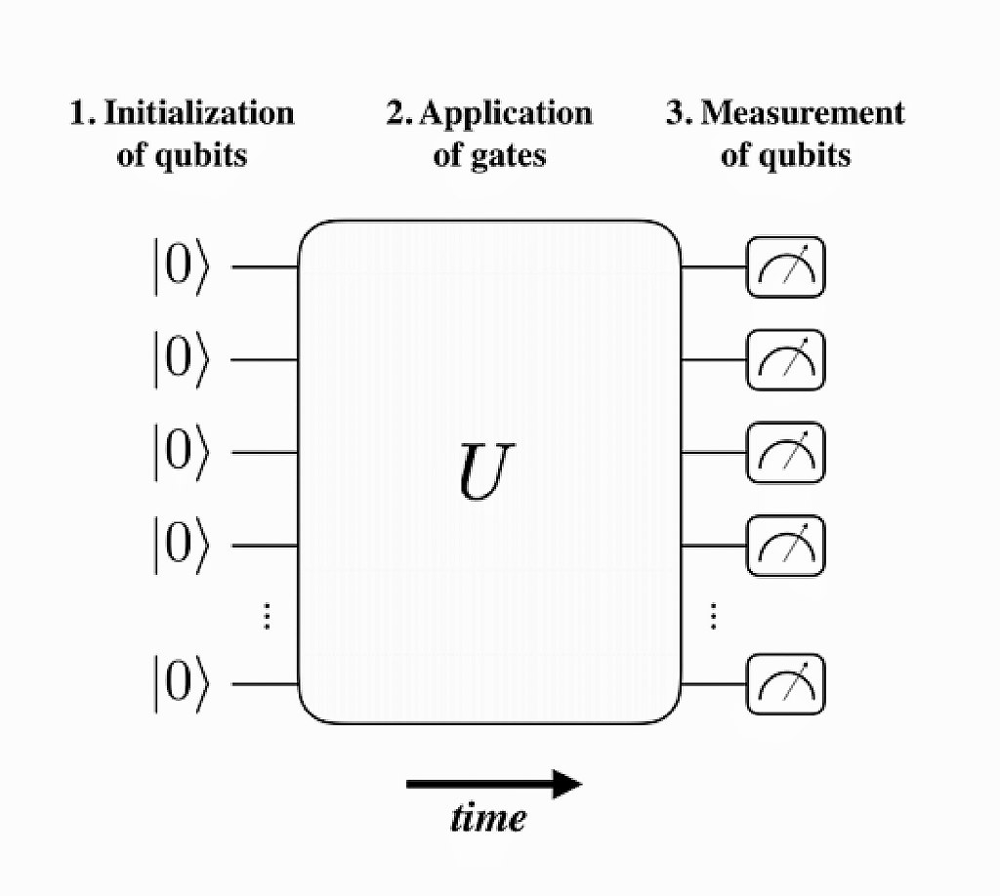
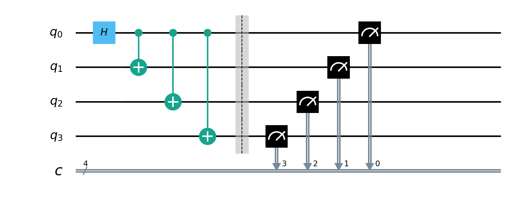

量子线路
====================
----

量子线路是量子计算领域中的一种重要模型，用于描述和研究量子算法和量子计算机的运行过程。它是一种图形化的表示方法，用于展示量子比特之间的操作和相互作用，类似于经典计算中的电路图。

由于组成量子线路的每一个量子逻辑门都是一个 ``酉算子`` ，所以整个量子线路整体也是一个大的酉算子。

量子线路的主要目的是模拟和探究量子计算过程，通过在量子比特上应用各种量子门操作（如Hadamard门、CNOT门等），以实现复杂的量子算法，一般来说，量子线路的结构大致如下图所示：

根据上图以及《量子计算与量子信息》一书的内容，量子线路的结构组成主要包括：

 - **量子比特（Qubits）** ：量子线路的基本单元，与经典计算中的比特类似，但具有量子叠加和纠缠等量子特性。

 - **量子操作和量子门（Quantum Gates）** ：这些是对量子比特进行操作的基本元素，类似于经典计算中的逻辑门。量子门可以是单比特门（只作用于一个量子比特）或多比特门（作用于多个量子比特），常见的有Hadamard门、Pauli门、CNOT门等。

 - **时间线** ：即连接量子操作的线，表示执行时序，同时量子线路中量子门的顺序和连接方式形成了一种拓扑结构，该结构决定了量子算法的运行流程。

.. _api_introduction:

模块介绍
>>>>>>>>>>>>>>>>>>>>>>>>>>>>

.. class:: QCircuit

    该类实现了用于构建和操作量子线路的方法，通过添加量子门和控制操作等来生成量子线路。

    .. method:: __init__()

        创建一个空的量子线路。

    .. method:: __init__(arg0: NodeIter)

        根据给定的节点迭代器创建量子线路。

        :param arg0: 节点迭代器。
        :type arg0: NodeIter

    .. method:: control(control_qubits: QVec) -> QCircuit

        获得QCircuit的施加控制之后的量子线路

        :param control_qubits: 控制比特列表。
        :type control_qubits: QVec
        :return: 新的施加控制后的量子线路。
        :rtype: QCircuit

    .. method:: dagger() -> QCircuit

        获得QCircuit的转置共轭之后的量子线路

        :return: QCircuit的转置共轭之后的量子线路
        :rtype: QCircuit

    .. method:: insert(arg0: QCircuit) -> QCircuit
             :: insert(arg0: QGate) -> QCircuit

        :param arg0: 要插入的量子门和量子线路。
        :type arg0: QGate、QCircuit
        :return: 当前量子线路。
        :rtype: QCircuit

    .. method:: is_empty() -> bool

        检查量子线路是否为空。

        :return: 若量子线路为空则为 True，否则为 False。
        :rtype: bool

    .. method:: set_control(control_qubits: QVec) -> None

        设置控制比特，用于实现控制门操作。

        :param control_qubits: 控制比特列表。
        :type control_qubits: QVec

    .. method:: set_dagger(arg0: bool) -> None

        设置线路是否为dagger形式。

        :param arg0: 若为 True 则表示将线路设置为dagger
        :type arg0: bool

    .. method:: __lshift__(arg0: QCircuit) -> QCircuit
             :: __lshift__(arg0: QGate) -> QCircuit

        :param arg0: 通过左移操作符待插入的节点
        :type arg0: QGate、QCircuit
        :return: 生成的新量子线路。
        :rtype: QCircuit

在pyqpanda中，QCircuit类是一个仅装载量子逻辑门的容器类型，它也是QNode中的一种，初始化一个QCircuit对象除了上述直接使用初始化函数外，

    .. code-block:: python

        cir = QCircuit()

还可以使用

    .. code-block:: python

        prog = create_empty_circuit()

你可以通过如下方式向QCircuit尾部填充节点，在这里pyqpanda重载了 ``<<`` 运算符作为插入量子线路的方法

    .. code-block:: python

        cir << node

node的类型可以为QGate或QCircuit。

我们还可以获得QCircuit的转置共轭之后的量子线路，使用方式为：

    .. code-block:: python
        
        cir_dagger = cir.dagger()

如果想复制当前的量子线路，并给复制的量子线路添加控制比特，可以使用下面的方式：

    .. code-block:: python
            
        qvec = [qubits[0], qubits[1]]
        cir_control = cir.control(qvec)

    .. note:: 
        - 向QCircuit中插入QPorg，QIf，Measure不会报错，但是运行过程中可能会产生预料之外的错误
        - 一个构建好的QCircuit不能直接参与量子计算与模拟，需要进一步构建成QProg类型

实例
>>>>>>>>>>>

    .. code-block:: python
    
        from pyqpanda import *

        if __name__ == "__main__":

            qvm = CPUQVM()
            qvm.init_qvm()
            qubits = qvm.qAlloc_many(4)
            cbits = qvm.cAlloc_many(4)

            # 构建量子程序
            prog = QProg()
            circuit = QCircuit()

            circuit << H(qubits[0]) \
                    << CNOT(qubits[0], qubits[1]) \
                    << CNOT(qubits[1], qubits[2]) \
                    << CNOT(qubits[2], qubits[3])

            prog << circuit << Measure(qubits[0], cbits[0])

            # 量子程序运行1000次，并返回测量结果
            result = qvm.run_with_configuration(prog, cbits, 1000)
            
            # 打印量子态在量子程序多次运行结果中出现的次数
            print(result)

运行结果：

    .. code-block:: python

        {'0000': 486, '0001': 514}

GHZ线路
>>>>>>>>>>>

通过对申请的寄存器中中添加量子门，来设计量子线路，下图是通过添加H门和CNOT门来实现GHZ态。

在qubit0上添加H门，使其变成叠加态 :math:`\left(|0\rangle+|1\rangle\right)/\sqrt{2}`  。

在qubit0和qubit1，2，3之间分别添加一个CNOT门，在理想的量子计算机上，构成的线路运行之后产生的状态就是GHZ态。

.. math::   
   \begin{aligned}
        |\psi\rangle = \left(|0000\rangle+|1111\rangle\right)/\sqrt{2}
   \end{aligned}

.. math::   
   \begin{aligned}
        \left(|0\rangle+|1\rangle\right)/\sqrt{2}   
   \end{aligned}

代码示例
>>>>>>>>>>>>>>>>>>>>>

    .. code-block:: python
    
        from pyqpanda import *

        if __name__ == "__main__":

            qvm = CPUQVM()
            qvm.init_qvm()
            qubits = qvm.qAlloc_many(4)
            cbits = qvm.cAlloc_many(4)

            # 构建量子程序
            prog = QProg()

            measure_node = Measure(qubits[0], cbits[0])

            或

            measure_node = Measure(0, 1)