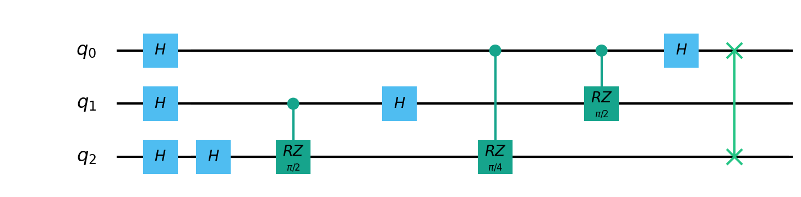
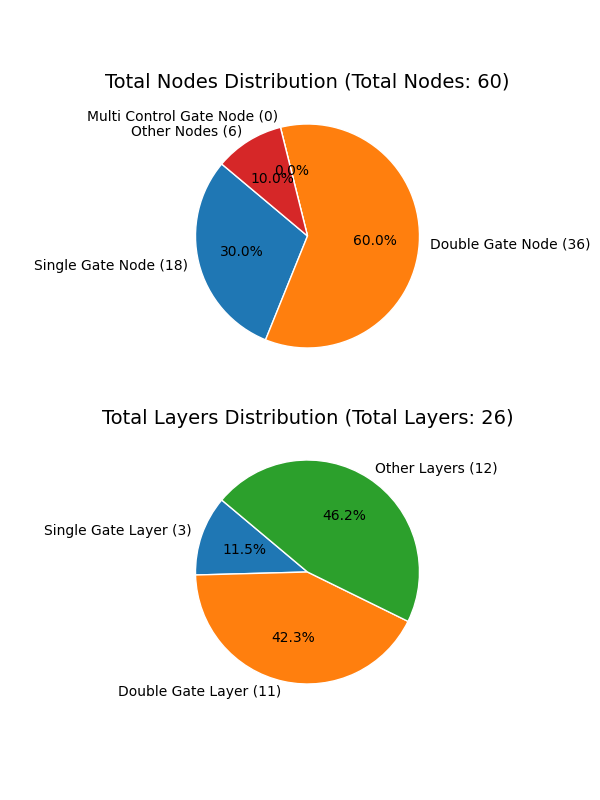
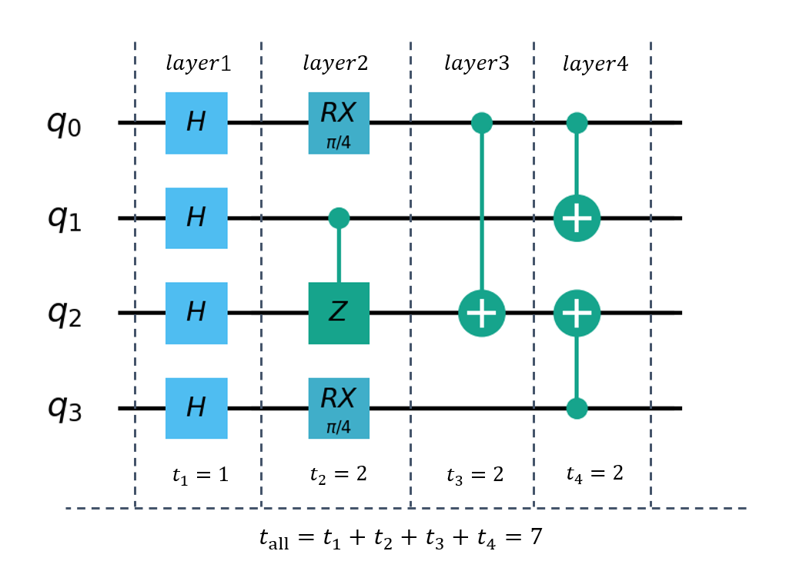

.. _QProgInfoCount:

量子程序统计
=======================

量子程序统计
--------------
在量子算法的设计以及量子计算机的性能分析中，经常需要对外界计算参数——量子程序进行分析，了解量子程序的结构信息对于优化和调试量子算法至关重要。

为了帮助研究者和开发者更方便地获取量子程序的结构信息，我们提供了一个便捷的接口 ``count_prog_info`` ，用于统计量子程序的节点数和层数

通过使用这个接口，可以快速了解量子程序的总节点数、总层数以及各类型节点和层的数量，为进一步的研究和优化提供有力支持，以及同时提供简单的可视化接口

当涉及到量子程序的层数（Layer）时，我们实际上在描述量子门（Quantum Gate）的分层排列方式。层数是用来表示量子程序中各个量子门在时间轴上的位置关系，从而更好地理解量子计算过程的组织和流程。

在量子计算中，每一层代表了一组同时执行的量子门操作，这些操作可以并行地在量子计算机的不同量子比特上进行。在某一层内，所有的量子门操作都是同时发生的，而不同层之间的操作可以顺序执行。通过合理地分层和排列，我们可以最大限度地利用量子计算机的并行性，提高量子算法的效率。

考虑下面的例子：

在这个例子中，第一层的三个H门可以同时执行，上图中一共可以划分为7层，我们可以采用不同的优化策略和编译算法来最小化层数，从而优化量子程序的执行效率和减少量子比特的错误率。

总之，量子程序的层数是对量子门操作在时间上排列的一种描述，用于指导量子计算的顺序执行。理解层数的概念对于优化和调试量子程序非常重要。

.. _count_prog_info:

pyqpanda中可以使用 ``count_prog_info`` 对层数和节点数进行统计。

.. class:: ProgCount

    该类用于统计量子程序的信息，包括双比特门层数、双比特门数量、单比特门数量、多控制门数量、总量子门数量、层数、节点数量等。

    .. attribute:: double_gate_layer_num

        纯双比特门的层数。

    .. attribute:: double_gate_num

        双比特门的数量。

    .. attribute:: gate_num

        总门的数量。

    .. attribute:: layer_num

        量子线路的层数。

    .. attribute:: node_num

        节点的数量。

    .. attribute:: single_gate_layer_num

        纯单比特门的层数。

    .. attribute:: single_gate_num

        单比特门的数量。

    .. attribute:: multi_control_gate_num

        多控制门的数量。

    .. attribute:: selected_gate_nums

        选取特定量子门的数量

    .. method:: __init__()

        初始化 ProgCount 类实例。

.. function:: count_prog_info(node: QProg, select_gate_types: [] = None) -> ProgCount

    该函数用于统计给定量子程序的信息，包括门层数、门数量等。

    :param node: 要统计信息的量子程序。
    :type node: QProg or QCircuit
    :return: ProgCount 结构，包含统计信息。
    :rtype: ProgCount

    注意：函数支持两种重载方式，分别接受 QProg 和 QCircuit 类型的量子程序作为参数，可以选择指定要统计的量子逻辑门数量合集

    示例用法::

        # 统计 QProg 的信息
        prog_info = count_prog_info(my_qprog)

        # 统计 QCircuit 的信息，并启用优化
        optimized_info = count_prog_info(my_qcircuit ,[pq.GateType.HADAMARD_GATE])

        # 获取统计结果的各种属性
        num_layers = prog_info.layer_num
        num_gates = prog_info.gate_num
        num_double_gates = prog_info.double_gate_num
        # ... 其他属性获取

具体示例可参考下面的程序：

    .. code-block:: python

        import pyqpanda as pq
        import matplotlib.pyplot as plt

        machine = pq.CPUQVM()
        machine.init_qvm()

        q = machine.qAlloc_many(6)
        c = machine.cAlloc_many(6)

        prog = pq.QProg()
        prog << pq.hadamard_circuit(q) << pq.QFT(q) << pq.QFT(q) << pq.measure_all(q,c)

        prog_info = pq.count_prog_info(prog,[pq.GateType.HADAMARD_GATE])

        #总节点数，包括逻辑门，测量和reset等
        print("all nodes num : ",prog_info.node_num)

        #总逻辑门数量
        print("all gate num : ",prog_info.gate_num)

        #总层数
        print("all layer num : ",prog_info.layer_num)

        #总的单门数量
        print("single gate num : ",prog_info.single_gate_num)

        #总的双门数量
        print("double gate num : ",prog_info.double_gate_num)

        #纯单门构成的层数
        print("single gate layer num : ",prog_info.single_gate_layer_num)

        #纯双门构成的层数
        print("double gate layer num : ",prog_info.double_gate_layer_num)

        #筛选的量子逻辑门数量
        print("selected_gate_nums : ",prog_info.selected_gate_nums)

        #可视化接口
        pq.show_prog_info_count(prog)

运行结果如下：

    .. code-block:: python

        all nodes num :  60
        all gate num :  54
        all layer num :  26
        single gate num :  18
        single gate layer num :  3
        double gate layer num :  11
        selected_gate_nums :  {<GateType.HADAMARD_GATE: 10>: 18}

量子程序时钟周期
--------------

量子程序时钟周期用于在已知每个量子逻辑门在运行时所需时间的条件下，估算一个量子程序运行所需要的时间。

每个量子逻辑门的时间设置在项目的元数据配置文件 ``QPandaConfig.xml`` 中，
如果未设置则会给定一个默认值，单量子门的默认时间为1，双量子门的时间为2。

配置文件可仿照下面设置
***********************

    .. code-block:: json

        "QGate": {
            "SingleGate":{
                "U3":{"time":1}
            },
            "DoubleGate":{
                "CNOT":{"time":2},
                "CZ":{"time":2}
            }
        }

具体时间根据每一层中运行时间最长的量子操作依次累加得到的时间，以下图为例，我们可以一共划分为 **4** 层

最终的时钟周期数为每一层的时间累加。

接口介绍
--------------

.. function:: get_qprog_clock_cycle(qprog: QProg, machine: QuantumMachine, optimize: bool = False) -> int

    该函数用于计算给定量子程序在指定量子机器上运行所需的时钟周期数，可以选择是否进行优化来获取不同条件下的时钟周期数。

    :param qprog: 要计算时钟周期的量子程序。
    :type qprog: QProg
    :param machine: 执行量子程序的量子机器。
    :type machine: QuantumMachine
    :param optimize: 是否对量子程序进行优化。默认为 False，为True时需要提供配置文件
    :type optimize: bool, optional
    :return: 量子程序运行所需的时钟周期数，没有单位，不以秒为单位。
    :rtype: int

    示例用法::

        cycle_count = get_qprog_clock_cycle(my_qprog, my_machine, optimize=True)

    .. note::

        时钟周期数是一个与具体硬件和实现有关的相对量，不具备实际物理单位。

    .. seealso:: :class:`~QProg`, :class:`~QuantumMachine`

我们先用pyQPanda构建一个量子程序：

    .. code-block:: python
          
        prog = QProg()
        prog << H(qubits[0]) << CNOT(qubits[0], qubits[1])\
             << iSWAP(qubits[1], qubits[2]) << RX(qubits[3], np.pi / 4)

然后调用 ``get_qprog_clock_cycle`` 接口得到量子程序的时钟周期

    .. code-block:: python
          
        clock_cycle = get_qprog_clock_cycle(qvm, prog)

实例
--------------

    .. code-block:: python
    
        from pyqpanda import *
        import numpy as np

        if __name__ == "__main__":
            qvm = CPUQVM()
            qvm.init_qvm()
            qubits = qvm.qAlloc_many(4)
            cbits = qvm.cAlloc_many(4)

            # 构建量子程序
            prog = QProg()
            prog << H(qubits[0]) << CNOT(qubits[0], qubits[1])\
                 << iSWAP(qubits[1], qubits[2]) << RX(qubits[3], np.pi / 4)

            # 统计量子程序时钟周期
            clock_cycle = get_qprog_clock_cycle(prog, qvm)
            
            print(clock_cycle)

运行结果：

    .. code-block:: c

        5
