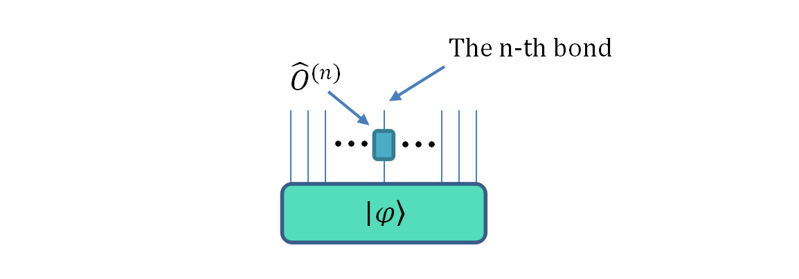
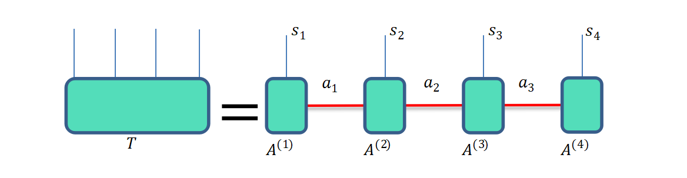

.. _张量网络量子电路模拟器:

张量网络量子虚拟机
=================

对于一个 :math:`N` 个量子比特的自旋体系，对应的希尔伯特空间维数为 :math:`2^{N}` 。

对于该复杂系统的状态演化，传统的全振幅模拟器将其看做一个有 :math:`2^{N}` 个元素的一维向量。

然而从张量网络的角度来看，整个系统量子态的系数对应 :math:`2^{N}` 维张量（即N阶张量，即有 :math:`N` 个指标，每个指标的维数是2），量子操作算符的系数为 :math:`2^{2N}` 维张量（ :math:`2N` 阶张量，即有个 :math:`2N` 指标，每个指标的维数是2），我们可以用如下图形来表示量子态：

当量子系统的自旋个数增加时，量子态系数的个数随指数增加，称为指数墙问题，这一障碍限制了传统全振幅模拟器的最大模拟自旋数和模拟性能。

但是可通过张量网络处理这一问题，从而绕过指数墙障碍，在张量网络中，我们对量子系统的模拟，包括量子逻辑门操作和测量操作，均可以通过对于张量的缩并与分解来实现。矩阵乘积态是张量网络中最常用的表示形式，在多线性代数中称为张量列或TT（Tensor-Train），示意图如下。

将量子态分解成等式右边的表示形式，对于量子线路中部分量子逻辑门操作，可以将全局问题转化为局部的张量处理问题，从而有效地降低了时间复杂度和空间复杂度。

使用介绍
>>>>>>>>>>>>>>>>

``pyqpanda`` 中可以通过 ``MPSQVM`` 类实现用张量网络模拟量子电路。

.. class:: MPSQVM(QuantumMachine)

    该类实现了基于矩阵乘积态（MPS）的量子线路模拟。可以获取测量结果、模拟量子态等操作。

    .. method:: __init__()

        初始化 MPSQVM 类实例。

    .. method:: pmeasure(qubit_list: QVec, select_max: int = -1) -> List[Tuple[int, float]]

        获取量子测量概率分布的列表形式。

        :param qubit_list: 用于测量的量子比特列表。
        :type qubit_list: QVec
        :param select_max: 返回的元素数量上限。默认为 -1，表示无限制。
        :type select_max: int, optional
        :return: 包含量子测量结果的列表，每个元组包含测量结果的索引和对应的概率。
        :rtype: List[Tuple[int, float]]

    .. method:: pmeasure_bin_index(program: QProg, string: str) -> complex

        获取指定二进制字符串的量子态振幅。

        :param program: 要运行的量子程序。
        :type program: QProg
        :param string: 二进制字符串。
        :type string: str
        :return: 指定二进制字符串的量子态振幅。
        :rtype: complex
        :raises run_fail: 获取振幅失败。

    .. method:: pmeasure_bin_subset(program: QProg, string_list: List[str]) -> List[complex]

        获取一组二进制字符串的量子态振幅。

        :param program: 要运行的量子程序。
        :type program: QProg
        :param string_list: 二进制字符串列表。
        :type string_list: List[str]
        :return: 一组二进制字符串的量子态振幅。
        :rtype: List[complex]
        :raises run_fail: 获取振幅失败。

    .. method:: pmeasure_dec_index(program: QProg, string: str) -> complex

        获取指定十进制字符串的量子态振幅。

        :param program: 要运行的量子程序。
        :type program: QProg
        :param string: 十进制字符串。
        :type string: str
        :return: 指定十进制字符串的量子态振幅。
        :rtype: complex
        :raises run_fail: 获取振幅失败。

    .. method:: pmeasure_dec_subset(program: QProg, string_list: List[str]) -> List[complex]

        获取一组十进制字符串的量子态振幅。

        :param program: 要运行的量子程序。
        :type program: QProg
        :param string_list: 十进制字符串列表。
        :type string_list: List[str]
        :return: 一组十进制字符串的量子态振幅。
        :rtype: List[complex]
        :raises run_fail: 获取振幅失败。

    .. method:: prob_run_dict(program: QProg, qubit_list: QVec, select_max: int = -1) -> Dict[str, float]

        运行量子程序并获取测量概率结果的字典形式。

        :param program: 要运行的量子程序。
        :type program: QProg
        :param qubit_list: 用于测量的量子比特列表。
        :type qubit_list: QVec
        :param select_max: 返回的元素数量上限。默认为 -1，表示无限制。
        :type select_max: int, optional
        :return: 包含测量概率的字典，键为测量结果的二进制字符串，值为对应的测量概率。
        :rtype: Dict[str, float]
        :raises run_fail: 运行量子程序失败。

    .. method:: prob_run_list(program: QProg, qubit_list: QVec, select_max: int = -1) -> List[float]

        运行量子程序并获取测量概率结果的列表形式。

        :param program: 要运行的量子程序。
        :type program: QProg
        :param qubit_list: 用于测量的量子比特列表。
        :type qubit_list: QVec
        :param select_max: 返回的元素数量上限。默认为 -1，表示无限制。
        :type select_max: int, optional
        :return: 包含测量概率的列表。
        :rtype: List[float]
        :raises run_fail: 运行量子程序失败。

    .. method:: prob_run_tuple_list(program: QProg, qubit_list: QVec, select_max: int = -1) -> List[Tuple[int, float]]

        运行量子程序并获取测量概率结果的元组列表形式。

        :param program: 要运行的量子程序。
        :type program: QProg
        :param qubit_list: 用于测量的量子比特列表。
        :type qubit_list: QVec
        :param select_max: 返回的元素数量上限。默认为 -1，表示无限制。
        :type select_max: int, optional
        :return: 包含测量概率的元组列表，每个元组包含测量结果的索引和对应的概率。
        :rtype: List[Tuple[int, float]]
        :raises run_fail: 运行量子程序失败。

    .. method:: quick_measure(qubit_list: QVec, shots: int) -> Dict[str, int]

        快速进行多次测量。

        :param qubit_list: 用于测量的量子比特列表。
        :type qubit_list: QVec
        :param shots: 测量操作的重复次数。
        :type shots: int
        :return: 包含多次测量结果的字典，键为测量结果的二进制字符串，值为对应的出现次数。
        :rtype: Dict[str, int]
        :raises run_fail: 运行量子程序失败。

    .. method:: set_measure_error(noise_model: NoiseModel, error_rate: float, gate_type: GateType = GateType.HADAMARD_GATE, qubits: List[QVec] = []) -> None

        设置测量误差模型。

        :param noise_model: 噪声模型。
        :type noise_model: NoiseModel
        :param error_rate: 误差率。
        :type error_rate: float
        :param gate_type: 误差应用的门类型。默认为 GateType.HADAMARD_GATE。
        :type gate_type: GateType, optional
        :param qubits: 用于应用误差的量子比特列表。默认为空列表。
        :type qubits: List[QVec], optional
        :return: 无返回值。

    .. method:: set_mixed_unitary_error(gate_type: GateType, error_matrix: List[List[complex]], qubits: List[QVec] = []) -> None

        设置混合幺正误差模型。

        :param gate_type: 门类型。
        :type gate_type: GateType
        :param error_matrix: 误差矩阵。
        :type error_matrix: List[List[complex]]
        :param qubits: 用于应用误差的量子比特列表。默认为空列表。
        :type qubits: List[QVec], optional
        :return: 无返回值。

    .. method:: set_noise_model(noise_model: NoiseModel, gate_type: GateType, error_rate: float, qubits: List[QVec] = []) -> None

        设置噪声模型。

        :param noise_model: 噪声模型。
        :type noise_model: NoiseModel
        :param gate_type: 误差应用的门类型。
        :type gate_type: GateType
        :param error_rate: 误差率。
        :type error_rate: float
        :param qubits: 用于应用误差的量子比特列表。默认为空列表。
        :type qubits: List[QVec], optional
        :return: 无返回值。

    .. method:: set_readout_error(readout_params: List[List[float]], qubits: QVec) -> None

        设置读数误差模型。

        :param readout_params: 读数误差参数列表。
        :type readout_params: List[List[float]]
        :param qubits: 用于应用误差的量子比特列表。
        :type qubits: QVec
        :return: 无返回值。

    .. method:: set_reset_error(reset_0_param: float, reset_1_param: float) -> None

        设置重置误差模型。

        :param reset_0_param: 重置到0态的参数。
        :type reset_0_param: float
        :param reset_1_param: 重置到1态的参数。
        :type reset_1_param: float
        :return: 无返回值。

    .. method:: set_rotation_error(param: float) -> None

        设置旋转门误差模型。

        :param param: 误差参数。
        :type param: float
        :return: 无返回值。

和许多其他模拟器的使用方法一样，都具有相同的量子虚拟机接口，比如下述简单的使用示例代码:

    .. code-block:: python

        from numpy import pi
        from pyqpanda import *

        # 构建量子虚拟机
        qvm = MPSQVM()

        # 初始化操作
        qvm.set_configure(64, 64)
        qvm.init_qvm()

        q = qvm.qAlloc_many(10)
        c = qvm.cAlloc_many(10)

        # 构建量子程序
        prog = QProg()
        prog << hadamard_circuit(q)\
            << CZ(q[2], q[4])\
            << CZ(q[3], q[7])\
            << CNOT(q[0], q[1])\
            << Measure(q[0], c[0])\
            << Measure(q[1], c[1])\
            << Measure(q[2], c[2])\
            << Measure(q[3], c[3])

        # 量子程序运行100次，并返回测量结果
        result = qvm.run_with_configuration(prog, c, 100)

        # 打印量子态在量子程序多次运行结果中出现的次数
        print(result)

        qvm.finalize()

完整示例代码
>>>>>>>>>>
----

.. _张量网络虚拟机示例程序:
以下示例展示了张量网络模拟器计算部分接口的使用方式

    .. code-block:: python

        from numpy import pi
        from pyqpanda import *

        qvm = MPSQVM()
        qvm.set_configure(64, 64)
        qvm.init_qvm()

        q = qvm.qAlloc_many(10)
        c = qvm.cAlloc_many(10)

        prog = QProg()
        prog << hadamard_circuit(q)\
            << CZ(q[2], q[4])\
            << CZ(q[3], q[7])\
            << CNOT(q[0], q[1])\
            << CZ(q[3], q[7])\
            << CZ(q[0], q[4])\
            << RY(q[7], pi / 2)\
            << RX(q[8], pi / 2)\
            << RX(q[9], pi / 2)\
            << CR(q[0], q[1], pi)\
            << CR(q[2], q[3], pi)\
            << RY(q[4], pi / 2)\
            << RZ(q[5], pi / 4)\
            << Measure(q[0], c[0])\
            << Measure(q[1], c[1])\
            << Measure(q[2], c[2])

        # Monte Carlo采样模拟接口
        result0 = qvm.run_with_configuration(prog, c, 100)

        # 概率测量接口
        result1 = qvm.prob_run_dict(prog, [q[0], q[1], q[2]], -1)

        print(result0)
        print(result1)

        qvm.finalize()

    上述代码中 ``run_with_configuration`` 与 ``prob_run_dict`` 接口分别用于Monte Carlo采样模拟和概率测量，他们分别输出模拟采样的结果和对应振幅的概率，上述程序的计算结果如下

    .. code-block:: python

        # Monte Carlo 采样模拟结果
        {'0000000000': 7, 
         '0000000001': 12, 
         '0000000010': 13, 
         '0000000011': 10, 
         '0000000100': 16, 
         '0000000101': 14, 
         '0000000110': 12, 
         '0000000111': 16}

        # 概率测量结果
        {'000': 0.12499999999999194, 
         '001': 0.12499999999999185, 
         '010': 0.12499999999999194, 
         '011': 0.124999999999992, 
         '100': 0.12499999999999198, 
         '101': 0.12499999999999194, 
         '110': 0.12499999999999198, 
         '111': 0.12499999999999208}