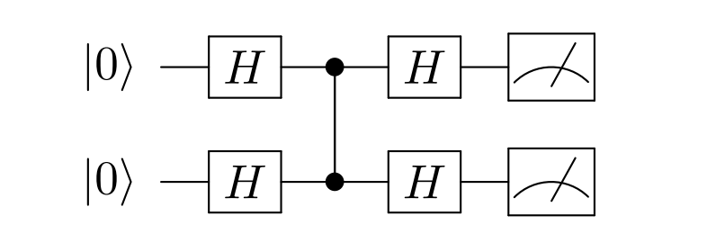
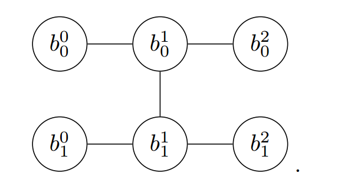
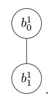

.. _单振幅量子虚拟机:

单振幅量子虚拟机
======================

背景与方案细节
>>>>>>>>>>>>>

短期内，量子霸权的存在，超出了现有经典算法在最先进计算机或超算上的能力，这刺激了最近在模拟量子电路的经典算法方面的进展。

与适用于低比特高深度的全向量模拟相比，单振幅模拟器将量子电路的模拟推广到一个无向图形模型上，并在精确推理的背景下，利用变量消去算法进行了计算。

首先我们在量子线路演化中引入费曼路径积分方法。

我们用酉矩阵的乘积来表示量子电路 :math:`U^{(t)}` ，其中t表示不同的时钟周期。

在电路的最后一个周期后，我们引入以下符号来表示特定量子位串的振幅。

.. math::

    \langle x|\mathcal{U}| 0 \ldots 0\rangle=\sum_{\left\{b^t\right\}} \prod_{t=0}^{d-1}\left\langle b^{t+1}\left|U^{(t)}\right| b^t\right\rangle, \quad\left|b^d\right\rangle=|x\rangle

这里 :math:`\left|b^t\right\rangle=\otimes_{j=1}^n\left|b_j^t\right\rangle` ，以及  :math:`\left|b_i^t\right\rangle` 对应量子态  :math:`|0\rangle` 或  :math:`|1\rangle` 的第 :math:`j`-th 比特。

上述表达式可以看作是n量子位系统的 :math:`\left\{b^0, \ldots, b^d\right\}` 的费曼路径积分形式。

根据上文所说，一个量子线路是多个酉矩阵的乘积，即 :math:`\mathcal{U}=U_g \cdots U_1` ，其中对于一个对角矩阵可以用如下表述：

.. math::

    U=\sum_{b \in\{0,1\}} \psi_U(b)|b\rangle\langle b| \quad \text { (diagonal) }

其中 :math:`\psi_U(b)` 是一个布尔变量的复函数，对于一个非对角矩阵，比如 :math:`\mathrm{H}, \mathrm{X}^{1 / 2}, \mathrm{Y}^{1 / 2}` ,有

.. math::

    U=\sum_{b, b^{\prime} \in\{0,1\}} \psi_U\left(b^{\prime}, b\right)\left|b^{\prime}\right\rangle\langle b| \quad \text { (non-diagonal) }

其中 :math:`\psi_U\left(b, b^{\prime}\right)` 是两个布尔变量的复函数，例如对于一个H门， :math:`\psi_{\mathrm{H}}(1,1)= -1 / \sqrt{2}` , 其他项等于 :math:`1 / \sqrt{2}` 。
一个对角双门，例如CZ，可以写成如下形式

.. math::

    U=\mathrm{CZ}=\sum_{b, b^{\prime} \in\{0,1\}} \psi_{\mathrm{CZ}}\left(b, b^{\prime}\right)\left|b, b^{\prime}\right\rangle\left\langle b, b^{\prime}\right|,

根据对角矩阵和非对角矩阵的性质，可以在有向无环图中分别用不同形状表示，以如下量子线路为例

假设以初态 :math:`| 00\rangle` 计算量子态末态为 :math:`| 00\rangle` 的概率，对应的有向无环图模型为

因为初态和末态是确定的，我们有 :math:`b_0^0=b_0^2=b_1^0=b_1^2=0` 。图可以简化为如下形式：

这个图的树宽为2 ,我们可以计算出

.. math::

    \begin{array}{r}
    \langle 00|C| 00\rangle=\sum_{b_0^1, b_1^1} \psi_{\mathrm{H}}\left(0, b_0^1\right) \psi_{\mathrm{CZ}}\left(b_0^1, b_1^1\right) \psi_{\mathrm{H}}\left(b_0^1, 0\right) \\
    \psi_{\mathrm{H}}\left(0, b_1^1\right) \psi_{\mathrm{H}}\left(b_1^1, 0\right) .
    \end{array}

函数 :math:`\psi_{\mathrm{H}}` 对应的H门映射表可以写为

.. math::

    \begin{array}{|ll|c|}
    \hline 0 & 0 & 1 / \sqrt{2} \\
    0 & 1 & 1 / \sqrt{2} \\
    1 & 0 & 1 / \sqrt{2} \\
    1 & 1 & -1 / \sqrt{2} \\
    \hline
    \end{array}

函数 :math:`\psi_{\mathrm{CZ}}` 对应的CZ门映射表可以写为

.. math::

    \begin{array}{|ll|c|}
    \hline 0 & 0 & 1 \\
    0 & 1 & 1 \\
    1 & 0 & 1 \\
    1 & 1 & -1 \\
    \hline
    \end{array}

上面的等式就可以重写为

.. math::

    \langle 00|C| 00\rangle=\sum_{b_0^1, b_1^1} \tau_1\left(b_0^1, b_1^1\right)

其中表中 :math:`\tau_1` 的映射关系为

.. math::

    \begin{array}{|ll|c|}
    \hline 0 & 0 & 1 / 4 \\
    0 & 1 & 1 / 4 \\
    1 & 0 & 1 / 4 \\
    1 & 1 & -1 / 4 \\
    \hline
    \end{array}

如果我们把所有的 :math:`b_1^1` 相加可以得到

.. math::

    \langle 00|C| 00\rangle=\sum_{b_0^1} \tau_2\left(b_0^1\right)

其中 :math:`\tau_2` 为

.. math::

    \begin{array}{|c|c|}
    \hline 0 & 1 / 2 \\
    1 & 0 \\
    \hline
    \end{array}

最终， 对 :math:`b_0^1` 求和，可以计算出末态的概率

.. math::

    \langle 00|C| 00\rangle=1 / 2 .

使用介绍
>>>>>>>>>>>>>>>>

.. class:: SingleAmpQVM(QuantumMachine)

    量子单振幅模拟器类
    =======================

    该类实现了基于单振幅的量子线路模拟，借助于费曼积分路径和quickBB，可以快速模拟大比特稀疏量子线路的单个振幅

    .. method:: __init__()

        初始化单振幅模拟器类实例。

    .. method:: pmeasure_bin_amplitude(bin_string: str) -> complex

        获取指定二进制字符串的量子态振幅。

        :param bin_string: 二进制字符串。
        :type bin_string: str
        :return: 指定二进制字符串的量子态振幅。
        :rtype: complex
        :raises run_fail: 获取振幅失败。

    .. method:: pmeasure_bin_index(bin_string: str) -> float

        获取指定二进制字符串的量子态概率振幅。

        :param bin_string: 二进制字符串。
        :type bin_string: str
        :return: 指定二进制字符串的量子态概率振幅。
        :rtype: float
        :raises run_fail: 获取概率振幅失败。

    .. method:: pmeasure_dec_amplitude(dec_string: str) -> complex

        获取指定十进制字符串的量子态振幅。

        :param dec_string: 十进制字符串。
        :type dec_string: str
        :return: 指定十进制字符串的量子态振幅。
        :rtype: complex
        :raises run_fail: 获取振幅失败。

    .. method:: pmeasure_dec_index(dec_string: str) -> float

        获取指定十进制字符串的量子态概率振幅。

        :param dec_string: 十进制字符串。
        :type dec_string: str
        :return: 指定十进制字符串的量子态概率振幅。
        :rtype: float
        :raises run_fail: 获取概率振幅失败。

    .. method:: run(prog: QProg, qubit_list: QVec, max_rank: int = 30, alloted_time: int = 5) -> None

        运行量子程序。

        :param prog: 要运行的量子程序。
        :type prog: QProg
        :param qubit_list: 用于运行的量子比特列表。
        :type qubit_list: QVec
        :param max_rank: 最大秩限制。默认为 30。
        :type max_rank: int, optional
        :param alloted_time: 允许quickBB的运行时间。默认为 5。
        :type alloted_time: int, optional
        :return: 无返回

其使用方式与前面介绍的量子虚拟机模块非常类似，首先通过 ``SingleAmpQVM`` 初始化一个单振幅量子虚拟机对象用于管理后续一系列行为。

    .. code-block:: python

        from pyqpanda import *
        from numpy import pi
        
        qvm = SingleAmpQVM()

然后是量子程序的初始化、构建与装载过程：

    .. code-block:: python

        qvm.init_qvm()

        qv = qvm.qAlloc_many(10)
        cv = qvm.cAlloc_many(10)

        prog = QProg()

        # 构建量子程序
        prog << CZ(qv[1], qv[5])\
            << CZ(qv[3], qv[5])\
            << CZ(qv[2], qv[4])\
            << CZ(qv[3], qv[7])\
            << CZ(qv[0], qv[4])\
            << RY(qv[7], pi / 2)\
            << RX(qv[8], pi / 2)\
            << RX(qv[9], pi / 2)\
            << CR(qv[0], qv[1], pi)\
            << CR(qv[2], qv[3], pi)\
            << RY(qv[4], pi / 2)\
            << RZ(qv[5], pi / 4)\
            << RX(qv[6], pi / 2)\
            << RZ(qv[7], pi / 4)\
            << CR(qv[8], qv[9], pi)\
            << CR(qv[1], qv[2], pi)\
            << RY(qv[3], pi / 2)\
            << RX(qv[4], pi / 2)\
            << RX(qv[5], pi / 2)\
            << CR(qv[9], qv[1], pi)\
            << RY(qv[1], pi / 2)\
            << RY(qv[2], pi / 2)\
            << RZ(qv[3], pi / 4)\
            << CR(qv[7], qv[8], pi)

然后是调用计算接口，需要注意的是， ``run`` 方法是调用计算振幅前必须调用的函数，用于正确生成有向无环图和计算路径，

``pmeasure_bin_index`` ,使用时需要结合 ``run`` 方法。用法示例：

    .. code-block:: python

        # run 有三个参数，默认2个，
        # 第一个执行的量子程序
        # 第二个为申请的量子比特
        # 第三个为最大RANK，这里根据内存设置，默认30
        # 第四个就是quickBB优化的最大运行时间，默认5s

        qvm.run(prog, qv)
        bin_result = qvm.pmeasure_bin_index("0001000000") 
        print("0001000000 : ", bin_result)

结果输出如下：

    .. code-block:: python

        0001000000 :  0.001953123603016138

``pmeasure_dec_index`` ,使用时需要结合 ``run`` 方法。用法示例：

    .. code-block:: python

        qvm.run(prog, qv)
        dec_result = qvm.pmeasure_dec_index("2")
        print("2 : ",dec_result)

结果输出如下：

    .. code-block:: python

        2 :  0.001953123603016138
  