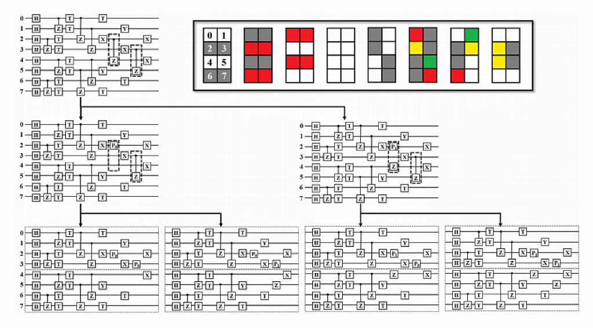

.. _部分振幅量子虚拟机:

部分振幅量子虚拟机
=========================

目前用经典计算机模拟量子虚拟机的主流解决方案有全振幅与单振幅两种。除此之外，还有部分振幅量子虚拟机，该方案[1]能在更低的硬件条件下，实现更高的模拟效率。

背景介绍
--------

在过去的几年里，半导体量子芯片也取得了很大进展[3-5]。量子霸权声称如果制造出一个由50个量子位组成的装置，经典计算机的极限将被超越（即直接模拟50个量子位需要大约16-PB的RAM来存储完整的向量）。

Google和ibm团队已经提出了一些有效的方法来模拟49量子位以上的低深度电路(例如延迟纠缠门)[2]。

在这里我们提出了一种优化低深度大采样数量子电路经典模拟的方案并对其进行了64量子位模拟。

具体来说，大致方案是通过将几个控制Z (CZ)门变换为测量门和单量子位门，将电路映射到多个额外的子电路中。

这些子电路由两个块组成，它们之间没有任何量子比特纠缠，从而将 **一个N量子比特的模拟问题转化为一组N/2的电路求解问题** 。

我们的方法是类似于二维网格的平衡切割，对于一个CZ门，分裂成四个子电路，然后将所有子电路的结果相加，以重建最终状态。

模拟方案细节
------------

部分振幅量子虚拟机的基本思想是将大比特的量子程序拆分成若干个小比特量子程序，每个小比特量子线路使用全振幅算法计算，量子程序的拆分规则如下： 若量子线路中出现跨节点的双量子逻辑门，则对量子程序进行拆分。即以量子程序中量子比特数为总量子比特数的一半或接近一半为分界线，例如总量子比特数为10，则4号比特与5号比特之间为分界线。 双量子逻辑门的控制位量子比特与目标位量子比特分别处于界线的两侧，称为跨节点，例如总量子比特数为10，CNOT(1,5)为跨节点，CNOT(1,4)则没有跨节点。

一个CZ门可以转化为两组测量门和单量子位门的组合，具体的

.. math::

    \mathrm{CZ}=P_0 \times I+P_1 \times Z

其中I表示单位矩阵,Z表示Pauli-Z矩阵

.. math::

    P_0=\left(\begin{array}{ll}1 & 0 \\ 0 & 0\end{array}\right)
    P_1=\left(\begin{array}{ll}0 & 0 \\ 0 & 1\end{array}\right)

对于其他双量子逻辑门，如CR、iSWAP、SqiSWAP等， 可以通过量子逻辑门转化算法将其转换成单量子逻辑门和支持拆分的双量子逻辑门的组合，再对双量子逻辑门进行拆分，拆分过程的示例图如下：

上图是拆分的一个例子。第一行是原来的电路。框中的两个CZ门将前四位和最后四位纠缠在一起。接着，转换左CZ门，原电路等效于第二行电路的加法。继续右CZ门被转换，在第三行产生四个电路。原电路的最终状态等于所有变换电路的加法。第三行中的虚线将每个电路分成两部分，在两部分中可以独立地进行模拟。 

使用介绍
------------

.. class:: PartialAmpQVM(QuantumMachine)

    量子部分振幅模拟器类,该类实现了基于部分振幅拆分图算法的量子线路模拟。

    .. method:: __init__()

        初始化 PartialAmpQVM 类实例。

    .. method:: get_prob_dict(qubit_list: QVec) -> Dict[str, float]

        获取测量概率结果的字典形式。

        :param qubit_list: 用于测量的量子比特列表。
        :type qubit_list: QVec
        :return: 包含测量概率的字典，键为测量结果的二进制字符串，值为对应的测量概率。
        :rtype: Dict[str, float]
        :raises run_fail: 获取测量概率失败。

    .. method:: init_qvm(type: BackendType = BackendType.CPU) -> None

        初始化量子虚拟机。

        :param type: 子图计算后端的类型。默认为 BackendType.CPU。
        :type type: BackendType, optional
        :return: 无返回值。

    .. method:: pmeasure_bin_index(bin_index: str) -> complex

        获取指定二进制索引的量子态振幅。

        :param bin_index: 二进制索引。
        :type bin_index: str
        :return: 指定二进制索引的量子态振幅。
        :rtype: complex
        :raises run_fail: 获取振幅失败。

    .. method:: pmeasure_dec_index(dec_index: str) -> complex

        获取指定十进制索引的量子态振幅。

        :param dec_index: 十进制索引。
        :type dec_index: str
        :return: 指定十进制索引的量子态振幅。
        :rtype: complex
        :raises run_fail: 获取振幅失败。

    .. method:: pmeasure_subset(index_list: List[str]) -> Dict[str, complex]

        获取量子态部分子集的振幅。

        :param index_list: 量子态索引列表。
        :type index_list: List[str]
        :return: 包含量子态子集振幅的字典，键为量子态索引，值为对应的量子态振幅。
        :rtype: Dict[str, complex]
        :raises run_fail: 获取振幅失败。

    .. method:: run(qprog: QProg, noise_model: Noise = NoiseModel()) -> None

        运行量子程序，拆分原始线路，生成子图。

        :param qprog: 要运行的量子程序。
        :type qprog: QProg
        :param noise_model: 噪声模型。默认为空的噪声模型。
        :type noise_model: Noise, optional
        :return: 无返回值。
        :raises run_fail: 运行量子程序失败。

其使用方式与前面介绍的量子虚拟机模块非常类似，首先通过 ``PartialAmpQVM`` 初始化一个部分振幅量子虚拟机对象用于管理后续一系列行为

    .. code-block:: python

        from pyqpanda import *
        from numpy import pi
        machine = PartialAmpQVM()

然后是量子程序的初始化、构建与装载过程，以QPanda2的部分振幅示例程序来演示：

    .. code-block:: python

        machine.init_qvm()

        q = machine.qAlloc_many(10)
        c = machine.cAlloc_many(10)

        # 构建量子程序
        prog = QProg()
        prog << hadamard_circuit(q)\
             << CZ(q[1], q[5])\
             << CZ(q[3], q[7])\
             << CZ(q[0], q[4])\
             << RZ(q[7], pi / 4)\
             << RX(q[5], pi / 4)\
             << RX(q[4], pi / 4)\
             << RY(q[3], pi / 4)\
             << CZ(q[2], q[6])\
             << RZ(q[3], pi / 4)\
             << RZ(q[8], pi / 4)\
             << CZ(q[9], q[5])\
             << RY(q[2], pi / 4)\
             << RZ(q[9], pi / 4)\
             << CZ(q[2], q[3])

        machine.run(prog)

    部分接口使用如下：

    - ``pmeasure_bin_index(string)`` ,使用示例

        .. code-block:: python

            result = machine.pmeasure_bin_index("0000000000")
            print(result)

        结果输出如下：

        .. code-block:: python

            (-0.00647208746522665-0.006472080945968628j)

    - ``pmeasure_dec_index(string)`` ,使用示例

        .. code-block:: python

            result = machine.pmeasure_dec_index("1")
            print(result)

        结果输出如下：

        .. code-block:: python

            (-4.413170804465268e-19-0.009152913087920392j)

    - ``pmeasure_subset(state_index)`` ,使用示例

        .. code-block:: python

            state_index = ["0", "1", "2"]
            result = machine.pmeasure_subset(state_index)
            print(result)

        结果输出如下：

        .. code-block:: python

             {'0': (-0.006472086912079613-0.00647208691207961j), 
              '1': (-4.413170804465268e-19-0.009152913087920392j), 
              '2': (-3.0357660829594124e-18-0.009152913087920392j)}

        
参考文献
---------
::

    [1] 64-qubit quantum circuit simulation Zhao-Yun Chen1,Qi Zhou,Cheng Xue,Guang-Can Guo,Guo-PingGuo(2020). 
    [2] Pednault E, Gunnels JA, Nannicini G, et al. Breaking the 49-qubit barrier in the simulation of quantum circuits. Preprint at https://arxiv.org/abs/1710.05867v1 (2017). 
    [3] Cao G, Li HO, Tu T, et al. Ultrafast universal quantum control of a quantum-dot charge qubit using Landau-Zener-Stuckelberg interference. Nat Commun 4: 1401 (2013). 
    [4] Li HO, Cao G, Yu GD, et al. Conditional rotation of two strongly coupled semiconductor charge qubits. Nat Commun 6: 7681 (2015). 
    [5] Li HO, Cao G, Yu GD, et al. Controlled quantum operations of a semiconductor three-qubit System. Phys Rev A 9: 024015 (2018). 
