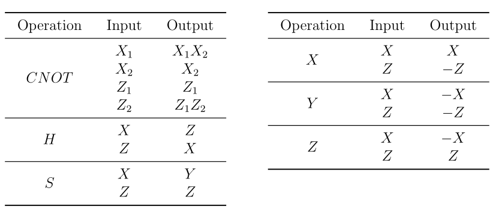

.. _Stabilizer:

稳定器与Clifford模拟器
=========================
----

概述
>>>>>>>>>>>>>>>>
----

**叠加和纠缠** 都是量子优势的典型来源，但是当系统包含的量子比特个数N增加时，量子态系数的个数随N指数增加，将无法使用经典计算机实现传统的全振幅模拟，这一问题称为 **指数墙问题** 。

基于 **Gottesman_knill定理** ，我们可以得知，在基于特定门集形成的稳定器线路中，我们是可以通过多项式复杂度进行模拟的，而这也意味着，可以在某些特定逻辑门构造的线路中打破量子的指数级加速霸权，将经典模拟应用到量子线路中，从而验证量子计算机的结果是否正确。并且在未来的容错量子计算机中，必然是需要冗余信息进行编码，从而达到容错计算的可能，这显然在基于目前量子计算模拟框架中是无法实现大比特线路的。

我们可以另辟蹊径，通过 **stabilizer** 及对应的 **Clifford** 门集模拟器可以有效利用其多项式模拟的特性，解决基于pauli噪声的容错量子计算。同时，为了推广到通用量子计算，也可以将stabilizer的理论性质带入到 **Clifford+T** 的模拟中，基于 **Clifford+T** 的模拟器，我们可以解决大比特下的non-clifford逻辑门较少前提下的量子模拟(Clifford+T可以近似分解任意逻辑门)。

原理介绍
>>>>>>>>>>>>>>>>
----

对于一个量子态 :math:`|\psi\rangle` （一般指纯态），如果存在一个酉矩阵U使得 :math:`U|\psi\rangle = |\psi\rangle` ，那么称 :math:`|\psi\rangle` 可以被U所stabilize，U是 :math:`|\psi\rangle` 的一个stabilizer，比如 :math:`Z|0\rangle = |0\rangle` 。

很明显，一个量子态存在多个stabilizer，当有多个stabilizer时，这些stabilizer的乘积自然也是stabilizer。

 :math:`Z_{1}Z_{2}X_{1}X_{2}|\psi\rangle = Z_{1}Z_{2}|\psi\rangle = |\psi\rangle` 

这种乘法封闭性告诉我们stabilizer会形成一个 **群** 。

对于量子态 :math:`|\psi\rangle` ，若幺正变换群S中的每个元素都是 :math:`|\psi\rangle` 的stabilizer，则称整个幺正变换群S是 :math:`|\psi\rangle` 的stabilizer group。

一般情况下我们只关注 :math:`P\text{auli}` 矩阵 :math:`\left\{ X,Y,Z,I \right\}` 作为stabilizer的情况，即
幺正变换群由Pauli群构成，即

 :math:`Stab(|\psi\rangle) = \left\{ P \in \mathcal{P}_{n}:P|\psi\rangle = |\psi\rangle \right\}` 

上述式子中，Pauli群 :math:`\mathcal{P}_{n}` 定义为作用在n比特上的 :math:`P\text{auli}` 操作符的集合，其中相位系数为 :math:`\pm 1` 和 :math:`\pm i` 。

 :math:`\mathcal{P}_{n} = \left\{ i^{\gamma}X(a)Z(b):\gamma \in \{ 0,1,2,3\},a,b \in \{ 0,1\}^{n} \right\}` 

该Pauli群中 :math:`P^{(1)},\ldots,P^{(m)} \in \mathcal{P}_{n}` 各个元素均是独立的。那么我们依据Pauli群的特殊性质可以得到：

 :math:`\begin{matrix} \text{Stab}(|00\rangle)\& = \left\{ I,Z_{1},Z_{2},Z_{1}Z_{2} \right\}\& = \left\langle Z_{1},Z_{2} \right\rangle \\ \text{Stab}(| + + \rangle)\& = \left\{ I,X_{1},X_{2},X_{1}X_{2} \right\}\& = \left\langle X_{1},X_{2} \right\rangle \\ \text{Stab}\left( \frac{\left| 00 \right\rangle + \left| 11 \right\rangle}{\sqrt{2}} \right)\& = \left\{ I,X_{1}X_{2},Z_{1}Z_{2}, - Y_{1}Y_{2} \right\}\& = \ \left\langle X_{1}X_{2},Z_{1}Z_{2} \right\rangle \\ \text{Stab}\left( \left| 0^{n} \right\rangle \right)\& = \left\{ Z(a):a \in \{ 0,1\}^{n} \right\}\& = \left\langle Z_{1},\ldots,Z_{n} \right\rangle \\ \end{matrix}` 

问题在于如何构造 **Stabilizer Group** ，这里就不得不提到，当 **Cliffford Group** 门集中的元素作用在Pauli群上会有这样一组变换:

 :math:`\mathbf{P|\psi\rangle = |\psi\rangle \Longleftrightarrow}\left( \mathbf{\text{UP}}\mathbf{U}^{\mathbf{\dagger}} \right)\mathbf{U|\psi\rangle = U|\psi\rangle}` 

当我们将群写成形式 :math:`P = i^{\gamma}X(a)Z(b)` ， **Cliffford Group** 的作用形式如下：

 :math:`U_{j}PU_{j}^{\dagger} = i^{\gamma}X^{a_{1}}Z^{b_{1}} \otimes \ldots \otimes X^{a_{j - 1}}Z^{b_{j - 1}} \otimes UX^{a_{j}}Z^{b_{j}}U^{\dagger} \otimes X^{a_{j + 1}}Z^{b_{j + 1}} \otimes \ldots \otimes X^{a_{n}}Z^{b_{n}}` 

我们会惊讶的发现， :math:`\mathbf{U}_{\mathbf{j}}\mathbf{P}\mathbf{U}_{\mathbf{j}}^{\mathbf{\dagger}}\mathbf{=}\mathbf{P}_{\mathbf{\text{new}}}` 。也就如下图所示：

这里可以发现，我们将 :math:`\mathcal{P}_{n}` 中的Y的变换去除了，这是由于 :math:`Y = IXZ` 。

 :math:`|\psi\rangle \rightarrow U|\psi\rangle` 

等价的只需要追踪stabilizer的演化，同样可以得到系统完整的动力学信息。

 :math:`S \rightarrow USU^{\dagger}` 

这里将量子态的逻辑门演化问题转化为更新量子态对应的 **Stabilizer Group** 问题，即使用 **Stabilizer** 模拟量子线路的核心思想是使用 **Stabilizer Group** 表征量子态，而不是传统模拟器的振幅。

也就是说，在基于特定门集形成的稳定器线路中，根据线路特性，通过多项式复杂度即可进行模拟超大数量的量子线路 **（仅限由Clifford量子逻辑门集合和衍生集合组成：H, S, X, Y, Z, CNOT, CY, CZ, SWAP ）** 

使用介绍
>>>>>>>>>>>>>>>>
----

``pyqpanda`` 中可以通过 ``Stabilizer`` 类实现对大比特的Clifford线路模拟，和许多其他模拟器有类似的功能接口:

.. class:: Stabilizer(QuantumMachine)

    基于Stablizer，模拟基本的Clifford量子线路的模拟器。

    :ivar NoiseModel _noise_model: 噪声模型，用于模拟实际量子系统中的噪声。

    :ivar bool _noise_set: 是否已设置噪声模型。

    .. automethod:: __init__

    .. automethod:: init_qvm

    .. automethod:: prob_run_dict

    .. automethod:: run_with_configuration

    .. automethod:: set_noise_model

    .. method:: __init__()

        构造函数，初始化 `Stabilizer` 类的实例。

    .. method:: init_qvm()

        初始化Stablizer。

    .. method:: prob_run_dict(qprog: QProg, qubits: QVec, select_max: int = -1) -> Dict[str, float]

        运行量子程序并获取概率结果。

        :param qprog: 要运行的量子程序。
        :type qprog: QProg
        :param qubits: 用于测量的量子比特。
        :type qubits: QVec
        :param select_max: 最大选择数（默认为 -1 表示不限制）。
        :type select_max: int, optional
        :return: 量子程序的概率结果。
        :rtype: Dict[str, float]

    .. method:: run_with_configuration(qprog: QProg, shot: int) -> Dict[str, int]

        运行量子程序并获取测量结果。

        :param qprog: 要运行的量子程序。
        :type qprog: QProg
        :param shot: 测量次数。
        :type shot: int
        :return: 量子程序的测量结果。
        :rtype: Dict[str, int]

    .. method:: set_noise_model(noise_model: NoiseModel, gate_types: Union[GateType, List[GateType]], prob: float, target_qubits: Optional[Union[QVec, List[QVec]]] = None) -> None

        设置噪声模型，用于模拟实际量子系统中的噪声。

        :param noise_model: 噪声模型。
        :type noise_model: NoiseModel
        :param gate_types: 受噪声影响的门类型或门类型列表。
        :type gate_types: Union[GateType, List[GateType]]
        :param prob: 噪声发生的概率。
        :type prob: float
        :param target_qubits: 受噪声影响的目标量子比特或目标量子比特列表（可选）。
        :type target_qubits: Optional[Union[QVec, List[QVec]]]
        :return: 无返回值。
        :rtype: None

        此函数允许您设置用于模拟实际量子系统中噪声的噪声模型，以及受影响的门类型和概率。可以选择指定受影响的目标量子比特，目前支持的噪声模型如下：
         - ``bit-flip`` ：比特翻转噪声模型，按指定概率发生X方向错误
         - ``phase-flip`` ：相位翻转噪声模型，按指定概率发生Y方向错误
         - ``bit-phase-flip`` ：比特相位翻转噪声模型，按指定概率发生Z方向错误
         - ``phase-damping`` ：相位阻尼噪声模型，相位阻尼可转化为相位反转噪声模型
         - ``depolarizing`` ：去极化噪声模型,X,Y和Z三个方向上发生等概率错误

采样测量
>>>>>>>>>>
----

    .. code-block:: python

        from numpy import pi
        from pyqpanda import *

        # 初始化Clifford模拟器，默认最大支持6000比特
        machine = Stabilizer()
        machine.init_qvm()

        q = machine.qAlloc_many(100)
        c = machine.cAlloc_many(100)

        # 构建量子线路，支持的门集为{ H, S, X, Y, Z, CNOT, CY, CZ, SWAP }
        prog = QProg()
        prog.insert(X(q[1]))\
            .insert(H(q[2]))\
            .insert(H(q[49]))\
            .insert(Z(q[2]))\
            .insert(CZ(q[0], q[22]))\
            .insert(CNOT(q[2], q[39]))\
            .insert(measure_all(q, c))\

        # run_with_configuration用于获取测量操作的测量结果
        result = machine.run_with_configuration(prog, 1000)
        print(result)

        machine.finalize()
    
    输出结果如下：

    .. code-block:: python

      {'000000000000000000000000000000000000000000000000000000000010': 254, 
       '000000000000000000001000000000000000000000000000000000000110': 279, 
       '000000000010000000000000000000000000000000000000000000000010': 251, 
       '000000000010000000001000000000000000000000000000000000000110': 216}
      
概率测量
>>>>>>>>>>
----

    .. code-block:: python

        from numpy import pi
        from pyqpanda import *

        # 初始化Clifford模拟器，默认最大支持6000比特
        machine = Stabilizer()
        machine.init_qvm()

        q = machine.qAlloc_many(100)
        c = machine.cAlloc_many(100)

        # 构建量子线路，支持的门集为{ H, S, X, Y, Z, CNOT, CY, CZ, SWAP }
        prog = QProg()
        prog.insert(X(q[1]))\
            .insert(H(q[0]))\
            .insert(H(q[1]))\
            .insert(Z(q[99]))\
            .insert(CZ(q[0], q[22]))\
            .insert(CNOT(q[2], q[98]))\

        # prob_run_dict用于获取指定比特的测量结果
        result = machine.prob_run_dict(prog, [q[0],q[1],q[2]])
        print(result)

        machine.finalize()
    
    输出结果如下：

    .. code-block:: python

        {'000': 0.25, '001': 0.25, '010': 0.25, '011': 0.25, '100': 0.0, '101': 0.0, '110': 0.0, '111': 0.0}