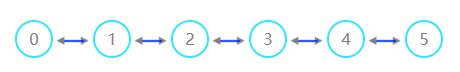

.. _真实芯片计算服务:

真实芯片计算服务
=============================
----

本源悟源超导芯片
>>>>>>>>>>>>>>>>>>>>>>>>>>>>>>

``本源悟源`` 是2020年9月12日本源量子自主研发的超导量子计算机（搭载6比特超导量子处理器夸父 KF C6-130）。得益于本源超导量子计算云平台，量子计算机可以走出实验室，为众多潜在行业提供探索量子计算的基础条件，推进量子计算产业落地与工程化发展，真正为人类社会服务。

超导量子计算云平台作为连接用户和量子计算系统之间的桥梁，在用户向量子系统发起计算任务到量子系统完成计算任务后返回计算结果过程中，发挥着重要的协调中转作用。

本源悟源的 ``芯片拓扑结构图`` 如下：

对应的 ``芯片参数`` 信息如下图：

.. image:: ./images/param.png
   :align: center

对于芯片任务，同样是通过 ``QCloud`` 来提交任务和查询计算计算结果。

.. class:: QCloud(QuantumMachine)

    除了用于与远程计算集群交互， ``QCloud`` 也可以通过提交真实量子计算机芯片任务并获取结果。

    :param QuantumMachine: QuantumMachine类的基类。
    :type QuantumMachine: class
    :ivar origin quantum cloud machine: 该类用于管理远程量子云计算资源。
    :vartype origin quantum cloud machine: str

    .. method:: __init__()

        QCloud类的构造函数。

        :return: 无返回值
        :rtype: None

    .. method:: get_state_fidelity(prog, shot, chip_id=2, is_amend=True, is_mapping=True, is_optimization=True, task_name='QPanda Experiment')

        该方法将给定的量子线路提交到远程真实量子芯片上进行计算，然后返回计算得到的状态保真度。可以通过调整参数来控制计算的方式和行为。

        :param prog: 要计算状态保真度的量子线路。
        :type prog: QProg
        :param shot: 重复运行线路以计算期望值的次数。
        :type shot: int
        :param chip_id: 远程计算集群上的芯片ID，正确默认为2（本源悟源芯片5号）。
        :type chip_id: int, optional
        :param is_amend: 是否自动修正电路。
        :type is_amend: bool, optional
        :param is_mapping: 是否进行电路映射。
        :type is_mapping: bool, optional
        :param is_optimization: 是否进行优化。
        :type is_optimization: bool, optional
        :param task_name: 任务名称，默认为'QPanda Experiment'。
        :type task_name: str, optional
        :return: 计算得到的状态保真度。
        :rtype: float

        
    .. method:: get_state_tomography_density(prog, shot, chip_id=2, is_amend=True, is_mapping=True, is_optimization=True, task_name='QPanda Experiment')

        计算量子线路的qst层析结果。

        :param prog: 要计算态密度矩阵的量子线路。
        :type prog: QProg
        :param shot: 重复运行线路以计算期望值的次数。
        :type shot: int
        :param chip_id: 远程计算集群上的芯片ID，正确默认为2（本源悟源芯片5号）。
        :type chip_id: int, optional
        :param is_amend: 是否自动修正电路。
        :type is_amend: bool, optional
        :param is_mapping: 是否进行电路映射。
        :type is_mapping: bool, optional
        :param is_optimization: 是否进行优化。
        :type is_optimization: bool, optional
        :param task_name: 任务名称，默认为'QPanda Experiment'。
        :type task_name: str, optional
        :return: 计算得到的态密度矩阵。
        :rtype: List[List[complex]]

    .. method:: init_qvm(token, is_logged=False)

        该方法用于初始化与远程量子计算云服务的连接，以便后续的量子计算任务提交和结果获取。

        :param token: 用于访问远程量子计算集群的访问令牌。
        :type token: str
        :param is_logged: 是否记录日志，默认为False。
        :type is_logged: bool, optional
        :return: 无返回值
        :rtype: None

    .. method:: real_chip_measure(prog, shot, chip_id=2, is_amend=True, is_mapping=True, is_optimization=True, task_name='QPanda Experiment')

        在真实量子计算芯片上进行量子测量。

        :param prog: 要在实际芯片上测量的量子线路。
        :type prog: QProg
        :param shot: 重复运行线路以计算期望值的次数。
        :type shot: int
        :param chip_id: 实际芯片ID，正确默认为2（本源悟源芯片5号）。
        :type chip_id: int, optional
        :param is_amend: 是否自动修正电路。
        :type is_amend: bool, optional
        :param is_mapping: 是否进行电路映射。
        :type is_mapping: bool, optional
        :param is_optimization: 是否进行优化。
        :type is_optimization: bool, optional
        :param task_name: 任务名称，默认为'QPanda Experiment'。
        :type task_name: str, optional
        :return: 测量结果字典，包含各个测量结果的概率。
        :rtype: Dict[str, float]

通过量子云平台向本源悟源请求计算任务的完整代码流程如下：

    .. code-block:: python

        from pyqpanda import *
        
        # 通过QCloud()创建量子云虚拟机
        qm = QCloud()

        # 通过传入当前用户的token来初始化
        qm.init_qvm("302e020100301006072a8648ce3d020106052b8104001c041730150201010410634a5b6d0a2a9a2b03b9d7c17c57405f/13082")

        qlist = qm.qAlloc_many(6)
        clist = qm.cAlloc_many(6)

        # 构建量子程序，可以手动输入，也可以来自OriginIR或QASM语法文件等
        prog = QProg()
        prog << hadamard_circuit(qlist)\
            << CZ(qlist[1], qlist[5])\
            << Measure(qlist[0], clist[0])\
            << Measure(qlist[1], clist[1])

        # 调用真实芯片计算接口，需要量子程序和测量次数两个参数
        result = qm.real_chip_measure(prog, 1000)
        print(result)
        qm.finalize()

    上述过程需要注意的是， ``init`` 需要用户传入量子云平台用户验证标识 ``token`` ，可以从本源量子云平台个人信息下获取，具体见下方截图。

    .. image:: images/token.png
        :align: center  
    
    输出结果如下,左侧是量子态的二进制表示，右边表示测量次数对应的概率：
    
    .. code-block:: python

        {'00': 0.238, '01': 0.270, '10': 0.234, '11': 0.258}

    在使用本源悟源真实芯片测量操作时，经常会遇到各种错误，下面给出部分错误信息，可以根据抛出的错误异常信息进行对号入座。

    -  ``server connection failed`` ：该异常表示服务器宕机或与服务器连接失败
    -  ``api key error`` ：该异常表示用户的API-Key参数异常，请去官网确认个人资料的信息
    -  ``un-activate products or lack of computing power`` ：该异常表示用户未开通该产品或算力不足
    -  ``build system error`` ：该异常表示编译系统运行出错
    -  ``exceeding maximum timing sequence`` ：该异常表示量子程序时序过长
    -  ``unknown task status`` ：其他任务状态异常的情况

除了蒙特卡洛测量接口之外，还有用于获取量子态qst层析结果和保真度接口，下面逐一介绍：

    -  **获取量子态qst层析结果接口：**  ``get_state_tomography_density`` ,使用示例如下：
 
    .. code-block:: python

        from pyqpanda import *
        PI=3.14159

        # 通过QCloud()创建量子云虚拟机
        qm = QCloud()

        # 通过传入当前用户的token来初始化
        qm.init_qvm("302e020100301006072a8648ce3d020106052b8104001c041730150201010410634a5b6d0a2a9a2b03b9d7c17c57405f/13082")

        q = qm.qAlloc_many(6)
        c = qm.cAlloc_many(6)

        # 构建量子程序，可以手动输入，也可以来自OriginIR或QASM语法文件等
        prog = QProg()
        prog << hadamard_circuit(q)\
            << RX(q[1], PI / 4)\
            << RX(q[2], PI / 4)\
            << RX(q[1], PI / 4)\
            << CZ(q[0], q[1])\
            << CZ(q[1], q[2])\
            << Measure(q[0], c[0])\
            << Measure(q[1], c[1])

        # 调用真实芯片计算qst层析接口，需要量子程序和测量次数两个参数
        result = qm.get_state_tomography_density(prog, 1000,real_chip_type.origin_wuyuan_d4)
        print(result)
        qm.finalize()

    输出结果如下：
            
    .. code-block:: python

        [[(0.2595032944754182+0j), (0.21819564115560064+0.01368474404460212j), (0.0010136847440446045-0.008616320324379118j), (0.020273694880892028+0.01951343132285857j)], 
        [(0.21819564115560064-0.01368474404460212j), (0.26001013684744045+0j), (0.000760263558033443+0.011657374556512917j), (-0.008362899138367963+0.010897110998479481j)], 
        [(0.0010136847440446045+0.008616320324379118j), (0.000760263558033443-0.011657374556512917j), (0.2554485554992397+0j), (-0.21490116573745568+0.012417638114546374j)], 
        [(0.020273694880892028-0.01951343132285857j), (-0.008362899138367963-0.010897110998479481j), (-0.21490116573745568-0.012417638114546374j), (0.22503801317790167+0j)]]

    -  **获取量子态保真度接口：**  ``get_state_fidelity`` ,使用示例如下：
 
    .. code-block:: python

        from pyqpanda import *
        PI=3.14159

        # 通过QCloud()创建量子云虚拟机
        qm = QCloud()

        # 通过传入当前用户的token来初始化
        qm.init_qvm("302e020100301006072a8648ce3d020106052b8104001c041730150201010410634a5b6d0a2a9a2b03b9d7c17c57405f/13082")

        q = qm.qAlloc_many(6)
        c = qm.cAlloc_many(6)

        # 构建量子程序，可以手动输入，也可以来自OriginIR或QASM语法文件等
        prog = QProg()
        prog << hadamard_circuit(q)\
            << RX(q[1], PI / 4)\
            << RX(q[2], PI / 4)\
            << RX(q[1], PI / 4)\
            << CZ(q[0], q[1])\
            << CZ(q[1], q[2])\
            << Measure(q[0], c[0])\
            << Measure(q[1], c[1])

        # 调用真实芯片计算保真度接口，需要量子程序和测量次数两个参数
        result = qm.get_state_fidelity(prog, 1000,real_chip_type.origin_wuyuan_d4)
        print(result)
        qm.finalize()

    输出结果如下：
            
    .. code-block:: python

        0.928951

.. note:: 
            - 使用对应的计算接口时，需要确认当前用户已经开通了该产品，否则可能会导致提交计算任务失败。
            - 本源悟源测量操作支持的测量次数范围在1000至10000之间，且目前仅支持6及以下量子比特的量子线路模拟，未来会加入其他的量子芯片，敬请期待。
            - 在使用时遇到任何问题，请给我们提交 `用户反馈 <https://forum.originqc.com.cn/rostrum/questionIndex.html>`_ ，我们看到后会尽快解决你的问题。