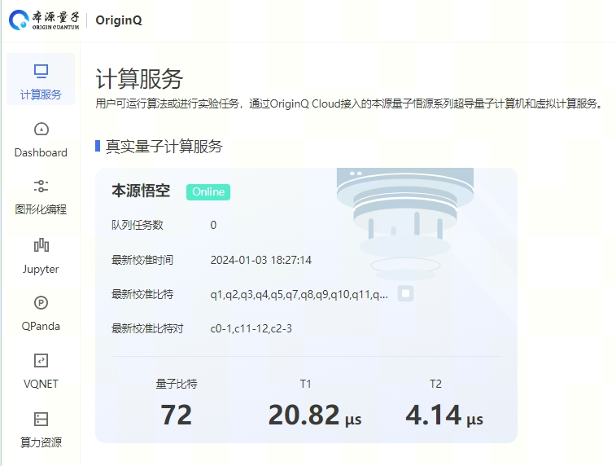

.. _真实芯片计算服务:

真实芯片计算服务
=============================
----

本源悟空超导芯片
>>>>>>>>>>>>>>>>>>>>>>>>>>>>>>

``本源悟空`` 是2024年本源量子正式发布的新一代超导量子计算机，最大运行规模可达72比特，并且在量子计算纠错，运行速度上实现质的飞跃。

对于芯片任务，同样是通过 ``QCloud`` 来提交任务和查询计算计算结果。

用户首先需要通过 **注册并访问** 最新的本源量子云计算官网 `本源量子云 <https://qcloud.originqc.com.cn/>`_ 。

然后点击右上键的 **工作台** ，进入量子计算访问计算界面，

可以看到有各种计算服务，包括虚拟计算和真实量子计算，接着需要进一步获取 **api_token** 等相关信息。 **api_token** 是每个用户用于使用pyqpanda的计算接口访问量子云计算资源的标识符，可以在个人账号中心获取。

    .. image:: images/token.png
        :align: center

 **api_token** 是重要的量子计算资源访问凭证，请妥善保管，量子计算任务的提交和查询，需要通过pyqpanda的量子云组件 ``QCloud`` ，通过将 **api_token** 作为 ``QCloud`` 的初始化函数 **init_qvm** 的参数传递，就可以正常使用后续接口，示例如下：

    .. code-block:: python

        machine = QCloud()
        machine.set_configure(72,72);

        machine.init_qvm("502e020100301006072ce3d020106052b8101c04150201010410b6d33ad8772eb9705e844394453a3c8a/6327",False)

量子云组件 ``QCloud`` 的其他接口介绍如下：

.. class:: QCloud(QuantumMachine)

    除了用于与远程计算集群交互， ``QCloud`` 也可以通过提交真实量子计算机芯片任务并获取结果。

    :param QuantumMachine: QuantumMachine类的基类。
    :type QuantumMachine: class
    :ivar origin quantum cloud machine: 该类用于管理远程量子云计算资源。
    :vartype origin quantum cloud machine: str

    .. method:: __init__()

        QCloud类的构造函数。

        :return: 无返回值
        :rtype: None

    .. method:: get_state_fidelity(prog, shot, chip_id=2, is_amend=True, is_mapping=True, is_optimization=True, task_name='QPanda Experiment')

        该方法将给定的量子线路提交到远程真实量子芯片上进行计算，然后返回计算得到的状态保真度。可以通过调整参数来控制计算的方式和行为。

        :param prog: 要计算状态保真度的量子线路。
        :type prog: QProg
        :param shot: 重复运行线路以计算期望值的次数。
        :type shot: int
        :param chip_id: 远程计算集群上的芯片ID，正确默认为2（本源悟源芯片5号）。
        :type chip_id: int, optional
        :param is_amend: 是否开启读取保真度修正。
        :type is_amend: bool, optional
        :param is_mapping: 是否进行电路映射。
        :type is_mapping: bool, optional
        :param is_optimization: 是否进行优化。
        :type is_optimization: bool, optional
        :param task_name: 任务名称，默认为'QPanda Experiment'。
        :type task_name: str, optional
        :return: 计算得到的状态保真度。
        :rtype: float

        
    .. method:: get_state_tomography_density(prog, shot, chip_id=2, is_amend=True, is_mapping=True, is_optimization=True, task_name='QPanda Experiment')

        计算量子线路的qst层析结果。

        :param prog: 要计算态密度矩阵的量子线路。
        :type prog: QProg
        :param shot: 重复运行线路以计算期望值的次数。
        :type shot: int
        :param chip_id: 远程计算集群上的芯片ID，正确默认为2（本源悟源芯片5号）。
        :type chip_id: int, optional
        :param is_amend: 是否开启读取保真度修正。
        :type is_amend: bool, optional
        :param is_mapping: 是否进行电路映射。
        :type is_mapping: bool, optional
        :param is_optimization: 是否进行优化。
        :type is_optimization: bool, optional
        :param task_name: 任务名称，默认为'QPanda Experiment'。
        :type task_name: str, optional
        :return: 计算得到的态密度矩阵。
        :rtype: List[List[complex]]

    .. method:: init_qvm(token: str, is_logged: bool = False, use_bin_or_hex: bool = True, request_time_out: int = 100)

        该方法用于初始化 QVM 服务，提供必要的用户身份验证令牌和其他参数。可选参数用于配置 QVM 的行为，例如是否记录操作，以及在处理二进制和十六进制字符串时是否使用默认设置。

        :param token: 用户身份验证令牌。
        :type token: str
        :param is_logged: 是否在控制台上记录 QVM 操作（默认为 False）。
        :type is_logged: bool, optional
        :param use_bin_or_hex: 是否在处理二进制和十六进制字符串时使用默认设置（默认为 True）。
        :type use_bin_or_hex: bool, optional
        :param request_time_out: 请求超时时间，以秒为单位（默认为 100）。
        :type request_time_out: int, optional

    .. method:: real_chip_measure(prog, shot, chip_id=2, is_amend=True, is_mapping=True, is_optimization=True, compile_level=3, task_name='QPanda Experiment')

        在真实量子计算芯片上进行量子测量。

        :param prog: 要在实际芯片上测量的量子线路。
        :type prog: Union[QProg, str]
        :param shot: 重复运行线路以计算期望值的次数。
        :type shot: int
        :param chip_id: 实际芯片ID，正确默认为2（本源悟源芯片5号）。
        :type chip_id: int, optional
        :param is_amend: 是否开启读取保真度修正，默认为True。
        :type is_amend: bool, optional
        :param is_mapping: 是否进行电路映射，默认为True。
        :type is_mapping: bool, optional
        :param is_optimization: 是否进行优化，默认为True。
        :type is_optimization: bool, optional
        :param compile_level: 编译级别，默认为3。
        :type compile_level: int, optional
        :param task_name: 任务名称，默认为'QPanda Experiment'。
        :type task_name: str, optional
        :return: 测量结果字典，包含各个测量结果的概率。
        :rtype: Dict[str, float]

    .. method:: async_real_chip_measure(prog, shot, chip_id=2, is_amend=True, is_mapping=True, is_optimization=True, compile_level=3, task_name='QPanda Experiment')

        异步在真实量子计算芯片上进行量子测量，后续查询计算结果需要配合query_task_state_result使用

        :param prog: 要在实际芯片上测量的量子线路。
        :type prog: Union[QProg, str]
        :param shot: 重复运行线路以计算期望值的次数。
        :type shot: int
        :param chip_id: 实际芯片ID，默认为2（本源悟源芯片5号）。
        :type chip_id: int, optional
        :param is_amend: 是否开启读取保真度修正，默认为True。
        :type is_amend: bool, optional
        :param is_mapping: 是否进行电路映射，默认为True。
        :type is_mapping: bool, optional
        :param is_optimization: 是否进行优化，默认为True。
        :type is_optimization: bool, optional
        :param compile_level: 编译级别，默认为3。
        :type compile_level: int, optional
        :param task_name: 任务名称，默认为'QPanda Experiment'。
        :type task_name: str, optional
        :return: 测量结果字典，包含各个测量结果的概率。
        :rtype: Dict[str, float]

    .. method:: async_batch_real_chip_measure(prog_array, shot, chip_id=real_chip_type.origin_72, is_amend=True, is_mapping=True, is_optimization=True, compile_level=3)

        在真实量子计算芯片上批量进行量子测量，后续查询计算结果需要配合query_batch_task_state_result使用

        :param prog_array: 要执行的量子程序列表。
        :type prog_array: Union[List[QProg], List[str]]
        :param shot: 每个程序执行的次数（测量次数）。
        :type shot: int
        :param chip_id: 要使用的真实量子芯片的ID，默认为 real_chip_type.origin_72。
        :type chip_id: real_chip_type, optional
        :param is_amend: 是否对程序执行修正，默认为True。
        :type is_amend: bool, optional
        :param is_mapping: 是否进行量子比特映射，默认为True。
        :type is_mapping: bool, optional
        :param is_optimization: 是否进行门融合优化，默认为True。
        :type is_optimization: bool, optional
        :param compile_level: 编译级别，默认为3。
        :type compile_level: int, optional
        :return: 批量任务ID。
        :rtype: str

    .. method:: batch_real_chip_measure(prog_array, shot, chip_id=real_chip_type.origin_72, is_amend=True, is_mapping=True, is_optimization=True, compile_level=3)

        在真实量子计算芯片上批量进行量子测量。

        :param prog_array: 要执行的量子程序列表。
        :type prog_array: Union[List[QProg], List[str]]
        :param shot: 每个程序执行的次数（测量次数）。
        :type shot: int
        :param chip_id: 要使用的真实量子芯片的ID，默认为 real_chip_type.origin_72。
        :type chip_id: real_chip_type, optional
        :param is_amend: 是否对程序执行修正，默认为True。
        :type is_amend: bool, optional
        :param is_mapping: 是否进行量子比特映射，默认为True。
        :type is_mapping: bool, optional
        :param is_optimization: 是否进行门融合优化，默认为True。
        :type is_optimization: bool, optional
        :param compile_level: 编译级别，默认为3。
        :type compile_level: int, optional
        :return: 包含每个程序测量结果概率的字典列表。
        :rtype: List[Dict[str, float]]

    .. method:: query_task_state_result(task_id: str)

        该方法用于查询单个任务的状态和结果。如果任务成功完成，结果列表将包含任务状态和相应的测量结果或其他相关信息。

        :param task_id: 要查询的任务ID。
        :type task_id: str
        :return: 包含任务状态和结果的列表。如果任务成功完成，结果将包含状态和相应的测量结果或其他相关信息。
        :rtype: List[Union[int, Any]]

    .. method:: query_batch_task_state_result(task_id: str)

        该方法用于查询批量任务的状态和结果。如果批量任务成功完成，结果列表将包含任务状态和相应的测量结果或其他相关信息。

        :param task_id: 要查询的批量任务ID。
        :type task_id: str
        :return: 包含任务状态和结果的列表。如果批量任务成功完成，结果将包含状态和相应的测量结果或其他相关信息。
        :rtype: List[Union[int, List[Any]]]

通过量子云平台向本源悟源请求计算任务的完整代码流程如下：

    .. code-block:: python

        from pyqpanda import *
        
        # 通过QCloud()创建量子云虚拟机
        qm = QCloud()

        # 通过传入当前用户的token来初始化
        qm.init_qvm("302e020100301006072a8648ce3d020106052b8104001c041730150201010410634a5b6d0a2a9a2b03b9d7c17c57405f/13082")

        qlist = qm.qAlloc_many(6)
        clist = qm.cAlloc_many(6)

        # 构建量子程序，可以手动输入，也可以来自OriginIR或QASM语法文件等
        prog = QProg()
        prog << hadamard_circuit(qlist)\
            << CZ(qlist[1], qlist[5])\
            << Measure(qlist[0], clist[0])\
            << Measure(qlist[1], clist[1])

        # 调用真实芯片计算接口，需要量子程序和测量次数两个参数
        result = qm.real_chip_measure(prog, 1000, real_chip_type.origin_72)
        print(result)
        qm.finalize()
  
    **real_chip_type.origin_72** 表示使用最新的悟空72比特芯片

    在使用本源真实芯片计算服务时，经常会遇到各种错误，下面给出部分错误信息，可以根据抛出的错误异常信息进行对号入座。

    -  ``server connection failed`` ：该异常表示服务器宕机或与服务器连接失败
    -  ``api key error`` ：该异常表示用户的API-Key参数异常，请去官网确认个人资料的信息
    -  ``un-activate products or lack of computing power`` ：该异常表示用户未开通该产品或算力不足
    -  ``build system error`` ：该异常表示编译系统运行出错
    -  ``exceeding maximum timing sequence`` ：该异常表示量子程序时序过长
    -  ``unknown task status`` ：其他任务状态异常的情况

除了蒙特卡洛测量接口之外，还有用于获取 **量子态qst层析** 结果和 **保真度** 接口，下面逐一介绍：

    -  **获取量子态qst层析结果接口：**  ``get_state_tomography_density`` ,使用示例如下：
 
    .. code-block:: python

        from pyqpanda import *
        PI=3.14159

        qm = QCloud()
        qm.set_configure(72,72);

        qm.init_qvm("302e020100301006072a88ce3d020106052b81040041730150201010410b6d33ad87729705e844394453a3c8a/65327",True)

        q = qm.qAlloc_many(6)
        c = qm.cAlloc_many(6)

        prog = QProg()
        prog << hadamard_circuit(q)\
            << RX(q[1], PI / 4)\
            << RX(q[2], PI / 4)\
            << RX(q[1], PI / 4)\
            << CZ(q[0], q[1])\
            << CZ(q[1], q[2])\
            << Measure(q[0], c[0])\
            << Measure(q[1], c[1])

        result = qm.get_state_tomography_density(prog, 1000,real_chip_type.origin_72)
        print(result)
        qm.finalize()

    输出结果是测量的两比特的QST层析结果，参考结果如下
            
    .. code-block:: python

        [[(0.2595032944754182+0j), (0.21819564115560064+0.01368474404460212j), (0.0010136847440446045-0.008616320324379118j), (0.020273694880892028+0.01951343132285857j)], 
        [(0.21819564115560064-0.01368474404460212j), (0.26001013684744045+0j), (0.000760263558033443+0.011657374556512917j), (-0.008362899138367963+0.010897110998479481j)], 
        [(0.0010136847440446045+0.008616320324379118j), (0.000760263558033443-0.011657374556512917j), (0.2554485554992397+0j), (-0.21490116573745568+0.012417638114546374j)], 
        [(0.020273694880892028-0.01951343132285857j), (-0.008362899138367963-0.010897110998479481j), (-0.21490116573745568-0.012417638114546374j), (0.22503801317790167+0j)]]

    -  **获取量子态保真度接口：**  ``get_state_fidelity`` ,使用示例如下：
 
    .. code-block:: python

        from pyqpanda import *
        PI=3.14159

        qm = QCloud()
        qm.set_configure(72,72);

        qm.init_qvm("302e020100301006072a868ce3d02006052b8104001c041730502010424100b6d33ad8772eb9705e844394453a3c8a/16327",True)

        q = qm.qAlloc_many(6)
        c = qm.cAlloc_many(6)

        prog = QProg()
        prog << hadamard_circuit(q)\
            << RX(q[1], PI / 4)\
            << RX(q[2], PI / 4)\
            << RX(q[1], PI / 4)\
            << CZ(q[0], q[1])\
            << CZ(q[1], q[2])\
            << Measure(q[0], c[0])\
            << Measure(q[1], c[1])

        result = qm.get_state_fidelity(prog, 1000,real_chip_type.origin_72)
        print(result)
        qm.finalize()

    输出结果是保真度，参考结果如下
            
    .. code-block:: python

        0.928951

    同时支持批量任务提交接口，分为**同步**和**异步**两种：

    -  **1.同步批量任务提交接口：**  是 ``batch_real_chip_measure`` 接口会一直等待结果返回,使用示例如下：
 
    .. code-block:: python

        from pyqpanda import *

        machine = QCloud()
        machine.set_configure(72,72);

        # XXX替换为实际用户api_token,可以从本源量子计算官网 https://qcloud.originqc.com.cn/ 获取
        machine.init_qvm("XXX", False)

        qlist = machine.qAlloc_many(6)
        clist = machine.cAlloc_many(6)

        measure_prog = QProg()
        measure_prog << H(qlist[0])\
                    << CNOT(qlist[0], qlist[1])\
                    << CNOT(qlist[1], qlist[2])\
                    << Measure(qlist[0], clist[0])\
                    << Measure(qlist[1], clist[1])\
                    << Measure(qlist[2], clist[2])

        batch_prog = [measure_prog for _ in range (6)]

        pmeasure_prog = QProg()
        pmeasure_prog << H(qlist[0])\
                    << CNOT(qlist[0], qlist[1])\
                    << CNOT(qlist[1], qlist[2])
        
        originir_list = [convert_qprog_to_originir(prog, machine) for prog in batch_prog]

        real_chip_measure_batch_result = machine.batch_real_chip_measure(batch_prog, 1000, real_chip_type.origin_72)
        originir_list_result = machine.batch_real_chip_measure(originir_list, 1000, real_chip_type.origin_72)

    **batch_real_chip_measure** 同时支持List[QProg]和List[originir_str]两种参数方式。

-  **2.异步批量任务提交接口：**  是 ``batch_real_chip_measure`` 接口会一直等待结果返回,使用示例如下：
 
    .. code-block:: python

            from pyqpanda import *

            machine = QCloud()
            machine.set_configure(72,72);

            machine.init_qvm("XXX",True)

            qlist = machine.qAlloc_many(6)
            clist = machine.cAlloc_many(6)

            measure_prog = QProg()
            measure_prog << hadamard_circuit(qlist)\
                        << CZ(qlist[0], qlist[1])\
                        << Measure(qlist[0], clist[0])\
                        << Measure(qlist[1], clist[1])\
                        << Measure(qlist[2], clist[2])

            batch_prog = [measure_prog for _ in range (6)]

            pmeasure_prog = QProg()
            pmeasure_prog  << hadamard_circuit(qlist)\
                        << CZ(qlist[0], qlist[1])
            
            originir_list = [convert_qprog_to_originir(prog, machine) for prog in batch_prog]
            
            batch_id = machine.async_batch_real_chip_measure(originir_list, 1000, real_chip_type.origin_72)
            print(batch_id) # example : '8C3C5BDDA616E1A094B76A85473F3557'

            import time
            while(True):
                state, result = machine.query_batch_task_state_result(batch_id)

                time.sleep(2)
                if(state == QCloud.TaskStatus.FINISHED.value):
                    break

            print(state, result)

    **batch_real_chip_measure** 也是同时支持List[QProg]和List[originir_str]两种参数方式，需要配合 ``query_batch_task_state_result`` 使用，该接口返回的是元组类型，包含任务状态和结果。

.. note:: 
            - 使用前需要确保用户已经开通相关权限，并且有足够的算力资源，否则会出现没有权限或者计算资源不足等出错信息。详见 https://qcloud.originqc.com.cn/zh/computerServices
            - 在使用时遇到任何问题，请给我们提交 `用户反馈 <https://forum.originqc.com.cn/rostrum/questionIndex.html>`_ ，我们看到后会尽快解决你的问题。