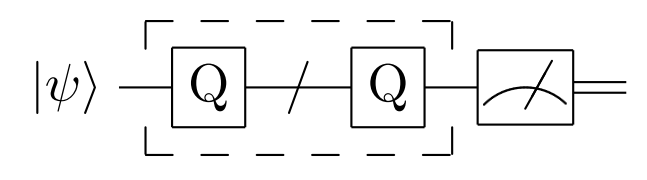

振幅放大
####

振幅放大（Amplitude Amplification）线路的主要作用为对于给定纯态的振幅进行放大，从而调整其测量结果概率分布。

算法背景
****

对于某个已知大小的可二元分类且标准 :math:`f` 确定的有限集合 :math:`\Omega`，基于 :math:`f` 可以将集合中的任一元素\
:math:`\left|\psi\right\rangle` 表示为两个正交基态 :math:`\left|\psi_0\right\rangle,\left|\psi_1\right\rangle` 的线性组合。

.. math::

   \begin{aligned}
   \left|\psi\right\rangle=sin\theta\left|\varphi_1\right\rangle+cos\theta\left|\varphi_0\right\rangle, \ 
   \left|\varphi_0\right\rangle=\left|\varphi_1^\bot\right\rangle.
   \end{aligned}

振幅放大量子线路可以将叠加态 :math:`\left|\psi\right\rangle` 的表达式中 :math:`\left|\psi_1\right\rangle` 的振幅放大，从而得到\
一个结果量子态，能够以大概率测量得到目标量子态 :math:`\left|\psi_1\right\rangle`。

假设我们可以构造出某种量子门操作的组合，记该组合为振幅放大算子 :math:`Q` ，将 :math:`Q` 作用 :math:`k` 次于量子态\
:math:`\left|\psi\right\rangle` 上得到形如下式的量子态

.. math::

   \begin{aligned}
   \left|\psi_k\right\rangle=\sin{k\theta}\left|\varphi_1\right\rangle+\cos{k\theta} \ 
   \left|\varphi_0\right\rangle,\ k\theta\approx\frac{\pi}{2}.
   \end{aligned}

那么就完成了所需的振幅放大量子线路构建。

相应的量子线路图如下：

假设基于集合 :math:`\Omega` 和分类标准 :math:`f` 的量子态 :math:`\left|\psi\right\rangle`\
已经完成制备，关键在于构造振幅放大算子 :math:`Q` 。

定义振幅放大算子如下

.. math::

   \begin{aligned}
   P_1=I-2\left|\psi_1\right\rangle \left\langle\psi_1\right|,
   P=I-2\left|\psi\right\rangle \left\langle\psi\right|,
   Q=-PP_1.
   \end{aligned}

.. note:: 如何通过集合 :math:`\Omega` 和分类标准 :math:`f` 来制备量子态？ :math:`P_1,P` \
   又是怎样通过量子线路实现的？

简单验证可知在 :math:`\{\left|\varphi_1\right\rangle,\left|\varphi_0\right\rangle\}`\
张成的空间中算子 :math:`Q` 可以表示为

.. math::

   \begin{aligned}
   Q=\left[\begin{matrix}\cos{\left(2\theta\right)}&-\sin{\left(2\theta\right)}\\
    \sin{\left(2\theta\right)}&\cos{\left(2\theta\right)}\\\end{matrix}\right]
   \end{aligned}

实质上可以视为一个角度为 :math:`2\theta` 的旋转量子门操作。因此有

.. math::

   \begin{aligned}
   Q^n\left|\psi\right\rangle=\sin{\left(2n+1\right)\theta}\left|\varphi_1
   \right\rangle+\cos{\left(2n+1\right)\theta}\left|\varphi_0\right\rangle.
   \end{aligned}

选取合适的旋转次数 :math:`n` 使得 :math:`\sin^2{\left(2n+1\right)\theta}` 最\
接近 :math:`1` 即可完成振幅放大量子线路。

相比经典的遍历分类方法，振幅放大量子线路可以充分体现量子计算的优势。

代码实例
****

取 :math:`\Omega=\{0,1\}, \left|\psi\right\rangle = \frac{\left|0\right\rangle+
\left|1\right\rangle}{2}, P_1=I-2\left|1\right\rangle \left\langle1\right|=Z`，

振幅放大量子线路的相应代码实例如下

.. code-block:: python

   #!/usr/bin/env python

   from pyqpanda import *
   from numpy import pi

   if __name__ == "__main__":

      machine = init_quantum_machine(QMachineType.CPU)
      qvec = machine.qAlloc_many(1)
      prog = create_empty_qprog()

      # 构建量子程序
      prog.insert(H(qvec[0]))
      for i in range(9):
            prog.insert(RY(qvec[0],pi/2))

      # 对量子程序进行概率测量
      result = prob_run_dict(prog, qvec, -1)
      destroy_quantum_machine(machine)

      # 打印测量结果
      for key in result:
            print(key+":"+str(result[key]))

输出结果应如下所示，分别以 :math:`1` 和 :math:`0` 的概率\
得到 :math:`\left|0\right\rangle`\和 :math:`\left|1\right\rangle` ：

.. code-block:: python
    
    0:1
    1:0
