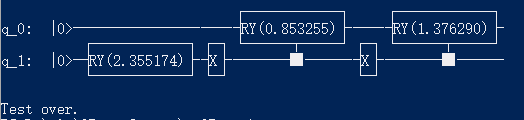

.. 量子态振幅编码:

量子态振幅编码
====================

接口 amplitude_encode 可以实现将N个数据编码到logN个qubit的叠加态的振幅值。
输入参数：(1)包含N个double型数据的list  (2)包含logN个qubit的list
输出参数：编码后的量子线路

.. note:: 假设传入qubit数目为m，如果要编码的数据个数少于2^m（2的m次方），则用0补全。另外还有一个比较重要的注意点：编码的N个double类型数据必须满足归一化条件。

实例
---------------

::

    import pyqpanda.pyQPanda as pq
    import math
    import numpy as np

    class InitQMachine:
        def __init__(self, quBitCnt, cBitCnt, machineType = pq.QMachineType.CPU):
            self.m_machine = pq.init_quantum_machine(machineType)
            self.m_qlist = self.m_machine.qAlloc_many(quBitCnt)
            self.m_clist = self.m_machine.cAlloc_many(cBitCnt)
            self.m_prog = pq.QProg()

        def __del__(self):
            pq.destroy_quantum_machine(self.m_machine)

    #测试接口： 量子态振幅编码
    if __name__=="__main__":
        init_machine = InitQMachine(4, 4)
        qlist = init_machine.m_qlist
        machine = init_machine.m_machine
        
        #这里实现用2个qubit，编码4个double数据[2.2, 1, 4.5, 3.7]
        mat=[2.2,1,4.5,3.7]
        mat = mat / np.linalg.norm(mat)
        cir_encode = pq.amplitude_encode([qlist[0], qlist[1]], mat)
        #输出编码量子线路
        print(cir_encode)
        
        print("Test over.")

上述示例代码中，cir_encode表示编码后的量子线路。以上示例代码会在控制台输出编码后的量子线路，如下图所示：

