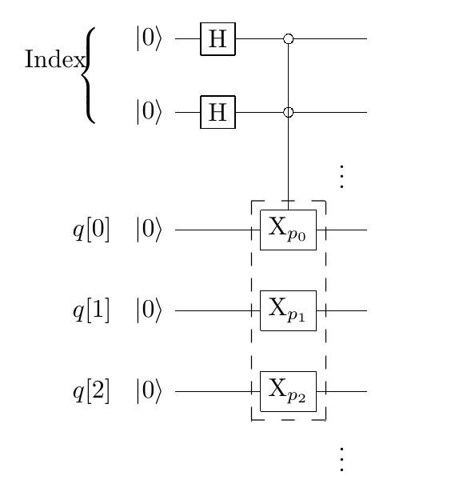
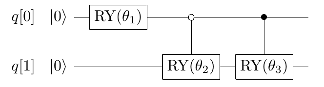

数据编码
####

调用量子门形成组合的过程中，会频繁需要调用经典数据。

将经典格式编码到量子态是量子计算中的一个重要的预处理环节，主要有2实现方式：

#. 编码到基向量。指将经典数据转化为整数形式后，将其二进制展开以直积态表示；
#. 编码到振幅上。指将经典数据通过量子门操作转化到量子态的振幅。

----

编码到基向量
****

对于任给的经典数据，通过追加额外比特，可以将它拆分成不含虚部、负号和小数点的多个非负整数的组合。
因此此处只介绍对于非负整数的编码过程。

.. note:: :math:`复数\rightarrow 实数 \rightarrow 非负实数 \rightarrow 非负整数`

二进制展开
++++

任给经典非负整数，对其进行二进制展开，每一位二进制数都可以简单绑定到单个量子比特，那么任给不超过N的非负整数，\
只需要 :math:`\lceil\log_2(N)\rceil` 个比特就可以将其绑定到基向量上。

存储比特与索引比特
++++

对于上限均为N的k个经典数据，需要 :math:`\lceil\log_2(N)\rceil` 个存储量子比特和 :math:`\lceil\log_2(k)]\rceil` 个\
索引量子比特将其编码到量子态基向量，每个数据均需要 :math:`\lceil\log_2(N)\rceil` 个条件非量子门。

考虑到量子比特的特性，当添加了索引比特之后，多个经典数据可以共用存储比特。如图所示，k个经典非负整数数据\
由二进制展开逐位对应编码到存储比特上，每个经典数据的编码量子门受控于索引比特的一种状态。

编码到振幅
****

编码到振幅的方式兼容所有的复数经典数据，但虚部依然需要追加额外比特。方便起见，此处只考虑编码实数经典数据。

如图所示，假设某个物理量A由4种属性描述，属性的取值均为实数。\
于是A的状态可以用归一化的波函数表示，进而A的量子态 :math:`\left|A\right\rangle` 可以表示成如公式所示的叠加态。

.. math::

   \left|A\left(x\right)\right\rangle=p_{00}\left|00\right\rangle+ \ 
   p_{01}\left |01\right\rangle{+p}_{10}\left|10\right\rangle+p_{11}\left|11\right\rangle

不妨假设 :math:`p_{00}^2+p_{01}^2\neq0,p_{10}^2+p_{11}^2\neq0`。

.. note:: 否则 :math:`\left|A\right\rangle` 不是叠加态

记

.. math::

   \begin{aligned}
   \\ p_1=\frac{\sqrt{p_{10}^2+p_{11}^2}}{\sqrt{p_{00}^2+p_{01}^2+p_{10}^2+p_{11}^2}}, \ 
   \\ p_{1|0}=\frac{\sqrt{p_{01}^2}}{\sqrt{p_{00}^2+p_{01}^2}},p_{1|1}\ =\frac{\sqrt{p_{11}^2}}{\sqrt{p_{10}^2+p_{11}^2}}, 
   \\ \sin{\frac{\theta_1}{2}}=p_1,\sin{\frac{\theta_2}{2}}=p_{1|0},\sin{\frac{\theta_3}{2}}=p_{1|1}.
   \end{aligned}
   
于是有

.. math::

   \begin{aligned}
   \sin{\frac{\theta_1}{2}}\cos{\frac{\theta_3}{2}}=p_1\sqrt{1-p_{1|1}^2}= \ 
   \frac{\sqrt{p_{10}^2}}{\sqrt{p_{00}^2+p_{01}^2+p_{10}^2+p_{11}^2}}=p_{10}, \\
   \sin{\frac{\theta_1}{2}}\sin{\frac{\theta_3}{2}}=p_{11},\cos{\frac{\theta_1}{2}} \ 
   \cos{\frac{\theta_2}{2}}=p_{00},\cos{\frac{\theta_1}{2}}\sin{\frac{\theta_2}{2}}=p_{01}.
   \end{aligned}

进而

.. math::

   \begin{aligned}
   &\left|A\left(\vec{x}\right)\right\rangle=\sin{\frac{\theta_1}{2}}\cos{\frac{\theta_3}{2}} \ 
   \left|1\right\rangle\left|0\right\rangle+\sin{\frac{\theta_1}{2}}\sin{\frac{\theta_3}{2}} \ 
   \left|1\right\rangle\left|1\right\rangle \\ & +\cos{\frac{\theta_1}{2}}\cos{\frac{\theta_2}{2}} \ 
   \left|0\right\rangle\left|0\right\rangle+\cos{\frac{\theta_1}{2}}\sin{\frac{\theta_2}{2}} \ 
   \left|0\right\rangle\left|1\right\rangle.
   \end{aligned}

直接由此表达式给出RY和受控RY量子门的组合，可以完成对4属性物理A的二比特量子态的编码。

推广到以N个实数刻画的经典数据，将其编码到量子态振幅的所需的量子比特数目为 :math:`\lceil\log_2(N)\rceil`，\
使用的量子门数量为 :math:`2\lceil\log_2(N)\rceil-1`。

----

对比两种不同的编码方式，编码到振幅上的方式兼容的数据类型更广，所需量子比特数更低，但不能进行经典数据相关的量子态的量子四则运算。