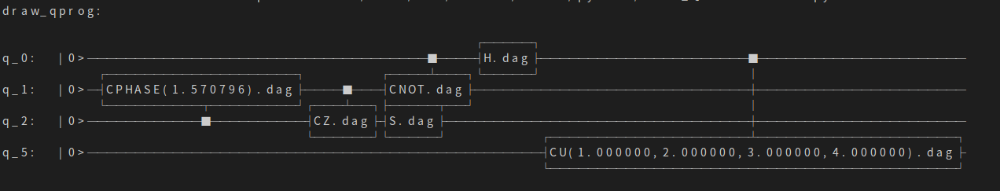

量子线路字符画
============

目前PyQPanda提供了3中量子线路可视化方式，具体使用方式参考如下示例。

实例
---------------

::

    import pyqpanda.pyQPanda as pq
    from pyqpanda.Visualization.circuit_draw import *
    import math
    class InitQMachine:
        def __init__(self, quBitCnt, cBitCnt, machineType = pq.QMachineType.CPU):
            self.m_machine = pq.init_quantum_machine(machineType)
            self.m_qlist = self.m_machine.qAlloc_many(quBitCnt)
            self.m_clist = self.m_machine.cAlloc_many(cBitCnt)

        def __del__(self):
            pq.destroy_quantum_machine(self.m_machine)

    def test_print_qcircuit(q, c):
        # 构建量子程序
        prog = pq.QCircuit()
        prog << pq.CU(1, 2, 3, 4, q[0], q[5]) << pq.H(q[0]) << pq.S(q[2]) << pq.CNOT(q[0], q[1]) << pq.CZ(q[1], q[2]) << pq.CR(q[2], q[1], math.pi/2)
        prog.set_dagger(True)
        
        print('draw_qprog:')

        # 通过print直接输出量子线路字符画，该方法会在控制台输出量子线路，输出格式为utf8编码，所以在非utf8编码的控制台下，输出字符画会出现乱码情况。
        # 同时，该方法会将当前量子线路字符画信息保存到文件，文件名为 “QCircuitTextPic.txt”，文件用utf8编码，并保存在当面路径下面，
        # 所以用户也可以通过该文件查看量子线路信息，注意该文件要以uft8格式打开，否则会出现乱码。
        print(prog)
        # 通过draw_qprog接口输出量子线路字符画，该方法功能和print方法一样，区别在于该接口可以指定控制台编码类型，以保证在控制台输出的量子线路字符画能正常显示。
        # 参数“console_encode_type” 用于指定控制台类型，目前支持两种编码方式:utf8和gbk，默认为utf8
        draw_qprog(prog, 'text', console_encode_type='gbk')
        # draw_qprog接口还可以将量子线路保存成图片，调用方式如下。参数“filename”用于指定保存的文件名。
        draw_qprog(prog, 'pic', filename='D:/test_cir_draw.jpg')

    if __name__=="__main__":
        init_machine = InitQMachine(16, 16)
        qlist = init_machine.m_qlist
        clist = init_machine.m_clist
        machine = init_machine.m_machine

        test_print_qcircuit(qlist, clist)
        
以上示例分别演示了draw_qprog接口的使用方法，上述代码的输出结果如下：

其他使用
--------

接口draw_qprog()的详细参数说明如下：
::
    def draw_qprog(prog: pyqpanda.pyQPanda.QProg, itr_start: pyqpanda.pyQPanda.NodeIter = <pyqpanda.pyQPanda.NodeIter>, itr_end: pyqpanda.pyQPanda.NodeIter = <pyqpanda.pyQPanda.NodeIter>)

可以看出这个接口有3个参数，并且后两个参数都为默认参数。这两个参数提供用户可根据实际需要，只打印某个量子程序中，某一区间段的量子线路信息，可以在某些场景下给用户以更灵活的使用方式。这里作为演示，我们将上述示例代码中的test_print_qcircuit()接口实现改成如下代码：
::

    prog = pq.QCircuit()
    prog << pq.CU(1, 2, 3, 4, q[0], q[5]) << pq.H(q[0]) << pq.S(q[2]) << pq.CNOT(q[0], q[1]) << pq.CZ(q[1], q[2]) << pq.CR(q[2], q[1], math.pi/2)
    iter_start = prog.begin()
    iter_end = iter_start.get_next()
    iter_end = iter_end.get_next()
    iter_end = iter_end.get_next()
    prog.set_dagger(True)
    print('draw_qprog:')
    pq.draw_qprog(prog, iter_start, iter_end)
    
上面这段示例代码只会输出prog的前4个逻辑门节点，用户可自行替换上述代码段到前面的示例程序中，运行查看结果，这里不再赘述。

