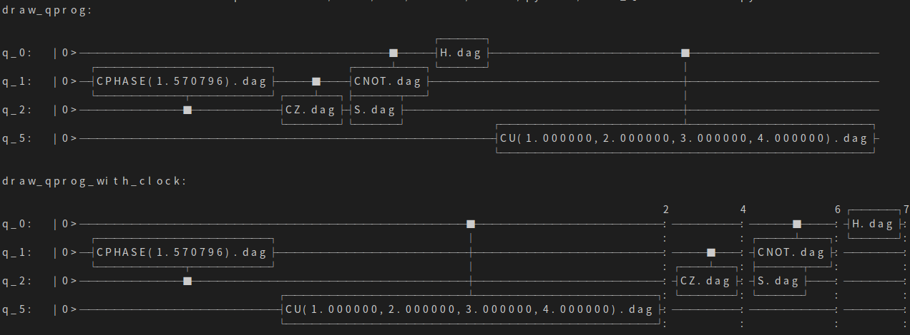

量子线路字符画
============

接口draw_qprog()可以将输入的量子程序转换为字符画并输出到控制台同时保存字符画信息到文件（QCircuitTextPic.txt，该接口会在当前程序运行目录下创建该txt文件，文件用utf8编码，并覆盖之前数据）。

实例
---------------

::

    import pyqpanda.pyQPanda as pq
    import math
    class InitQMachine:
        def __init__(self, quBitCnt, cBitCnt, machineType = pq.QMachineType.CPU):
            self.m_machine = pq.init_quantum_machine(machineType)
            self.m_qlist = self.m_machine.qAlloc_many(quBitCnt)
            self.m_clist = self.m_machine.cAlloc_many(cBitCnt)

        def __del__(self):
            pq.destroy_quantum_machine(self.m_machine)
    
    def test_print_qcircuit(q, c):
        prog = pq.QCircuit()
        prog.insert(pq.CU(1, 2, 3, 4, q[0], q[5])).insert(pq.H(q[0])).insert(pq.S(q[2])).insert(pq.CNOT(q[0], q[1])).insert(pq.CZ(q[1], q[2])).insert(pq.CR(q[2], q[1], math.pi/2))
        prog.set_dagger(True)
        print('draw_qprog:')
        pq.draw_qprog(prog )
    
    if __name__=="__main__":
        init_machine = InitQMachine(16, 16)
        qlist = init_machine.m_qlist
        clist = init_machine.m_clist
        machine = init_machine.m_machine

        test_print_qcircuit(qlist, clist)
        
以上示例分别演示了draw_qprog接口的使用方法，上述代码的输出结果如下：

其他使用
--------

接口draw_qprog()的详细参数说明如下：
::
    def draw_qprog(prog: pyqpanda.pyQPanda.QProg, itr_start: pyqpanda.pyQPanda.NodeIter = <pyqpanda.pyQPanda.NodeIter>, itr_end: pyqpanda.pyQPanda.NodeIter = <pyqpanda.pyQPanda.NodeIter>)

可以看出这个接口有3个参数，并且后两个参数都为默认参数。这两个参数提供用户可根据实际需要，只打印某个量子程序中，某一区间段的量子线路信息，可以在某些场景下给用户以更灵活的使用方式。这里作为演示，我们将上述示例代码中的test_print_qcircuit()接口实现改成如下代码：
::

    prog = pq.QCircuit()
    prog.insert(pq.CU(1, 2, 3, 4, q[0], q[5])).insert(pq.H(q[0])).insert(pq.S(q[2])).insert(pq.CNOT(q[0], q[1])).insert(pq.CZ(q[1], q[2])).insert(pq.CR(q[2], q[1], math.pi/2))
    iter_start = prog.begin()
    iter_end = iter_start.get_next()
    iter_end = iter_end.get_next()
    iter_end = iter_end.get_next()
    prog.set_dagger(True)
    print('draw_qprog:')
    pq.draw_qprog(prog, iter_start, iter_end)
    
上面这段示例代码只会输出prog的前4个逻辑门节点，用户可自行替换上述代码段到前面的示例程序中，运行查看结果，这里不再赘述。

