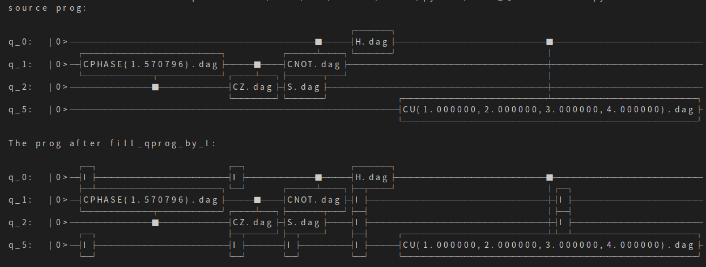

用I门填充QProg
===============

接口fill_qprog_by_I实现用I门填充QProg(量子程序)的功能。

实例
---------------

::

    import pyqpanda.pyQPanda as pq
    import math
    class InitQMachine:
        def __init__(self, quBitCnt, cBitCnt, machineType = pq.QMachineType.CPU):
            self.m_machine = pq.init_quantum_machine(machineType)
            self.m_qlist = self.m_machine.qAlloc_many(quBitCnt)
            self.m_clist = self.m_machine.cAlloc_many(cBitCnt)
        
        def __del__(self):
            pq.destroy_quantum_machine(self.m_machine)

    def test_fill_I(q, c):
        prog = pq.QCircuit()
        prog.insert(pq.CU(1, 2, 3, 4, q[0], q[5])).insert(pq.H(q[0])).insert(pq.S(q[2])).insert(pq.CNOT(q[0], q[1])).insert(pq.CZ(q[1], q[2])).insert(pq.CR(q[2], q[1], math.pi/2))
        prog.set_dagger(True)
        print('source prog:')
        pq.draw_qprog(prog)
        prog = pq.fill_qprog_by_I(prog)
        print('The prog after fill_qprog_by_I:')
        pq.draw_qprog(prog)

    if __name__=="__main__":
        init_machine = InitQMachine(16, 16)
        qlist = init_machine.m_qlist
        clist = init_machine.m_clist
        machine = init_machine.m_machine

        test_fill_I(qlist, clist)

以上示例程序演示了fill_qprog_by_I接口的使用方法，我们可以看到只需要传入一个QProg类型的参数即可，该接口返回一个填充后的新QProg，输入QProg保持不变。
以上示例程序的字符画展示输出结果如下：

