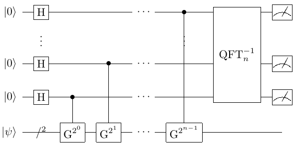
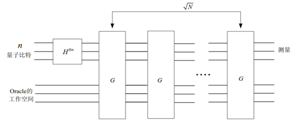

Grover算法和量子计数算法
####

量子计数算法（Quantum Counting）与Grover算法都是基于集合元素二类划分问题衍生的算法。\
量子计数算法可以求得集合中两种类型元素的个数，Grover算法则可以求得指定类型的一个元素。

问题背景概述
****

前文中介绍了振幅放大量子线路的问题背景集合元素二类划分问题，即对于给定的有限集合和划分标准 :math:`\Omega,f`，\
我们可以用如下量子态表示集合元素

.. math::

   \begin{aligned}
   \left|\psi\right\rangle=sin\theta\left|\varphi_1\right\rangle+cos\theta\left|\varphi_0\right\rangle, \ 
   \left|\varphi_0\right\rangle=\left|\varphi_1^\bot\right\rangle.
   \end{aligned}

现在对此问题进行两种扩展。

量子计数问题
++++

记 :math:`\left|\Omega\right|=N=2^n,\Omega\supseteq B, \left|B\right|=M\le N`，且判别函数满足

.. math::
   \begin{aligned}
   \left\{\begin{matrix}
   f:\Omega\rightarrow\{0,1\},\\ 
   f\left(x\right)=\left\{\begin{matrix}
   1,x\in B,\\ 0,x\notin B.
   \end{matrix}\right.
   \end{matrix}\right.
   \end{aligned}
求 :math:`M`。

传统算法是简单地通过 :math:`O(N)` 次的运算进行遍历计数，从而求得解的集合基数 :math:`M`。\
量子计数算法的时间复杂度与QPE过程完全一致，均为 :math:`O\left(\left(\log_2{N}\right)^2\right)`。

.. note:: 将振幅放大算子应用到QPE线路中，可以起到类似于由特征量子态提取特征值的过滤提取作用。

解元素的搜索问题
++++

集合 :math:`\Omega` 中存在某个元素 :math:`\omega \in \Omega` 为特定问题的解，判别函数的定义如下：

.. math::
   \begin{aligned}
   \left\{\begin{matrix}
   f:\Omega\rightarrow\{0,1\},\\ 
   f\left(x\right)=\left\{\begin{matrix}
   1,x=\omega,\\ 0,x \neq \omega.
   \end{matrix}\right.
   \end{matrix}\right.
   \end{aligned}
求 :math:`\omega \in \Omega` 。

Grover算法的过程与振幅放大量子线路的过程完全一致。\
Grover算法的时间复杂度为 :math:`O(\sqrt N)`，相对于经典算法的O(N)有着极大加速。

.. note:: 事实上，振幅放大得到振幅和基向量的近似求解的思想不局限于集合元素二类划分问题。

算法原理
****

两种算法需要预制备的集合元素量子态有着相似的如下形式：

.. math::

   \begin{aligned}
   \left|\psi\right\rangle=sin\theta\left|\varphi_1\right\rangle+cos\theta\left|\varphi_0\right\rangle, \ 
   \left|\varphi_0\right\rangle=\left|\varphi_1^\bot\right\rangle.
   \end{aligned}
但具体定义和需要求解的目标不同，因此基于振幅放大量子线路衍生出的算法原理也有所不同。

基于振幅放大算子的QPE过程
++++

量子计数算法中的两个基量子态是基于集合和判别函数定义的，即：

.. math::
   \begin{aligned}
   \left|\varphi_0\right\rangle=\frac{1}{\sqrt{N-M}}\sum_{x\notin B}\left|x\right\rangle,
   \left|\varphi_1\right\rangle=\frac{1}{\sqrt M}\sum_{x\in B}\left|x\right\rangle.
   \end{aligned}
将问题转化到空间 :math:`\{\left|\varphi_0\right\rangle,\left|\varphi_1\right\rangle\}` 上，\
不妨记 :math:`\sin{\theta}=\frac{\sqrt M}{\sqrt N}` ，则需要求解 :math:`\theta` 。

直接在空间 :math:`\{\left|\varphi_0\right\rangle,\left|\varphi_1\right\rangle\}` 上定义振幅放大算子\
:math:`G=\left[\begin{matrix}\cos{2\theta}&-\sin{2\theta}\\\sin{2\theta}&\cos{2\theta}\\\end{matrix}\right]`，\
满足

.. math::
   \begin{aligned}
   G(\cos{\theta}\left|\varphi_0\right\rangle+\sin{\theta}\left|\varphi_1\right\rangle)
   =\cos{3\theta}\left|\varphi_0\right\rangle+\sin{3\theta}\left|\varphi_1\right\rangle.
   \end{aligned}
振幅放大算子 :math:`G` 的特征向量可以构成空间 :math:`\{\left|\varphi_0\right\rangle,\left|\varphi_1\right\rangle\}` 的\
一组基向量，因此 :math:`\psi` 可以拆解为 :math:`G` 的特征向量的线性组合。

:math:`G` 的特征值为 :math:`e^{\pm2i\theta}`，借助在制备 :math:`\psi` 的过程中使用的索引比特，可以准确区分出以 :math:`G` \
构造的QPE过程结果对应的特征子相位是 :math:`2\theta` 或 :math:`2\pi-2\theta`。

于是就可以通过基于 :math:`G` 的QPE过程完成对 :math:`\theta` 的求解，而 :math:`N` 已知，于是完成了对 :math:`M` 的求解。

.. note:: 为什么可以判定振幅放大算子 :math:`G` 的特征向量可以构成空间 :math:`\{\left|\varphi_0\right\rangle,\left|\varphi_1\right\rangle\}` 的\
   一组基向量？

基于镜像变换的振幅放大量子线路
++++

对于给定的量子态 :math:`\left|\psi\right\rangle=sin\theta\left|\varphi_1\right\rangle+cos\theta\left|\varphi_0\right\rangle`，
可以直接参考振幅放大量子线路，给出Grover算子，从而得到 :math:`\left|\psi_k\right\rangle=\sin{(2k+1)\theta}
\left|\varphi_1\right\rangle+\cos{(2k+1)\theta}\left|\varphi_0\right\rangle,\ (2k+1)\theta\approx\frac{\pi}{2}`。

但直接通过镜像变换构造的Grover算子 :math:`G=-(I-2\left|\omega\right\rangle \left\langle\omega\right|)
(I-2\left|\psi\right\rangle \left\langle\psi\right|)` 在实际的编程实现和运算过程中计算量过大，因此需要考虑如何将其利用\
基础的普适量子门简单实现累乘。

将原问题转换到空间 :math:`\{\left|\omega\right\rangle,\left|\psi\right\rangle\}` 上，不妨记 :math:`\left|\Omega\right|=N` ，由
:math:`\left\langle\varphi\middle|\omega\right\rangle=\frac{1}{\sqrt N}, \left\langle\varphi\middle|\varphi\right\rangle=1` 可知

.. math::
   \begin{aligned}
   U_\omega=(I-2\left|\omega\right\rangle\langle\omega|)=\left[\begin{matrix}-1&-\frac{2}{\sqrt N}\\0&1\\\end{matrix}\right],
   U_s=2\left|\varphi\right\rangle\langle\varphi|-I=\left[\begin{matrix}-1&0\\\frac{2}{\sqrt N}&1\\\end{matrix}\right].
   \end{aligned}  
记 :math:`\sin{\theta}=\frac{1}{\sqrt N},a=e^{i\theta},\ \ \frac{1}{\sqrt N}=\frac{a-a^{-1}}{2i}`，于是有

.. math::
   \begin{aligned}
   U_\omega U_s=\frac{1}{a^2+1}\left[\begin{matrix}-i&i\\a&a^{-1}\\\end{matrix}\right]\left[\begin{matrix}a^2&0
   \\0&a^{-2}\\\end{matrix}\right]\left[\begin{matrix}i&a\\-a^2i&a\\\end{matrix}\right].
   \end{aligned}  
记 :math:`Q=U_sU_\omega` ，有 :math:`Q\left|\varphi\right\rangle=\frac{N-4}{N}\left|\varphi\right\rangle
+\frac{2}{\sqrt N}\left|\omega\right\rangle` ，且 

.. math::
   Q^k = \frac{1}{a^2+1}\left[\begin{matrix}-i&i\\a&a^{-1}\\\end{matrix}
   \right]\left[\begin{matrix}a^{2k}&0\\0&a^{-2k}\\\end{matrix}\right]\left[\begin{matrix}i&a\\-a^2i&a\\\end{matrix}\right].
对 :math:`\left|\varphi\right\rangle` 执行量子门 :math:`Q^k` 后，测量第一个寄存器得到解量子态 :math:`\left|\omega\right\rangle` \
的概率为 :math:`P(\omega)={\langle\omega|Q}^k\left|\varphi\right\rangle=\left[\begin{matrix}\left\langle\omega|\omega\right\rangle
&\left\langle\omega|\varphi\right\rangle\\\end{matrix}\right]{{{(U}_sU}_\omega)}^k\left[\begin{matrix}0\\1\\\end{matrix}\right]
=\frac{a^{2k+1}-a^{-\left(2k+1\right)}}{2i}=\sin{(\left(2k+1\right)\theta)}`。

解 :math:`\left(2k+1\right)\theta=\frac{\pi}{2}` 可知经过 :math:`k=[\frac{\pi}{4}\arcsin{\frac{1}{\sqrt N}}-\frac{1}{2}]≈O(N)`\
次 :math:`Q` 量子门操作后可以通过测量以逼近 :math:`1` 的概率得到解 :math:`\left|\omega\right\rangle`。

量子线路图与参考代码
****

量子计数算法和Grover算法的核心内容都是振幅放大算子，算法结构分别与QPE和振幅放大量子线路基本一致。

Quantum Counting算法的量子线路图如下所示

Grover算法的量子线路图如下所示

基于QPanda-2.0的实现量子计数算法的过程与QPE过程几乎没有区别，因此源码与Grover算法合并在一起，两种算法的程序实现可以参考
`QPanda-2.0下Quantum Counting和Grover算法程序源码 <https://github.com/OriginQ/QPanda-2/tree/master/include/QAlg/Grover>`_ \ 。

下面对Grover算法介绍基于QPanda-2.0的一个接口函数和一个样例代码实现。Quantum Counting算法的程序实例不再赘述，与QPE的代码实现没有本质区别。

.. note:: 基于集合 :math:`\Omega` 和判别函数 :math:`f` 的试验态制备是两种算法共同的重要前置工作，与振幅放大算子一起构成了算法的核心组件。

.. code-block:: python

   Grover(data, Classical_condition, QuantumMachine, qlist, data)

输入参数分别为算法搜索空间、搜索条件、量子模拟机、输出结果存储比特以及迭代次数，返还一个可执行的Grover量子线路。
Grover算法还有其他的接口函数，此处不作赘述。

下面是一个一维Grover示例程序代码

.. code-block:: python

   #!/usr/bin/env python

   import pyqpanda as pq
   import numpy as np
   
   if __name__ == "__main__":

      machine = pq.init_quantum_machine(pq.QMachineType.CPU)
      x = machine.cAlloc()
      prog = pq.create_empty_qprog()

      data=[3, 6, 6, 9, 10, 15, 11, 6]
      grover_result = pq.Grover_search(data, x==6, machine, 1)

      print(grover_result[1])

输出结果是查找列表中数值6所在的坐标，应当如下

.. code-block:: python

   [1,2,7]
