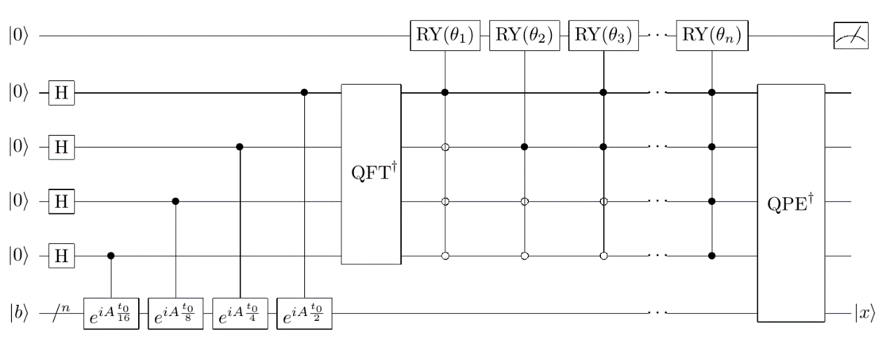

HHL算法
####

HHL算法是一种求解线性方程组的量子算法，线性方程组在许多领域中都有着广泛的实际应用。

问题背景概述
*******************

线性方程组问题可定义为：
给定矩阵 :math:`A\in C^{N\times N}` 和向量 :math:`\vec{b}\in C^N` ，找到 :math:`\vec{x}\in C^N` \
满足 :math:`A\vec{x}=\vec{b}`。

如果矩阵A每行或每列最多具有s个非零元，则将线性方程组称为s-稀疏线性方程组。用经典算法（共轭梯度法）来解决\
N维的s-稀疏线性方程组，需要的时间复杂度为 :math:`O\left(Nsk\log{\left(\frac{1}{\varepsilon}\right)}\right)`\
，这里k表示系统的条件数， :math:`\varepsilon` 表示近似的精度。HHL是一种量子算法，当A是自共轭矩阵时，\
用HHL算法解线性方程组的时间复杂度为 :math:`O\left(\log{\left(N\right)}s^2\frac{k^2}{\varepsilon}\right)`。

HHL算法相对于经典算法有着指数级的加速，但经典算法可以返回精确解，而HHL算法只能返回近似解。

.. note:: HHL算法是一种纯量子算法，它和它的改进版的出现对于证明量子算法的实用性有着重大意义。

算法原理
*********************************

在对线性方程组进行一定格式转换后可以以HHL算法进行求解，HHL算法主要包含了以下三大步骤，并需要使用右端项比特、存储比特和辅助比特总共三个寄存器。

#. 构造右端项量子态，对存储比特及右端项比特进行参数含左端项矩阵的相位估计，将左端项矩阵的整数形式特征值全部转移到存储比特的基向量中。
#. 进行一系列参数含特征值的受控旋转，过滤出所有的特征值相关量子态，将特征值从存储比特的基向量转移到振幅；
#. 对特征存储比特及右端项比特进行逆相位估计，将存储比特振幅上的特征值合并到右端项比特上，当辅助比特测量得到特定状态时，在右端项比特上可得到解的量子态。

在进行算法具体步骤之前，需要对经典形式的线性方程组求解问题 :math:`A\vec{x}=\vec{b}` 进行特定转换：

不失一般性地假设矩阵 :math:`A` 为自共轭矩阵，否则取

.. math::
   \begin{aligned}
   C_A=\left[\begin{matrix}0&A\\A^H&0\\\end{matrix}\right],
   C_b=\left[\begin{matrix}b\\0\\\end{matrix}\right],
   C_x=\left[\begin{matrix}0\\x\\\end{matrix}\right],
   \end{aligned}
使得 :math:`C_A\vec{C_x}=\vec{C_b}` 成立且满足 :math:`C_A` 自共轭。

以下内容中将默认A为自共轭矩阵。

将向量 :math:`\vec{b},\vec{x}` 分别归一化后采用编码到振幅上的方式映射到量子态 :math:`\left|b\right\rangle,\left|x\right\rangle` ，\
原问题转换为 :math:`A\left|x\right\rangle=\left|b\right\rangle`.

对矩阵 :math:`A` 进行谱分解有

.. math::
   \begin{aligned}
   A=\sum_{j=0}^{N-1}\lambda_j\left|u_j\right\rangle\left\langle u_j\right|,\lambda_j\in R.
   \end{aligned}
其中 :math:`{{\lambda}_j,u_j}` 为矩阵A的特征对（特征值及相应的特征向量）。

将 :math:`\left|b\right\rangle` 以特征向量基展开，得到

.. math::
   \begin{aligned}
   \left|b\right\rangle=\sum_{j=0}^{N-1}{b_j\left|u_j\right\rangle},b_j\in C.
   \end{aligned}
于是原方程组的解可表示为

.. math::
   \left|x\right\rangle=A^{-1}\left|b\right\rangle=\sum_{j=0}^{N-1}{\lambda_j^{-1}b_j\left|u_j\right\rangle.}
显而易见算法的基本思路应当是从右端项量子态 :math:`\left|b\right\rangle` 出发构造解量子态 :math:`\left|x\right\rangle` 。

通过QPE提取特征值
++++

为了将矩阵 :math:`A` 的特征值提取到解量子态的振幅，首先需要完成特征值的提取。
由前文可知，QPE量子线路可以用于特征值提取。

对 :math:`\left|0\right\rangle^{\otimes n}\left|b\right\rangle` 进行一次QPE操作，得到

.. math::
   \begin{aligned}
   {QPE(\left|0\right\rangle}^{\otimes n}\left|b\right\rangle)=\sum_{j=0}^{N-1}{b_j\left|\widetilde{\lambda_j}\right\rangle\left|u_j\right\rangle}.
   \end{aligned}
其中 :math:`\widetilde{\lambda_j}` 是对应特征值 :math:`\lambda_j` 的近似整数，细节参见QPE部分介绍。
于是矩阵A的特征值信息存入到了基向量 :math:`\left|\widetilde{\lambda_j}\right\rangle` 中。

通过受控旋转转移特征值
++++

构造如下受控旋转 :math:`CR(k)`

.. math::
   \begin{aligned}
   CR(k)(\left|a\right\rangle\left|j\right\rangle)=\left\{\begin{matrix}
   RY(\arccos{\frac{C}{k}})\left|a\right\rangle\left|k\right\rangle,j=k,\\ 
   \left|a\right\rangle\left|j\right\rangle,j\neq k,
   \end{matrix}\right.
   \end{aligned}
式中 :math:`C` 为 :math:`\widetilde{\lambda_j}` 的归一化系数，有 :math:`C\le\smash{\displaystyle\min_{j}} {\left|\widetilde{\lambda_j}\right|}`\
从而任意 :math:`\frac{C^2}{{\widetilde{\lambda_j}}^2}\le 1`。对 :math:`\sum_{j=0}^{N-1}{b_j\left|0\right\rangle
\left|\widetilde{\lambda_j}\right\rangle\left|u_j\right\rangle}` 经过遍历式旋转量子门操作后可以得到

.. math::
   \begin{aligned}
   (\prod (CR(k)\otimes I))\sum_{N-1}^{j=0}b_j\left|0\right\rangle\left|\widetilde{\lambda_j}\right\rangle
   \left|u_j\right\rangle=\sum_{j=0}^{N-1}{(\sqrt{1-\frac{C^2}{{\widetilde{\lambda_j}}^2}}\left|0\right\rangle
   +\frac{C}{\widetilde{\lambda_j}}\left|1\right\rangle)b_j\left|\widetilde{\lambda_j}\right\rangle\left|u_j\right\rangle}.
   \end{aligned}

通过逆QPE输出结果量子态
++++

理论上，受控旋转后的量子态已经可以通过测量得到解量子态 :math:`\left|x\right\rangle` 。

但为了避免出现 :math:`\left|u_j\right\rangle` 相同但\
:math:`\left|\widetilde{\lambda_j}\right\rangle` 不同的需要合并的量子态\
:math:`\frac{C }{\widetilde{\lambda_j}}b_j\left|1\right\rangle\left|\widetilde{\lambda_j}\right\rangle\left|u_j\right\rangle`，应当选择\
逆QPE操作来得到形如 :math:`\frac{C }{\widetilde{\lambda_j}}b_j\left|1\right\rangle\left|0\right\rangle\left|u_j\right\rangle` 的结果量子态。

对旋转结果进行逆QPE，有

.. math::
   \begin{aligned}
   & (I\otimes{QPE}^{\dagger})\sum_{j=0}^{N-1}{(\sqrt{1-\frac{C^2}{{\widetilde{\lambda_j}}^2}}\left|0\right\rangle+\frac{C}{\widetilde{\lambda_j}}
   \left|1\right\rangle)b_j\left|\widetilde{\lambda_j}\right\rangle\left|u_j\right\rangle} \\ & 
   =\sum_{j=0}^{N-1}{(b_j}\sqrt{1-\frac{C^2}{{\widetilde{\lambda_j}}^2}}\left|0\right\rangle\left|0\right\rangle\left|u_j\right\rangle+b_j
   \frac{C}{\widetilde{\lambda_j}}\left|1\right\rangle\left|0\right\rangle\left|u_j\right\rangle).
   \end{aligned}

事实上即使是这种形式的结果量子态，由于误差的存在，依然无法在第一个和第二个量子寄存器分别为 :math:`\left|1\right\rangle,\left|0\right\rangle` \
的情况下以概率1得到解量子态 :math:`\left|x\right\rangle=\sum_{j=0}^{N-1}{\lambda_j^{-1}b_j\left|u_j\right\rangle}` 。

.. note:: HHL算法充分利用了量子相位估计提取特征值信息的功能，巧妙构造了受控旋转门从存储比特的基向量中抓取特征值存入振幅，
   最后利用逆相位估计还原存储量子比特，从而得到了振幅含特征值的方程解。

量子线路图与参考代码
****

HHL算法的量子线路图如下所示

基于QPanda-2.0的HHL算法实现代码较为冗长，此处不作详述，具体参见\
`QPanda-2.0下HHL算法程序源码 <https://github.com/OriginQ/QPanda-2/tree/master/QAlg/HHL>`_ \ ，\
此处仅介绍QPanda-2.0中提供的几个HHL算法调用接口。

.. code-block:: python

   HHL(matrix, data, QuantumMachine)

   HHL_solve_linear_equations(matrix, data)

第一个函数接口用于得到HHL算法对应的量子线路，第二个函数接口则可以输入QStat格式的矩阵和右端项，返还解向量。

选择一个最简单的二维左端项单位矩阵例子来验证HHL接口函数的可用性，代码实例如下：

.. code-block:: python
   
    #!/usr/bin/env python

    import pyqpanda as pq
    import numpy as np

    if __name__ == "__main__":

        machine = pq.init_quantum_machine(pq.QMachineType.CPU)
        prog = pq.create_empty_qprog()

        # 构建量子程序
        prog.insert(pq.build_HHL_circuit([1,0,0,1],[0.6,0.8],machine))

        pq.directly_run(prog)

        result = np.array(machine.get_qstate())[:2]
        pq.destroy_quantum_machine(machine)

        #打印测量结果
        for key in result:
             print(key)

输出结果应该和右端项向量一样是 :math:`[0.6,0.8]`，因为误差会出现较小的扰动：

.. code-block:: python:

   (0.5988269448280334-3.930189507173054e-14i)
   (0.7984358668327332-8.08242361927114e-14i)
