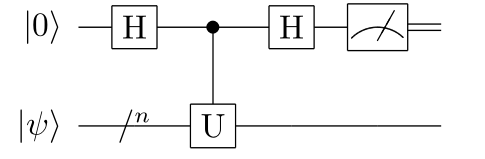
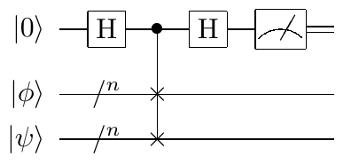

Hadamard Test与SWAP Test
####

量子线路是一系列量子门操作的组合。众多量子线路中有一部分量子线路是在构造量子算法时会被反复使用，\
这些被高频调用的量子线路组件我们称之为量子算法基本线路，下面将介绍几种常用基本线路。

----

Hadamard Test
****

Hadamard Test量子线路的主要作用是对任给的幺正算符 :math:`U` 和量子态 :math:`\psi` ，\
可以给出该幺正算符在量子态上的投影期望 :math:`\left\langle\psi\left|U\right|\psi\right\rangle` 。

Hadamard Test的量子线路图结构简单，如下所示。

整个量子线路可以视为对两个寄存器中量子比特组成的一个n+1维量子态 :math:`\left|0\right\rangle\left|\psi\right\rangle` \
进行量子门操作组合 :math:`Q=\left.(H\otimes I^{\otimes n})\left(C-U\right)(H\otimes I^{\otimes n}\right)`\
，其中 :math:`C-U` 表示基于幺正算符 :math:`U` 的受控门。

输出结果及推广
++++

对Hadamard Test量子线路的输出结果进行推导，有如下结论：

.. math::

   \begin{aligned}
   Q\left|0\right\rangle\left|\psi\right\rangle=\frac{\left|0\right\rangle+\left|1\right\rangle}{2} \ 
   \left|\psi\right\rangle+\frac{\left|0\right\rangle-\left|1\right\rangle}{2}U\left|\psi\right\rangle \\
   =\left|0\right\rangle\frac{\left|\psi\right\rangle+U\left|\psi\right\rangle}{2}+\left|1\right\rangle \ 
   \frac{\left|\psi\right\rangle-U\left|\psi\right\rangle}{2}.
   \end{aligned}

对输出的结果量子态进行测量得到 :math:`\left|0\right\rangle`，:math:`\left|1\right\rangle`  的概率为

.. math::

   \begin{aligned}
   P_0= \frac{1}{4}\left \| (I+U)(Q\left|{0} \right\rangle\left|\psi \right\rangle)| \right \|^2 \ 
   =\frac{1+Re(\left\langle\psi\left|U\right|\psi\right\rangle)}{2}, \
   P_1 = 1- P_0.
   \end{aligned}

由公式推导可知，Hadamard Test的结果相应的测量概率均与 :math:`Re(\left\langle\psi\left|U\right|\psi\right\rangle)` \ 
即幺正算符 :math:`U` 在量子态 :math:`\psi` 上投影期望的实部相关。

将图中测量之前的 :math:`H` 门换成 :math:`RX(\frac{\pi}{2})` 门，则可以得到概率与投影期望虚部相关的结果量子态。

代码实例
++++

取 :math:`\left|\psi\right\rangle=\frac{\left|0\right\rangle+\left|1\right\rangle}{\sqrt2},U=H`，\
Hadamard Test的一个代码实例如下：

.. code-block::

    #!/usr/bin/env python

    from pyqpanda import *

    if __name__ == "__main__":

        machine = init_quantum_machine(QMachineType.CPU_SINGLE_THREAD)
        cqv = machine.qAlloc_many(1)
        tqv = machine.qAlloc_many(1)
        prog = create_empty_qprog()

        # 构建量子程序
        prog.insert(H(cqv[0])) \
            .insert(H(tqv[0])) \
            .insert(H(tqv[0]).control([cqv[0]]))\
            .insert(H(cqv[0]))

        # 对量子程序进行概率测量
        result = prob_run_dict(prog, cqv, -1)
        destroy_quantum_machine(machine)

        # 打印测量结果
        for key in result:
            print(key+":"+str(result[key]))

输出结果应如下所示，分别以 :math:`\frac{1+\sqrt2/2}{2}` 和 :math:`1-\frac{1+\sqrt2/2}{2}` 的概率\
得到 :math:`\left|0\right\rangle`\和 :math:`\left|1\right\rangle` ：

.. code-block::
    
    0:0.853553
    1:0.146447

Hadamard Test有着多种形式和广泛用途，其中一种特殊形式是基本量子线路SWAP Test。

SWAP Test
****

任给两个维数相同的量子态，通过SWAP Test线路，可以得到两个量子态的保真度，反应了它们的重叠情况。

两个量子态 :math:`\left|\phi\right\rangle, \left|\psi\right\rangle` 的保真度是指量子态内积范数的平方\
:math:`\left|\left\langle \phi |\psi\right\rangle \right|^2`。

SWAP Test的量子线路图如下所示。

对SWAP Test的公式推导验证过程完全类似于Hadamard Test，结果量子态的第一个寄存器测量得到\
:math:`\left|0\right\rangle, \left|1\right\rangle` 的概率均与给定的两个量子态的保真度相关。

.. math::

   \begin{aligned}
   P_0= \frac{1+\left|\left\langle\psi|\phi\right\rangle\right|^2}{2}, \
   P_1 = 1- P_0.
   \end{aligned}

SWAP Test作为Hadamard的一种特殊形式，它对两个给定量子态给出了其保真度相关的测量结果，\
具有重要应用意义。在量子态的内积相关研究中有着重要作用。

如果将受控SWAP门替换为一般的受控门F那么可以还原得到一般形式的Hadamard Test的结果量子态

.. math::
   \begin{aligned}
   \frac{\left|0\right\rangle}{2}(I+F)\left|\phi\right\rangle \ 
   \left|\psi\right\rangle+\frac{\left|1\right\rangle}{2}(I-F)\left|\phi\right\rangle\left|\psi\right\rangle.
   \end{aligned}

代码实例
++++

SWAP Test的代码实例与Hadamard Test有细微区别。

取 :math:`\left|\phi\right\rangle=\frac{\left|0\right\rangle+\left|1\right\rangle} \ 
{\sqrt2},\left|\psi\right\rangle=\left|1\right\rangle`，\
SWAP Test的一个代码实例如下：

.. code-block::

    #!/usr/bin/env python

    from pyqpanda import *

    if __name__ == "__main__":

        machine = init_quantum_machine(QMachineType.CPU_SINGLE_THREAD)
        cqv = machine.qAlloc_many(1)
        tqv = machine.qAlloc_many(1)
        qvec = machine.qAlloc_many(1)
        prog = create_empty_qprog()

        # 构建量子程序
        prog.insert(H(cqv[0])) \
            .insert(H(tqv[0])) \
            .insert(X(qvec[0])) \
            .insert(SWAP(tqv[0],qvec[0]).control([cqv[0]]))\
            .insert(H(cqv[0]))

        # 对量子程序进行概率测量
        result = prob_run_dict(prog, cqv, -1)
        destroy_quantum_machine(machine)

        # 打印测量结果
        for key in result:
            print(key+":"+str(result[key]))

输出结果应如下所示，分别以 :math:`0.75` 和 :math:`0.25` 的概率\
得到 :math:`\left|0\right\rangle`\和 :math:`\left|1\right\rangle` ：

.. code-block::
    
    0:0.75
    1:0.25