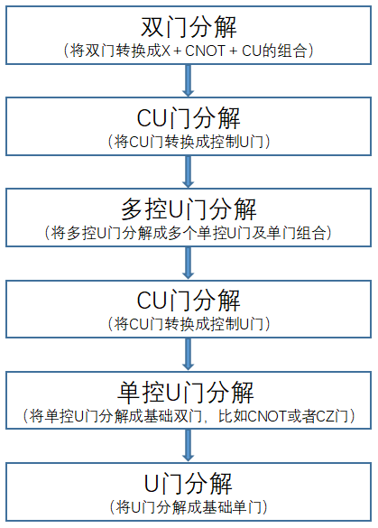
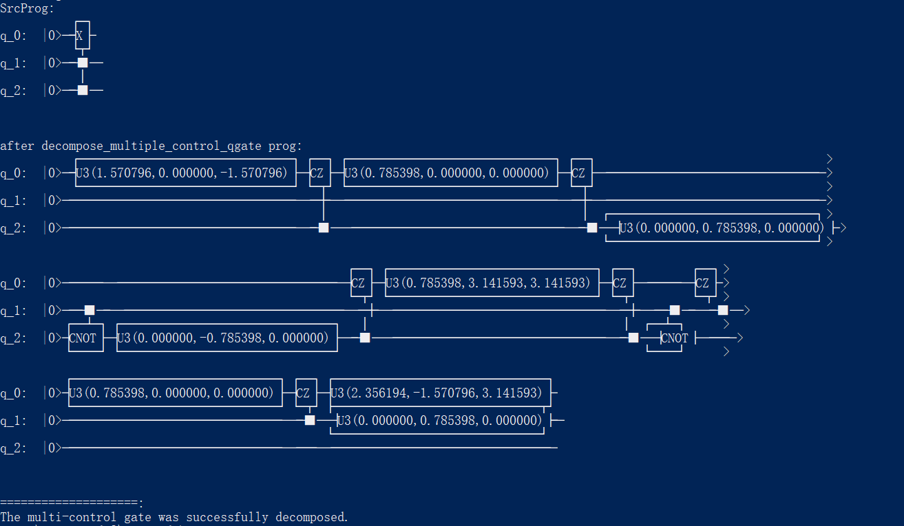

多控门分解
=====================

在量子算法实现过程中，经常会用到多控门，如下图所示：
    

 .. code-block:: python

              ┌─┐ ┌─┐     ┌─┐ ┌─┐
    q_0:  |0>─┤H├ ┤X├ ─■─ ┤H├ ┤X├
              ├─┤ ├─┤  │  ├─┤ ├─┤
    q_1:  |0>─┤H├ ┤X├ ─■─ ┤H├ ┤X├
              ├─┤ ├─┤  │  ├─┤ ├─┤
    q_2:  |0>─┤H├ ┤X├ ─■─ ┤H├ ┤X├
              ├─┤ ├─┤  │  ├─┤ ├─┤
    q_3:  |0>─┤H├ ┤X├ ─■─ ┤H├ ┤X├
              ├─┤ ├─┤  │  ├─┤ ├─┤
    q_4:  |0>─┤H├ ┤X├ ─■─ ┤H├ ┤X├
              ├─┤ ├─┤ ┌┴┐ ├─┤ ├─┤
    q_5:  |0>─┤H├ ┤X├ ┤Z├ ┤H├ ┤X├
              └─┘ └─┘ └─┘ └─┘ └─┘

量子程序员在设计量子算法时经常会用到多控门，如上图所示，从图中我们可以看到有一个6个qubit受控的CZ门，在更加复杂的量子算法场景下，将会出现更多的、受控维度更高的多控门。目前实现的物理量子计算机基本都不支持多控门，并且我们无法保证所有的受控物理qubit都处于连通状态（目前的物理量子芯片都有固定的拓扑结构），所以想要在真实物理量子计算机上运行量子算法，首先要对多控门进行拆解，使其转换成N个量子芯片支持的逻辑门的组合，以适配目标量子芯片。

目前PyQPanda中实现了两种多控门分解算法，并封装成对应的算法接口，下面分别对两种分解方法做详细介绍。
    
算法概述及接口介绍
>>>>>>>>>>
----

1. **传统多控门分解算法**：该算法的实现过程如下流程图所示：

对应的接口如下：

    .. code-block:: python
        decompose_multiple_control_qgate(prog, qvm, 'QPandaConfig.json')
    
    
**使用介绍**

通过调用decompose_multiple_control_qgate接口，可将目标量子线路中的多控门转换为指定的基础逻辑门组合，其中基础逻辑门包括基础单门和基础单门，通过配置文件给出。该接口需要3个参数，第一个是目标量子线路或者量子程序，第二个是目标量子线路或者量子程序对应的量子虚拟机，第三个参数用于指定配置信息，配置信息可以json文件或者json字符串，配置文件中指定了基础逻辑门信息。

实例
>>>>>>>>>>
----

.. _多控门分解示例程序:

以下示例展示了多控门分解接口的使用方式：

    .. code-block:: python
  
        from pyqpanda import *

        if __name__ == "__main__":
            qvm = CPUQVM()
            qvm.init_qvm()
            q = qvm.qAlloc_many(6)
            c = qvm.cAlloc_many(6)

            #构造测试量子线路
            prog = QProg()
            prog << H(q[1]) << H(q[2]) << Z(q[0]).control([q[1],q[2]])
            print("SrcProg: ", prog)
            src_mat = get_matrix(prog)
            #执行多控门分解操作
            after_prog = decompose_multiple_control_qgate(prog, qvm)
            print("after decompose_multiple_control_qgate prog: ", after_prog)
            after_mat = get_matrix(after_prog)

            if(src_mat == after_mat):
                print("The multi-control gate was successfully decomposed.")
            else:
                print("Decompose error !")

上述实例运行的结果如下：

根据测试程序数据结果可知，量子线路中的多控门被成功分解，且分解前后，量子线路矩阵形式不变，达到预期效果。

