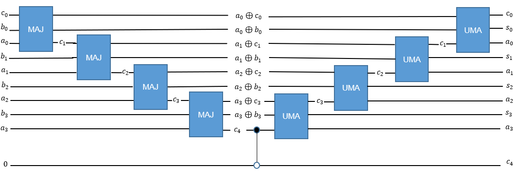
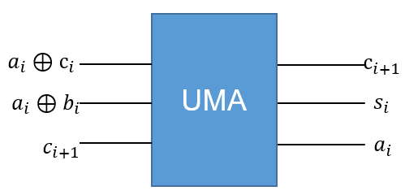

量子四则运算
####

在特定情况下，量子计算机中需要实现基本的四则运算。量子加法器及衍生出来的量子四则运算可以满足这些计算需求。

加法器算法背景
****

除了测量之外的所有量子门操作都是酉变换，因而不含测量的量子线路整体是可逆的。

量子加法器的量子线路也应当可逆，因而输入输出是数量相等的量子比特，量子线路图如下所示。

图中包含了两种子量子线路模块MAJ和UMA，作用分别是获得当前二进制位的进位数值和当前二进制位的结果数值。

MAJ量子线路组件
++++

MAJ的量子线路如下所示。

.. image:: images/MAJ.png
   :align: center

.. image:: images/MAJ_detail.png
   :align: center

下面对MAJ量子线路的具体功能进行解读。

MAJ量子线路的输入分别为前一位的进位值 :math:`c_i`、当前位的两个待加值 :math:`a_i,b_i`，输出为\
:math:`a_i+c_i \ \text{mod}\ 2`， :math:`a_i+b_i \ \text{mod} \ 2` 和当前位进位值 :math:`c_{i+1}` 。

MAJ模块是为了实现获得进位，我们想要得到进位 :math:`c_{i+1}` ,也就是要从 :math:`a_i+b_i+c_i` 出发，判断 :math:`(a_i+b_i+c_i)/2`。

在待加值中任选一个数 :math:`a_i` 对进位情况进行如下枚举，

#. :math:`a_i=0`， :math:`c_i=[(a_i+b_i)\%2]*[(a_i+c_i)\%2]`；
#. :math:`a_i=1`， :math:`c_i=([(a_i+b_i)\%2]*[(a_i+c_i)\%2]+1)\%2`；

因此，只需要考察 :math:`a_i,[(a_i+b_i)\%2]*[(a_i+c_i)\%2]` 就可以判断进位情况。

从现有的量子逻辑门出发，制备量子态 :math:`a_i, (a_i+b_i)\%2, (a_i+c_i)\%2`，即可以准确判断出进位的情况。\
此处选取的考察对象并不唯一，其他方案会衍生出相应的量子线路。

制备三个量子态的方案如上图中所示，使用CNOT门来完成模2加法得到 :math:`(a_i+b_i)\%2, (a_i+c_i)\%2`，使用Toffoli门完成\
:math:`a` 与 :math:`[[(a_i+b_i)\%2]*[(a_i+c_i)\%2]` 的异或运算。

UMA量子线路组件
++++

UMA的量子线路如下所示。

.. image:: images/UMA_detail.png
   :align: center

下面对UMA量子线路的具体功能进行解读。

UMA量子线路的输入分别为 :math:`a_i+c_i \ \text{mod}\ 2`， :math:`a_i+b_i \ \text{mod} \ 2` 和当前位进位值 :math:`c_{i+1}`，\
输出为 :math:`c_i`， :math:`a_i+b_i+c_i \ \text{mod} \ 2 := s_i` 和 :math:`a_i`。

UMA模块是为了实现获得当前位结果，我们想要得到当前位 :math:`s_i` ,也就是要得到 :math:`(a_i+b_i+c_i)\%2`。

参考MAJ模块，首先通过与MAJ所用的完全相反的TOffoli门由 :math:`c_{i+1}` 得到 :math:`a_i`，然后利用与MAJ所用的相反的CNOT变换得到 :math:`c_i` ，\
综合已有的 :math:`a_i+b_i \ \text{mod} \ 2` ，于是可以通过简单的CNOT门得到 :math:`(a_i+b_i+c_i)\%2`。

整个过程的前两步都可以视为MAJ相应量子门的逆变换。

.. note:: MAJ的实现量子线路是不唯一的，那么UMA也是不唯一的吗？

量子四则运算
****

.. note::在尝试调用量子四则运算之前，应回顾一下数据编码一节中如何编码经典数据得到自己所需的量子态。

量子加法器
++++

量子加法器的原理如前文所示。

量子减法器
++++

基础的加法器只支持非负整数的加法。对于小数要求输入的被加数a和b必须小数点位置相同，小数点对齐后整体长度相同。

对于带符号变换的量子加法，则需要追加辅助比特用于记录符号位。任给两个目标量子态 :math:`A,B`，对第二个量子态 :math:`B` 进行特定的补码操作，然后转换为\
:math:`A-B=A+(-B)`，此处的 :math:`-B` 并不以符号位取反的方式实现。

该特定的补码操作为：符号位为正则不变，符号位为负需要按位取反后再加1。因此需要一个额外的辅助比特来控制是否进行求补码的操作。

量子减法器实质上就是量子加法器的带符号版本。

量子乘法器
++++

量子乘法器是基于加法器完成的。选择乘数 :math:`A` 作为受控比特，选择乘数 :math:`B` 以二进制展开逐位作为控制比特，将受控加法器的运算结果累加到辅助比特中。\
每完成一次 :math:`B` 控制的受控加法就将乘数 :math:`A` 左移一位并在末位补零。

于是把通过受控加法输出的数值在辅助比特中累加起来，得到乘法结果。

量子除法器
++++

量子除法器是基于量子减法器完成的，通过执行减法后被除数的符号位是否改变来完成大小比较，并决定除法是否终止。

除数减去被除数时，商结果加1。每完成一次减法后，重新进行被除数与除数的大小比较，直至除尽或者达到预设精度。

因此还需要额外追加一个存储精度参数的辅助比特。

代码实现及使用说明
****

量子加法器
++++

在QPanda-2.0中加法器的接口函数如下：

.. code-block:: python

   QAdder(adder1,adder2,c,is_carry)

   QAdderIgnoreCarry(adder1,adder2,c)

   QAdd(adder1,adder2,k)

前两种接口函数的区别是是否保留进位is_carry，但都只支持正数加法。参数中adder1与adder2为执行加法的比特且格式完全一致，c为辅助比特。

第三种加法器接口函数是带符号的加法器，是基于量子减法器实现的。\
待加数添加了符号位，相应的辅助比特也从1-2个单比特变为一个adder1.size()+2比特。

加法的输出比特都是adder1，其他非进位比特不变。

量子减法器
++++

量子减法器基于基本加法器完成，同时也是带符号的加法器的基础。

在QPanda-2.0中减法器（带符号的加法器）的接口函数如下：

.. code-block:: python

   QSub(a,b,k)

与带符号的加法器相同，两个待减数的量子比特最高位为符号位，辅助比特k.size()=a.size()+2。

减法的输出比特是a，其他比特不变。

量子乘法器
++++

在QPanda-2.0中乘法器的接口函数如下：

.. code-block:: python

   QMultiplier(a,b,k,d)

   QMul(a,b,k,d)

两个接口函数的输入待乘量子比特都包含符号位，但只有QMul支持带符号的乘法运算。

相应的，QMultiplier中，辅助比特k.size()=a.size()+1，结果比特d.size()=2*a.size()。

QMul中，辅助比特k.size()=a.size()，结果比特d.size()=2*a.size()-1。

乘法的输出比特都是d，其他比特不变。

如果等长的输入比特a和b存在小数点，那么在输出比特d中的小数点位置坐标为输入比特中的2倍。

量子除法器
++++

在QPanda-2.0中除法法器的接口函数如下：

.. code-block:: python

   QDivider(a,b,c,k,t)

   QDivider(a,b,c,k,f,s)

   QDiv(a,b,c,k,t)

   QDiv(a,b,c,k,f,s)

与乘法器类似，除法器也是分为两类，尽管输入的待运算比特都带有符号位，但接口分为带符号运算和仅限正数两类。

k为辅助比特，t或s为限制QWhile循环次数的经典比特。

此外，除法器有除不尽的问题，因此可以接口函数有如上四种，对应的输入和输出参数分别有如下性质：

#. QDivider返还余数和商（分别存储在a和c中）时，c.size()=a.size()，但k.size()=a*size()*2+2;
#. QDivider返还精度和商（分别存储在f和c中）时，c.size()=a.size()，但k.size()=3*size()*2+5；
#. QDiv返还余数和商（分别存储在a和c中）时，c.size()=a.size()，但k.size()=a*size()*2+4;
#. QDivider返还精度和商（分别存储在f和c中）时，c.size()=a.size()，但k.size()=a*size()*3+7；

如果参数不能满足量子四则运算所需的比特数目，那么计算依然会进行但结果会溢出。

除法的输出比特是c，带精度的除法中a,b,k都不会变，否则b,k不变但a中存储余数。

示例
****

下面是一个简单的基于QPanda-2.0调用量子四则运算的代码示例

.. code-block:: python

    #!/usr/bin/env python

    import pyqpanda as pq
    # from numpy import pi

    if __name__ == "__main__":
        # 为了节约比特数，辅助比特将会互相借用
        qvm = pq.init_quantum_machine(pq.QMachineType.CPU)
       
        qdivvec = qvm.qAlloc_many(10)
        qmulvec = qdivvec[:7]
        qsubvec = qmulvec[:-1]
        qvec1 = qvm.qAlloc_many(4)
        qvec2 = qvm.qAlloc_many(4)
        qvec3 = qvm.qAlloc_many(4)
        cbit = qvm.cAlloc()
        prog = pq.create_empty_qprog()

        # (4/1+1-3)*5=10
        prog.insert(pq.bind_data(4,qvec3)) \
           .insert(pq.bind_data(1,qvec2)) \
           .insert(pq.QDivider(qvec3, qvec2, qvec1, qdivvec, cbit)) \
           .insert(pq.bind_data(1,qvec2)) \
           .insert(pq.bind_data(1,qvec2)) \
           .insert(pq.QAdd(qvec1, qvec2, qsubvec)) \
           .insert(pq.bind_data(1,qvec2)) \
           .insert(pq.bind_data(3,qvec2)) \
           .insert(pq.QSub(qvec1, qvec2, qsubvec)) \
           .insert(pq.bind_data(3,qvec2)) \
           .insert(pq.bind_data(5,qvec2)) \
           .insert(pq.QMul(qvec1, qvec2, qvec3, qmulvec)) \
           .insert(pq.bind_data(5,qvec2))

        # 对量子程序进行概率测量
        result = pq.prob_run_dict(prog, qmulvec,1)
        pq.destroy_quantum_machine(qvm)

        # 打印测量结果
        for key in result:
           print(key+":"+str(result[key]))

执行的计算为 :math:`(4/1+1-3)*5=10`，因此结果应当以概率 :math:`1` 得到 :math:`\left|10\right\rangle`\
即 :math:`\left|1010\right\rangle`。

.. code-block:: python
    
    1010:1
