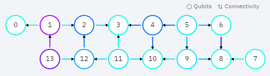
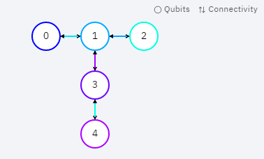

.. 量子线路信息查询:

获取量子线路对应矩阵
====================

接口 get_matrix 可以获得输入线路的对应矩阵，有3个输出参数，一个量子线路QCircuit(或者Qprog)，另外两个是可选参数：迭代器开始位置和结束位置，用于指定一个要获取对应矩阵信息的线路区间，如果这两个参数为空，代表要获取整个量子线路的矩阵信息。

.. note:: 使用 get_matrix 需要注意的是量子线路中不能包含测量操作。

实例
---------------

.. code-block:: python

    import pyqpanda.pyQPanda as pq
    import math

    class InitQMachine:
        def __init__(self, quBitCnt, cBitCnt, machineType = pq.QMachineType.CPU):
            self.m_machine = pq.init_quantum_machine(machineType)
            self.m_qlist = self.m_machine.qAlloc_many(quBitCnt)
            self.m_clist = self.m_machine.cAlloc_many(cBitCnt)
            self.m_prog = pq.QProg()

        def __del__(self):
            pq.destroy_quantum_machine(self.m_machine)

    def test_get_matrix(q, c):
        prog = pq.QProg()

        # 构建量子程序
        prog.insert(pq.H(q[0])) \
            .insert(pq.S(q[2])) \
            .insert(pq.CNOT(q[0], q[1])) \
            .insert(pq.CZ(q[1], q[2])) \
            .insert(pq.CR(q[1], q[2], math.pi/2))
        
        # 获取线路对应矩阵
        result_mat = pq.get_matrix(prog)

        # 打印矩阵信息
        pq.print_matrix(result_mat)

    if __name__=="__main__":
        init_machine = InitQMachine(16, 16)
        qlist = init_machine.m_qlist
        clist = init_machine.m_clist
        machine = init_machine.m_machine

        test_get_matrix(qlist, clist)
        print("Test over.")

具体步骤如下:

1. 首先在主程序中用 init_quantum_machine(pq.QMachineType.CPU) 初始化一个量子虚拟机对象，用于管理后续一系列行为
2. 接着用 machine.qAlloc_many() 和 machine.cAlloc_many() 初始化量子比特与经典寄存器数目，这里分别申请8个量子比特和8个经典寄存器
3. 然后构建 prog
4. 确定计算矩阵信息的线路区间，即设置 iter_start 和 iter_end 的值
5. 最后调用接口 get_matrix 输出量子线路的对应矩阵, 可通过接口 print_mat 接口打印获取到的矩阵信息

判断量子逻辑门是否匹配量子拓扑结构
====================================

每一款量子芯片都有其特殊的量子比特拓扑结构,例如IBMQ 提供的 ibmq_16_melbourne：

从图中可知，量子芯片中的每个量子比特不是两两相连的，不相连的量子比特之间是不能直接执行多门操作的。所以在执行量子程序之前需要先判断量子程序中的双门（多门）操作是否适配量子比特拓扑结构。

接口介绍
---------------

is_match_topology：判断量子逻辑门是否符合量子比特拓扑结构。第一个输入参数是目标量子逻辑门QGate，第二个输入参数是量子比特拓扑结构，返回值为布尔值，表示目标量子逻辑门是否满足量子比特拓扑结构。True为满足，False为不满足。

.. code-block:: python

    import pyqpanda.pyQPanda as pq
    import math

    class InitQMachine:
        def __init__(self, quBitCnt, cBitCnt, machineType = pq.QMachineType.CPU):
            self.m_machine = pq.init_quantum_machine(machineType)
            self.m_qlist = self.m_machine.qAlloc_many(quBitCnt)
            self.m_clist = self.m_machine.cAlloc_many(cBitCnt)
            self.m_prog = pq.QProg()

        def __del__(self):
            pq.destroy_quantum_machine(self.m_machine)
        
    def test_is_match_topology(q, c):
        cx = pq.CNOT(q[1], q[3])

        # 构建拓扑结构
        qubits_topology = [[0,1,0,0,0],[1,0,1,1,0],[0,1,0,0,0],[0,1,0,0,1],[0,0,0,1,0]]

        #判断逻辑门是否符合量子拓扑结构
        if (pq.is_match_topology(cx,qubits_topology)) == True:
            print('Match !\n')
        else:
            print('Not match.')

    if __name__=="__main__":
        init_machine = InitQMachine(16, 16)
        qlist = init_machine.m_qlist
        clist = init_machine.m_clist
        machine = init_machine.m_machine
        test_is_match_topology(qlist, clist)
        print("Test over.")

在使用 is_match_topology 前需要先构建指定量子芯片的量子比特拓扑结构邻接矩阵qubits_topology。

从以上示例可以看出，qubits_topology有5个量子比特，量子比特拓扑图如下：

CNOT逻辑门操作的是1,3号量子比特，而从图中可以看出1,3号量子比特是相连的，所以得到的结果为true。

获得指定位置的量子逻辑门的相邻量子逻辑门
========================================

接口 get_adjacent_qgate_type 可以获得量子程序中指定位置的量子逻辑门的相邻逻辑门。第一个输入参数为目标量子程序QProg，第二个是目标量子逻辑门在量子程序中的迭代器，返回结果是目标量子逻辑门的相邻量子逻辑门迭代器的集合。

实例
---------------

.. code-block:: python

    import pyqpanda.pyQPanda as pq
    import math

    class InitQMachine:
        def __init__(self, quBitCnt, cBitCnt, machineType = pq.QMachineType.CPU):
            self.m_machine = pq.init_quantum_machine(machineType)
            self.m_qlist = self.m_machine.qAlloc_many(quBitCnt)
            self.m_clist = self.m_machine.cAlloc_many(cBitCnt)
            self.m_prog = pq.QProg()

        def __del__(self):
            pq.destroy_quantum_machine(self.m_machine)

    def test_get_adjacent_qgate_type(qlist, clist):
        prog = pq.QProg() 
        
        # 构建量子程序
        prog.insert(pq.T(qlist[0])) \
        .insert(pq.CNOT(qlist[1], qlist[2])) \
        .insert(pq.Reset(qlist[1])) \
        .insert(pq.H(qlist[3])) \
        .insert(pq.H(qlist[4]))
        
        iter = prog.begin()
        iter = iter.get_next()
        type =iter.get_node_type()
        if pq.NodeType.GATE_NODE == type:
            gate = pq.QGate(iter)
            print(gate.gate_type())
        
        # 获取指定位置前后逻辑门类型
        list =pq.get_adjacent_qgate_type(prog,iter)
        print(len(list))
        print(len(list[0].m_qubits))
        print(list[1].m_is_dagger)

        node_type = list[0].m_node_type
        print(node_type)
        if node_type == pq.NodeType.GATE_NODE:
            gateFront = pq.QGate(list[0].m_itr)
            print(gateFront.gate_type())

        node_type = list[1].m_node_type
        print(node_type)
        if node_type == pq.NodeType.GATE_NODE:
            gateBack = pq.QGate(list[1].m_itr)
            print(gateBack.gate_type())

    if __name__=="__main__":
        init_machine = InitQMachine(16, 16)
        qlist = init_machine.m_qlist
        clist = init_machine.m_clist
        machine = init_machine.m_machine
        test_get_adjacent_qgate_type(qlist, clist)
        print("Test over.")

以上实例展示 get_adjacent_qgate_type 接口的使用方式：

  1. 构建一个量子程序prog；
  2. 指定位置信息，即设置iter
  3. 调用 get_adjacent_qgate_type 接口获取iter的相邻逻辑门的迭代器集合。示例代码最后4行分别打印了获取到的逻辑门的类型

在使用 get_adjacent_qgate_type 接口时，我们需要注意以下几点： 

  1. 目标量子逻辑门相邻量子逻辑门迭代器的集合永远包含两个元素；第一个元素是前一个量子逻辑门的迭代器，第二个元素是后一个量子逻辑门的迭代器。
  2. 如果目标量子逻辑门是量子程序的第一个节点，那么输出的参数目标量子逻辑门相邻量子逻辑门迭代器的集合中则只能获取目标量子逻辑门后一个量子逻辑门的迭代器，集合的第一个元素为空迭代器。
  3. 如果目标量子逻辑门是量子程序的最后一个量子逻辑门，那么输出的参数目标量子逻辑门相邻量子逻辑门迭代器的集合中则只能获取目标量子逻辑门前一个量子逻辑门的迭代器，集合的第二个元素为空迭代器。
  4. 如果目标量子逻辑门前一个节点是QIf或者QWhile，那么输出的参数目标量子逻辑门相邻量子逻辑门迭代器的集合中则只能获取目标量子逻辑门后一个量子逻辑门的迭代器，集合的第一个元素为空迭代器。
  5. 如果目标量子逻辑门后一个节点是QIf或者QWhile，那么输出的参数目标量子逻辑门相邻量子逻辑门迭代器的集合中则只能获取目标量子逻辑门前一个量子逻辑门的迭代器，集合的第二个元素为空迭代器。
  6. 如果目标量子逻辑门是QWhile的第一个量子逻辑门，那么输出的参数目标量子逻辑门相邻量子逻辑门迭代器的集合中则只能获取目标量子逻辑门后一个量子逻辑门的迭代器，集合的第一个元素为空迭代器。
  7. 如果目标量子逻辑门是QWhile的最后量子逻辑门，那么输出的参数目标量子逻辑门相邻量子逻辑门迭代器的集合中则只能获取目标量子逻辑门前一个量子逻辑门的迭代器，集合的第二个元素为空迭代器。

判断两个量子逻辑门是否可交换位置
================================

接口 is_swappable 可判断量子程序中两个指定位置的量子逻辑门是否可以交换位置。输入参数一为量子程序QProg，输入参数二，三是需要判断的两个量子逻辑门的迭代器。返回值为布尔值，True表示可交换，False表示不可交换。

实例
---------------

以下实例展示 is_swappable 接口的使用方式：

  1. 构建一个量子程序prog, 这里列举了一个稍微复杂的带嵌套节点的量子程序； 
  2. 获取嵌套节点cir的两个指定位置的迭代器：iter\_first和iter\_second；
  3. 调用 is_swappable 接口判断指定位置的两个逻辑门能否交换位置, 并在控制台输出能否交换的判断结果。

::

    import pyqpanda.pyQPanda as pq
    import math
    
    class InitQMachine:
        def __init__(self, quBitCnt, cBitCnt, machineType = pq.QMachineType.CPU):
            self.m_machine = pq.init_quantum_machine(machineType)
            self.m_qlist = self.m_machine.qAlloc_many(quBitCnt)
            self.m_clist = self.m_machine.cAlloc_many(cBitCnt)
            self.m_prog = pq.QProg()

        def __del__(self):
            pq.destroy_quantum_machine(self.m_machine)
        
    #测试接口： 判断指定的两个逻辑门是否可以交换位置
    def test_is_swappable(q, c):
        prog = pq.QProg()
        cir = pq.QCircuit()
        cir2 = pq.QCircuit()
        cir2.insert(pq.H(q[3])).insert(pq.RX(q[1], math.pi/2)).insert(pq.T(q[2])).insert(pq.RY(q[3], math.pi/2)).insert(pq.RZ(q[2], math.pi/2))
        cir2.set_dagger(True)
        cir.insert(pq.H(q[1])).insert(cir2).insert(pq.CR(q[1], q[2], math.pi/2))
        prog.insert(pq.H(q[0])).insert(pq.S(q[2]))\
        .insert(cir)\
        .insert(pq.CNOT(q[0], q[1])).insert(pq.CZ(q[1], q[2])).insert(pq.measure_all(q,c))

        iter_first = cir.begin()

        iter_second = cir2.begin()
        #iter_second = iter_second.get_next()
        #iter_second = iter_second.get_next()
        #iter_second = iter_second.get_next()

        type =iter_first.get_node_type()
        if pq.NodeType.GATE_NODE == type:
            gate = pq.QGate(iter_first)
            print(gate.gate_type())

        type =iter_second.get_node_type()
        if pq.NodeType.GATE_NODE == type:
            gate = pq.QGate(iter_second)
            print(gate.gate_type())

        if (pq.is_swappable(prog, iter_first, iter_second)) == True:
            print('Could be swapped !\n')
        else:
            print('Could NOT be swapped.')
        
    if __name__=="__main__":
        init_machine = InitQMachine(16, 16)
        qlist = init_machine.m_qlist
        clist = init_machine.m_clist
        machine = init_machine.m_machine

        test_is_swappable(qlist, clist)
        print("Test over.")

判断逻辑门是否属于量子芯片支持的量子逻辑门集合
==============================================

量子芯片支持的量子逻辑门集合可在元数据配置文件QPandaConfig.xml中配置。如果我们没有设置配置文件，QPanda会默认设置一个默认量子逻辑门集合。

默认集合如下所示：

::

        single_gates.push_back("RX");
        single_gates.push_back("RY");
        single_gates.push_back("RZ");
        single_gates.push_back("X1");
        single_gates.push_back("H");
        single_gates.push_back("S");

        double_gates.push_back("CNOT");
        double_gates.push_back("CZ");
        double_gates.push_back("ISWAP");

配置文件可仿照下面设置:

::

    <QGate>
        <SingleGate>
            <Gate time = "2">rx</Gate>
            <Gate time = "2">Ry</Gate>
            <Gate time = "2">RZ</Gate>
            <Gate time = "2">S</Gate>
            <Gate time = "2">H</Gate>
            <Gate time = "2">X1</Gate>
        </SingleGate>
        <DoubleGate>
            <Gate time = "5">CNOT</Gate>
            <Gate time = "5">CZ</Gate>
            <Gate time = "5">ISWAP</Gate>
        </DoubleGate>
    </QGate>

从上面的示例中我们可以得到，量子芯片支持RX，RY，RZ，S，H，X1，CNOT，CZ，ISWAP门。在配置文件配置完成后，我们可以调用接口 is_supported_qgate_type ，判断逻辑门是否属于量子芯片支持的量子逻辑门集合。is_supported_qgate_type 接口只有一个参数：目标量子逻辑门。

::

    import pyqpanda.pyQPanda as pq
    import math
    
    class InitQMachine:
        def __init__(self, quBitCnt, cBitCnt, machineType = pq.QMachineType.CPU):
            self.m_machine = pq.init_quantum_machine(machineType)
            self.m_qlist = self.m_machine.qAlloc_many(quBitCnt)
            self.m_clist = self.m_machine.cAlloc_many(cBitCnt)
            self.m_prog = pq.QProg()

        def __del__(self):
            pq.destroy_quantum_machine(self.m_machine)
        
    def test_support_qgate_type():
        machine = pq.init_quantum_machine(pq.QMachineType.CPU)
        q = machine.qAlloc_many(8)
        c = machine.cAlloc_many(8)
    
        prog = pq.QProg()
        prog.insert(pq.H(q[1]))
        result = pq.is_supported_qgate_type(prog.begin())
        if result == True:
            print('Support !\n')
        else:
            print('Unsupport !')
        
    if __name__=="__main__":
        init_machine = InitQMachine(16, 16)
        qlist = init_machine.m_qlist
        clist = init_machine.m_clist
        machine = init_machine.m_machine

        test_support_qgate_type()
        print("Test over.")

.. note:: 用户可通过如下链接地址获取默认配置文件 `QPandaConfig.json <https://github.com/OriginQ/QPanda-2/blob/master/QPandaConfig.json>`_, 将该默认配置文件放在执行程序同级目录下，可执行程序会自动解析该文件。
