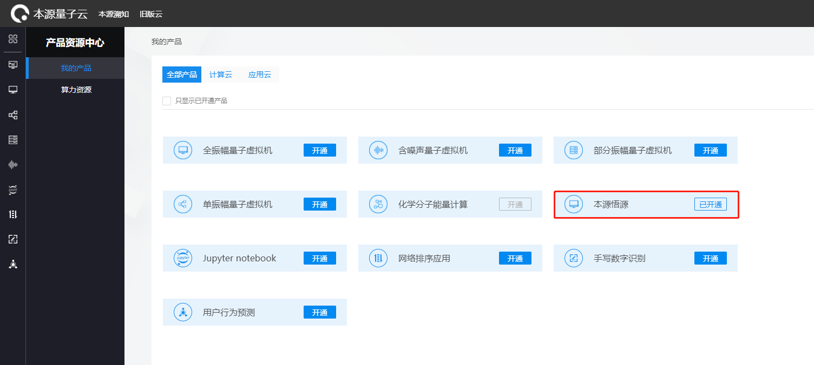

量子云虚拟机
=====================

在复杂的量子线路模拟中有必要借助于高性能计算机集群或真实的量子计算机，用云计算的方式替代本地计算，在一定程度上减轻用户的计算成本，获得更好的计算体验。

量子云虚拟机基于量子云平台，用户通过量子云平台经由调度服务器向部署在远程的量子计算机或计算集群提交任务，并接收返回的结果，流程如下图所示。

.. image:: images/qcloud.gif
   :align: center  

pyqpanda封装了量子云虚拟机，可以向本源量子的计算服务器集群或量子真实芯片发送计算指令，并获取计算结果，在使用下文介绍的各种虚拟机之前，需要确保已开通对应的虚拟机产品。

本源悟源真实芯片计算任务
>>>>>>>>>>>>>>>>>>>>>>>>>>>>>>
----

``本源悟源`` 是2020年9月12日本源量子自主研发的超导量子计算机（搭载6比特超导量子处理器夸父 KF C6-130）。得益于本源超导量子计算云平台，量子计算机可以走出实验室，为众多潜在行业提供探索量子计算的基础条件，推进量子计算产业落地与工程化发展，真正为人类社会服务。

超导量子计算云平台作为连接用户和量子计算系统之间的桥梁，在用户向量子系统发起计算任务到量子系统完成计算任务后返回计算结果过程中，发挥着重要的协调中转作用。

本源悟源的 ``芯片拓扑结构图`` 如下：

.. image:: images/tuopu.png
   :align: center

对应的 ``芯片参数`` 信息如下图：

.. image:: images/param.png
   :align: center

通过本源悟源请求计算任务的完整代码流程如下：

    .. code-block:: python

        from pyqpanda import *
        
        # 通过QCloud()创建量子云虚拟机
        QCM = QCloud()

        # 通过传入当前用户的token来初始化
        QCM.init_qvm("3B1AC640AAC248C6A7EE4E8D8537370D")

        qlist = QCM.qAlloc_many(6)
        clist = QCM.cAlloc_many(6)

        # 构建量子程序，可以手动输入，也可以来自OriginIR或QASM语法文件等
        measure_prog = QProg()
        measure_prog.insert(hadamard_circuit(qlist))\
                    .insert(CZ(qlist[1], qlist[5]))\
                    .insert(Measure(qlist[0], clist[0]))\
                    .insert(Measure(qlist[1], clist[1]))

        pmeasure_prog = QProg()
        pmeasure_prog.insert(hadamard_circuit(qlist))\
                        .insert(CZ(qlist[1], qlist[5]))\
                        .insert(RX(qlist[2], PI / 4))\
                        .insert(RX(qlist[1], PI / 4))\

        # 调用真实芯片计算接口，需要量子程序和测量次数两个参数
        result = QCM.real_chip_measure(measure_prog, 1000)
        print(result)

        QCM.finalize()

    上述过程需要注意的是， ``init`` 需要用户传入量子云平台用户验证标识 ``token`` ，可以从本源量子云平台个人信息下获取，具体见下方截图。

    .. image:: images/token.png
        :align: center  
    
    输出结果如下,左侧是量子态的二进制表示，右边表示测量次数对应的概率：
    
    .. code-block:: python

        {'00': 0.009017310339861142, 
         '01': 0.05618913175703472, 
         '10': 0.027749039108681332, 
         '11': 0.907044518794423}

    在使用本源悟源真实芯片测量操作时，经常会遇到各种错误，下面给出部分错误信息，可以根据抛出的错误异常信息进行对号入座。

    -  ``server connection failed`` ：该异常表示服务器宕机或与服务器连接失败
    -  ``api key error`` ：该异常表示用户的API-Key参数异常，请去官网确认个人资料的信息
    -  ``un-activate products or lack of computing power`` ：该异常表示用户未开通该产品或算力不足
    -  ``build system error`` ：该异常表示编译系统运行出错
    -  ``exceeding maximum timing sequence`` ：该异常表示量子程序时序过长
    -  ``unknown task status`` ：其他任务状态异常的情况
 
本源高性能计算集群虚拟机任务
>>>>>>>>>>>>>>>>>>>>>>>>>>>>>>
----

本源量子的高性能计算集群提供多种功能强大的虚拟机计算后端，适用于不同情况下的量子线路模拟需求，具体接口使用方式介绍如下：

    - ``1.full_amplitude_measure(全振幅蒙特卡洛测量操作)`` ：

        .. code-block:: python

            result0 = QCM.full_amplitude_measure(measure_prog, 100)
            print(result0)
        
        需要传入的第二个参数是测量次数，输出结果如下,左侧是量子态的二进制表示，右边表示测量次数对应的概率：
        
        .. code-block:: python

            {'00': 0.25, 
             '01': 0.28, 
             '10': 0.22, 
             '11': 0.25}

    - ``2.full_amplitude_pmeasure(全振幅概率测量操作)`` ：

        .. code-block:: python

            result1 = QCM.full_amplitude_pmeasure(pmeasure_prog, [0, 1, 2])
            print(result1)
        
        需要传入的第二个参数是测量的比特，输出结果如下,左侧是量子态的二进制表示，右边表示测量对应的概率：
        
        .. code-block:: python

            {'000': 0.125, 
             '001': 0.125, 
             '010': 0.125, 
             '011': 0.125, 
             '100': 0.125,
             '110': 0.125, 
             '111': 0.125}

    - ``3.partial_amplitude_pmeasure(部分振幅概率测量操作)`` ：

        .. code-block:: python

            result2 = QCM.partial_amplitude_pmeasure(pmeasure_prog, ["0", "1", "2"])
            print(result2)
        
        需要传入的第二个参数是测量的量子态振幅的十进制表示，输出结果如下,左侧是量子态振幅的十进制表示，右边表示复数形式的振幅值：
        
        .. code-block:: python

            {'0': (0.08838832192122936-0.08838833495974541j), 
             '1': (0.08838832192122936-0.08838833495974541j), 
             '2': (0.08838832192122936-0.08838833495974541j } 

    - ``4.single_amplitude_pmeasure(单振幅概率测量操作)`` ：

        .. code-block:: python

            result3 = QCM.single_amplitude_pmeasure(pmeasure_prog, "0")
            print(result3)
        
        需要传入的第二个参数是测量的振幅（十进制表示），输出结果如下,只会输出一个量子态对应的复数形式的振幅值：
        
        .. code-block:: python

            (0.08838833056846361-0.08838833850593952j)

    - ``5.noise_measure(噪声虚拟机测量操作)`` ：

        .. code-block:: python

            QCM.set_noise_model(NoiseModel.BIT_PHASE_FLIP_OPRATOR, [0.01], [0.02])
            result4 = QCM.noise_measure(measure_prog, 100)
            print(result4)
        
        通过 ``set_noise_model`` 设置噪声参数，第一个参数是噪声模型，后面分别是单门噪声参数和双门噪声参数，噪声模型的定义如下：

        .. code-block:: c

            enum NOISE_MODEL
            {
                DAMPING_KRAUS_OPERATOR,
                DEPHASING_KRAUS_OPERATOR,
                DECOHERENCE_KRAUS_OPERATOR_P1_P2,
                BITFLIP_KRAUS_OPERATOR,
                DEPOLARIZING_KRAUS_OPERATOR,
                BIT_PHASE_FLIP_OPRATOR,
                PHASE_DAMPING_OPRATOR,
                DECOHERENCE_KRAUS_OPERATOR,
                PAULI_KRAUS_MAP,
                KRAUS_MATRIX_OPRATOR,
                MIXED_UNITARY_OPRATOR,
            };

        可以通过pyqpanda的枚举类 ``NoiseModel`` 来获取，该接口输出结果如下,左侧是量子态的二进制表示，右边表示测量对应的概率：
        
        .. code-block:: python

            {'00': 0.26, 
             '01': 0.21, 
             '10': 0.29, 
             '11': 0.24}

        .. note:: 
            - 使用对应的计算接口时，需要确认当前用户已经开通了该产品，否则可能会导致提交计算任务失败。
            - 在噪声模拟时，退相干的单门噪声和双门参数参数分别有3个，不同于其他噪声
            - 本源悟源测量操作支持的测量次数范围在1000至10000之间，且目前仅支持6及以下量子比特的量子线路模拟，未来会加入其他的量子芯片，敬请期待。
            - 在使用时遇到任何问题，请给我们提交 `用户反馈 <https://qcloud.qubitonline.cn/userFeedback>`_ ，我们看到后会尽快解决你的问题
