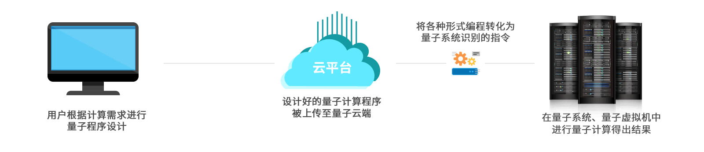

本源量子云服务
=====================

在复杂的量子线路模拟中有必要借助于高性能计算机集群或真实的量子计算机，用云计算的方式替代本地计算，在一定程度上减轻用户的计算成本，获得更好的计算体验。

本源量子量子云平台经由调度服务器向部署在远程的量子计算机或计算集群提交任务，并接收返回的结果，流程如下图所示。

pyqpanda封装了量子云虚拟机，可以向本源量子的计算服务器集群或量子真实芯片发送计算指令，并获取计算结果，在使用下文介绍的各种虚拟机之前，需要确保已开通对应的虚拟机产品。

.. image:: images/real.png
   :align: center

.. image:: images/cloud.png
   :align: center
 
.. toctree::
   :maxdepth: 2
   
   Realchip
   QCloudQVM
