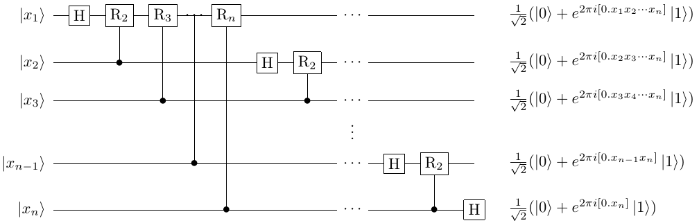

量子傅里叶变换
####

量子傅里叶变换（QFT）实质上是经典的逆离散傅里叶变换（IDFT）的量子版本。

量子傅里叶变换可以将存在于基向量中的数据与振幅中的数据在一定条件下相互转换。

基本定义
****

如图所示，QFT可以简单地通过对IDFT进行替换得到，QFT和DFT本质上都是同一个向量在两个等价空间中的不同表示形式，即基向量的更换。

.. math::

   \begin{aligned}
   y_k\rightarrow\frac{1}{\sqrt N}\mathrm{\Sigma}_{j=0}^{N-1}x_j \
    e^{\frac{2\pi\ i}{N}jk},\\ \left|x\right\rangle\rightarrow \ 
    \frac{1}{2^\frac{n}{2}}\Sigma_{k=0}^{2^n-1}e^{\frac{2\pi i}{2^n} \ 
    xk}\left|k\right\rangle.
   \end{aligned}

由定义可知，空间 :math:`span\{\left|x\right\rangle\}` 中的某个向量 :math:`\mathrm{\Sigma}_x\alpha_x\left|x\right\rangle` \
通过傅里叶变换可以表示为另一个等价空间 :math:`span\{\left|k\right\rangle\}` 中基向量的线性组合\
:math:`\mathrm{\Sigma}_k\beta_k\left|k\right\rangle`, 且线性组合的系数 :math:`\beta_k` 由\
:math:`\left|x\right\rangle` 和 :math:`\alpha_x` 决定。

.. note:: 量子傅里叶变换/逆变换，实质上可以视为一种振幅和基向量的相互转化。

量子线路构造
****

对QFT的量子线路实现需要对其表达式进行变形，得到可以用现有普适量子门组合实现的变换过程。

QFT的求和形式与张量积形式
----

对任给整数 :math:`x` ，由二进制展开 :math:`k=\mathrm{\Sigma}_{i=1}^nk_i2^{n-i}`，对\
:math:`\left|x\right\rangle` 进行量子傅里叶变换的结果可表示为

.. math::
   \begin{aligned}
   & QFT(\left|x\right\rangle)=\frac{1}{2^\frac{n}{2}}\mathrm{\Sigma}_{k=0}^{2^n-1}e^\frac{2\pi ixk}{2^n} \ 
   \left|k\right\rangle=\frac{1}{2^\frac{n}{2}}\mathrm{\Sigma}_{k_1=0}^1\cdots\mathrm{\Sigma}_{k_n=0}^1 \ 
   e^{2\pi ixk\left(\mathrm{\Sigma}_{l=1}^nk_l2^{-l}\right)}\left|k_1\cdots k_n\right\rangle \\ 
   & =\frac{1}{2^\frac{n}{2}}\mathrm{\Sigma}_{k_1=0}^1\cdots\mathrm{\Sigma}_{k_n=0}^1\otimes_{l=1}^n 
   e^{2\pi ix k_l2^{-l}} \left|k_l\right\rangle=\frac{1}{2^\frac{n}{2}}\otimes_{l=1}^n(\left|0\right\rangle+e^{2\pi ix2^{-l}} \ 
   \left|1\right\rangle).
   \end{aligned}

由上式可知，QFT可以将特定量子态 :math:`\left|x\right\rangle` 表示为另一组基的线性组合，而这个线性组合还能表示为多个单比特量子态\
:math:`\frac{1}{\sqrt{2}}(\left|0\right\rangle + e^{2\pi ix2^{-l}}\left|1\right\rangle)` 的张量积。

因此对任给整数 :math:`x`，如果可以由二进制展开位 :math:`\left|x_{n+1-l}\right\rangle` 快速构造量子态
:math:`\frac{1}{\sqrt{2}}(\left|0\right\rangle + e^{2\pi ix2^{-l}}\left|1\right\rangle)`，那么就可以通过张量积形式的QFT表达式\
完成相应QFT量子线路的构造。

二进制展开与量子态制备
----

任给整数 :math:`x` 进行二进制展开近似：

.. math::
   \begin{aligned}
   x/2^m \approx \left[x_1\cdots x_m\right]/2^m=\left[0.x_1\cdots x_m\right]=\Sigma_{k=1}^mx_k2^{-k},
   \end{aligned}
而

.. math::
   \begin{aligned}
   2\pi ix2^{-l}=2\pi i\left[x_1\cdots x_n\right]2^{-l}=2\pi i\left[0.x_{n-l}\cdots x_n\right].
   \end{aligned}
于是制备 :math:`\frac{1}{\sqrt{2}}(\left|0\right\rangle + e^{2\pi ix2^{-l}}\left|1\right\rangle)` 转化为\
制备 :math:`\frac{1}{\sqrt{2}}(\left|0\right\rangle + e^{2\pi i [0.x_{n-l}\cdots x_n]}\left|1\right\rangle)` 。

注意到 :math:`H\left|0\right\rangle = \frac{1}{\sqrt{2}}(\left|0\right\rangle + \left|1\right\rangle) = \ 
\frac{1}{\sqrt{2}}(\left|0\right\rangle + e^{2\pi i [0.x_n]}\left|1\right\rangle)` ，而

.. math::
   \begin{aligned}
   & \frac{1}{\sqrt{2}}(\left|0\right\rangle + e^{2\pi i [0.x_{n-1} x_n]}\left|1\right\rangle) = \
   \frac{1}{\sqrt{2}}(\left|0\right\rangle + e^{2\pi i [0.x_{n-1}]} e^{2\pi i [0.0 x_n]}  \left|1\right\rangle),\\
   & R_m \left|0\right\rangle = \left|0\right\rangle, R_m \left|1\right\rangle = e^{2\pi i \frac{1}{2^m}}\left|1\right\rangle.
   \end{aligned}
定义受控旋转量子门 :math:`(C-R)_{j-k+1}` 满足

.. math::
   \begin{aligned}
   (C-R)_{j-k+1} \frac{1}{\sqrt{2}}(\left|0\right\rangle + e^{2\pi i [0.x_{n-j}]}
   \left|1\right\rangle)\left|x_{n-k}\right\rangle = \frac{1}{\sqrt{2}}(
   \left|0\right\rangle + e^{2\pi i [0.x_{n-j}0\cdots 0x_{n-k}]}\left|1\right\rangle.
   \end{aligned}

于是利用量子门 :math:`H` 和 :math:`(C-R)_{j-k+1}` 就可以完成对量子态\
:math:`\frac{1}{\sqrt{2}}(\left|0\right\rangle + e^{2\pi ix2^{-l}}\left|1\right\rangle)`\
的制备，进而完成QFT的量子线路。

QFT的量子线路图如下所示

特别地，注意到上图中初始量子态为 :math:`\left|x_i\right\rangle` 的量子比特对应的结果量子态为\
:math:`\frac{1}{\sqrt{2}}(\left|0\right\rangle + e^{2\pi ix2^{n+1-l}}\left|1\right\rangle)`\ 
而非 :math:`\frac{1}{\sqrt{2}}(\left|0\right\rangle + e^{2\pi ix2^{-l}}\left|1\right\rangle)` ，\
因此实际使用时还需要追加相应的多组 :math:`SWAP` 门。

代码实现
****

QFT在一维情况就是Hadamard量子门。
基于QPanda-2.0的QFT接口函数如下：

.. code-block:: python

   QFT(qlist)

选取 :math:`\left|x\right\rangle=\left|000\right\rangle` 验证QFT的代码实例如下

.. code-block:: python

    #!/usr/bin/env python

    import pyqpanda as pq
    from numpy import pi

    if __name__ == "__main__":

        machine = pq.init_quantum_machine(pq.QMachineType.CPU)
        qvec = machine.qAlloc_many(3)
        prog = pq.create_empty_qprog()

        # 构建量子程序
        prog.insert(pq.QFT(qvec))

        # 对量子程序进行概率测量
        result = pq.prob_run_dict(prog, qvec, -1)
        pq.destroy_quantum_machine(machine)

        # 打印测量结果
        for key in result:
             print(key+":"+str(result[key]))

由前文中QFT的定义及 :math:`\left|x\right\rangle=\left|000\right\rangle` 可知\
输出结果应当以均匀概率 :math:`\frac{1}{8}` 得到所有量子态，即

.. code-block:: python

   000, 0.125
   001, 0.125
   010, 0.125
   011, 0.125
   100, 0.125
   101, 0.125
   110, 0.125
   111, 0.125
