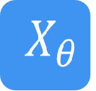
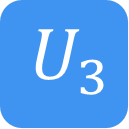

量子逻辑门
====================
----

经典计算中，最基本的单元是比特，而最基本的控制模式是逻辑门。我们可以通过逻辑门的组合来达到我们控制电路的目的。类似地，处理量子比特的方式就是量子逻辑门。
使用量子逻辑门，我们有意识的使量子态发生演化。所以量子逻辑门是构成量子算法的基础。

量子逻辑门由酉矩阵表示。最常见的量子门在一个或两个量子位的空间上工作，就像常见的经典逻辑门在一个或两个位上操作一样。

常见量子逻辑门矩阵形式
--------------------------------------

.. |H| image:: images/QGate_H.png
   :width: 50px
   :height: 50px

.. |S| image:: images/QGate_S.png
   :width: 50px
   :height: 50px

.. |X| image:: images/QGate_X.png
   :width: 50px
   :height: 50px

   
.. |Z| image:: images/QGate_Z.png
   :width: 50px
   :height: 50px

.. |Y1| image:: images/QGate_Y1.png
   :width: 50px
   :height: 50px
   

.. |RZ| image:: images/QGate_RZ.png
   :width: 50px
   :height: 50px

.. |U1| image:: images/QGate_U1.png
   :width: 50px
   :height: 50px

.. |U2| image:: images/QGate_U2.png
   :width: 50px
   :height: 50px

.. |CNOT| image:: images/QGate_CNOT.png
   :width: 50px
   :height: 50px

.. |CR| image:: images/QGate_CR.png
   :width: 50px
   :height: 50px

.. |iSWAP| image:: images/QGate_iSWAP.png
   :width: 50px
   :height: 50px

.. |SWAP| image:: images/QGate_SWAP.png
   :width: 50px
   :height: 50px

.. |CZ| image:: images/QGate_CZ.png
   :width: 50px
   :height: 50px

.. |CU| image:: images/QGate_CU.png
   :width: 50px
   :height: 50px

.. |Toffoli| image:: images/QGate_Toff.png
   :width: 50px
   :height: 50px

单比特量子逻辑门：

======================================================== ======================= =========================================================================================================================================================================
| |I|                                                     | ``I``                     | :math:`\begin{bmatrix} 1 & 0 \\ 0 & 1 \end{bmatrix}\quad`
| |H|                                                     | ``Hadamard``              | :math:`\begin{bmatrix} 1/\sqrt {2} & 1/\sqrt {2} \\ 1/\sqrt {2} & -1/\sqrt {2} \end{bmatrix}\quad`
| |T|                                                     | ``T``                     | :math:`\begin{bmatrix} 1 & 0 \\ 0 & \exp(i\pi / 4) \end{bmatrix}\quad`
| |S|                                                     | ``S``                     | :math:`\begin{bmatrix} 1 & 0 \\ 0 & 1i \end{bmatrix}\quad`
| |X|                                                     | ``Pauli-X``               | :math:`\begin{bmatrix} 0 & 1 \\ 1 & 0 \end{bmatrix}\quad`
| |Y|                                                     | ``Pauli-Y``               | :math:`\begin{bmatrix} 0 & -1i \\ 1i & 0 \end{bmatrix}\quad`
| |Z|                                                     | ``Pauli-Z``               | :math:`\begin{bmatrix} 1 & 0 \\ 0 & -1 \end{bmatrix}\quad`
| |X1|                                                    | ``X1``                    | :math:`\begin{bmatrix} 1/\sqrt {2} & -1i/\sqrt {2} \\ -1i/\sqrt {2} & 1/\sqrt {2} \end{bmatrix}\quad`
| |Y1|                                                    | ``Y1``                    | :math:`\begin{bmatrix} 1/\sqrt {2} & -1/\sqrt {2} \\ 1/\sqrt {2} & 1/\sqrt {2} \end{bmatrix}\quad`
| |Z1|                                                    | ``Z1``                    | :math:`\begin{bmatrix} \exp(-i\pi/4) & 0 \\ 0 & \exp(i\pi/4) \end{bmatrix}\quad`
| |RX|                                                    | ``RX``                    | :math:`\begin{bmatrix} \cos(\theta/2) & -1i×\sin(\theta/2) \\ -1i×\sin(\theta/2) & \cos(\theta/2) \end{bmatrix}\quad`
| |RY|                                                    | ``RY``                    | :math:`\begin{bmatrix} \cos(\theta/2) & -\sin(\theta/2) \\ \sin(\theta/2) & \cos(\theta/2) \end{bmatrix}\quad`
| |RZ|                                                    | ``RZ``                    | :math:`\begin{bmatrix} \exp(-i\theta/2) & 0 \\ 0 & \exp(i\theta/2) \end{bmatrix}\quad`
| |U1|                                                    | ``U1``                    | :math:`\begin{bmatrix} 1 & 0 \\ 0 & \exp(i\theta) \end{bmatrix}\quad`
| |U2|                                                    | ``U2``                    | :math:`\begin{bmatrix} 1/\sqrt {2} & -\exp(i\lambda)/\sqrt {2} \\ \exp(i\phi)/\sqrt {2} & \exp(i\lambda+i\phi)/\sqrt {2} \end{bmatrix}\quad`
| |U3|                                                    | ``U3``                    | :math:`\begin{bmatrix} \cos(\theta/2) & -\exp(i\lambda)×\sin(\theta/2) \\ \exp(i\phi)×\sin(\theta/2) & \exp(i\lambda+i\phi)×\cos(\theta/2) \end{bmatrix}\quad`
| |U4|                                                    | ``U4``                    | :math:`\begin{bmatrix} u0 & u1 \\ u2 & u3 \end{bmatrix}\quad`
======================================================== ======================= =========================================================================================================================================================================

多比特量子逻辑门：

============================================================ =========================== ========================================================================================================
| |CNOT|                                                      | ``CNOT``                  | :math:`\begin{bmatrix} 1 & 0 & 0 & 0  \\ 0 & 1 & 0 & 0 \\ 0 & 0 & 0 & 1 \\ 0 & 0 & 1 & 0 \end{bmatrix}\quad`
| |CR|                                                        | ``CR``                    | :math:`\begin{bmatrix} 1 & 0 & 0 & 0  \\ 0 & 1 & 0 & 0 \\ 0 & 0 & 1 & 0 \\ 0 & 0 & 0 & \exp(i\theta) \end{bmatrix}\quad`
| |iSWAP|                                                     | ``iSWAP``                 | :math:`\begin{bmatrix} 1 & 0 & 0 & 0  \\ 0 & \cos(\theta) & -i×\sin(\theta) & 0 \\ 0 & -i×\sin(\theta) & \cos(\theta) & 0 \\ 0 & 0 & 0 & 1 \end{bmatrix}\quad`
| |SWAP|                                                      | ``SWAP``                  | :math:`\begin{bmatrix} 1 & 0 & 0 & 0  \\ 0 & 0 & 1 & 0 \\ 0 & 1 & 0 & 0 \\ 0 & 0 & 0 & 1 \end{bmatrix}\quad`
| |CZ|                                                        | ``CZ``                    | :math:`\begin{bmatrix} 1 & 0 & 0 & 0  \\ 0 & 1 & 0 & 0 \\ 0 & 0 & 1 & 0 \\ 0 & 0 & 0 & -1 \end{bmatrix}\quad`
| |CU|                                                        | ``CU``                    | :math:`\begin{bmatrix} 1 & 0 & 0 & 0  \\ 0 & 1 & 0 & 0 \\ 0 & 0 & u0 & u1 \\ 0 & 0 & u2 & u3 \end{bmatrix}\quad`
| |Toffoli|                                                   | ``Toffoli``               | :math:`\begin{bmatrix} 1 & 0 & 0 & 0 & 0 & 0 & 0 & 0 \\ 0 & 1 & 0 & 0 & 0 & 0 & 0 & 0 \\ 0 & 0 & 1 & 0 & 0 & 0 & 0 & 0 \\ 0 & 0 & 0 & 1 & 0 & 0 & 0 & 0 \\ 0 & 0 & 0 & 0 & 1 & 0 & 0 & 0  \\ 0 & 0 & 0 & 0 & 0 & 1 & 0 & 0 \\ 0 & 0 & 0 & 0 & 0 & 0 & 0 & 1  \\ 0 & 0 & 0 & 0 & 0 & 0 & 1 & 0 \\ \end{bmatrix}\quad`
============================================================ =========================== ========================================================================================================

.. _api_introduction:

QPanda 2把所有的量子逻辑门封装为API向用户提供使用，并可获得QGate类型的返回值。比如，您想要使用Hadamard门，就可以通过如下方式获得：

     .. code-block:: python
          
          h = H(qubit)

可以看到，H函数只接收一个qubit，qubit如何申请会在 :ref:`QuantumMachine` 部分介绍。

再比如，您想要使用RX门，可以通过如下方式获得：

     .. code-block:: python
          
          rx = RX(qubit，PI)

如上所示，RX门接收两个参数，第一个是目标量子比特，第二个偏转角度。您也可以通过相同的方式使用RY，RZ门。

两比特量子逻辑门的使用和单比特量子逻辑门的用法相似，只不过是输入的参数不同，举个使用CNOT的例子：

     .. code-block:: python
          
          cnot = CNOT(control_qubit，target_qubit)

CNOT门接收两个参数，第一个是控制比特，第二个是目标比特。

获得三量子逻辑门 ``Toffoli`` 的方式：

     .. code-block:: python

          toffoli = Toffoli(control1,control2,target)

三比特量子逻辑门Toffoli实际上是CCNOT门，前两个参数是控制比特，最后一个参数是目标比特。

接口介绍
----------------

在本章的开头介绍过，所有的量子逻辑门都是酉矩阵，那么您也可以对量子逻辑门做转置共轭操作，获得一个量子逻辑门 ``dagger`` 之后的量子逻辑门可以用下面的方法：

     .. code-block:: python
          
          rx_dagger = RX(qubit,PI).dagger()

除了转置共轭操作，您也可以为量子逻辑门添加控制比特，添加控制比特后，当前量子逻辑门是否执行需要根据控制比特的量子态决定，而控制比特有可能处于叠加态，
所以当前量子逻辑门是否执行，获得一个量子逻辑门 ``control`` 之后的量子逻辑门可以用下面的方法：

     .. code-block:: python
          
          qvec = [qubits[0], qubits[1]]
          rx_control = RX(qubit,PI).control(qvec)

实例
----------------

以下实例主要是向您展现QGate类型接口的使用方式.

    .. code-block:: python

          from pyqpanda import *

          if __name__ == "__main__":

               init(QMachineType.CPU)
               qubits = qAlloc_many(3)
               control_qubits = [qubits[0], qubits[1]]
               prog = CreateEmptyQProg()

               prog.insert(H(qubits[0])) \
                   .insert(H(qubits[1])) \
                   .insert(H(qubits[0]).dagger()) \
                   .insert(X(qubits[2]).control(control_qubits))

               result = prob_run_dict(prog, qubits, -1)
               for key in result:
                    print(key+":"+str(result[key]))
               
               finalize()

计算结果如下：

    .. code-block:: python
        
          000:0.4999999999999998
          001:0.0
          010:0.4999999999999998
          011:0.0
          100:0.0
          101:0.0
          110:0.0
          111:0.0
