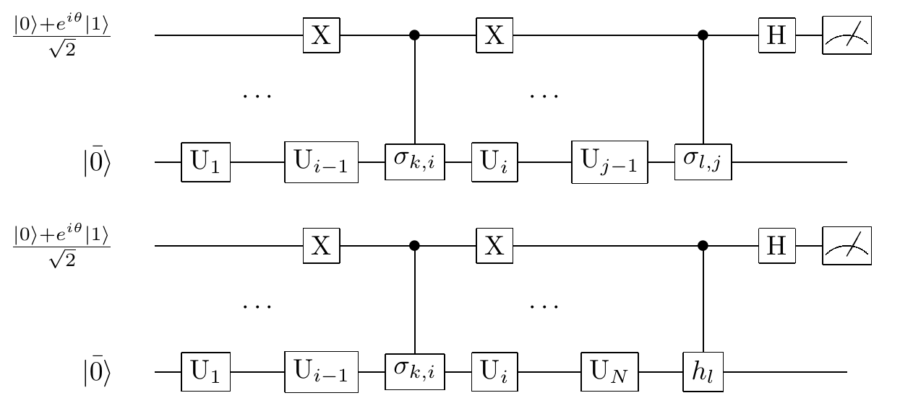
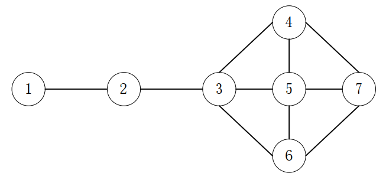

Quantum Imaginary Time Evolution
####

虚时演化（Imaginary time evolution）是研究量子系统的一个有力工具。虚时演化算法作为一种量子经典混合算法\
对于任意一个给定哈密顿量H的系统均可以近似求解得到其基态向量，即哈密顿量 :math:`H`的最小特征值对应的特征向量。\
此算法的量子线路浅易于实现，应用范围广泛，可以求解一些经典算法难以解决的问题。

问题背景概述
****

对于给定哈密顿量 :math:`H` 的系统，随着时间 :math:`t`，系统根据传播变换（propagator）
:math:`e^{-iHt}` 演化。对应的虚时 :math:`(\tau=it)` 传播变换为 :math:`e^{-Ht}`，是一个非幺正算符。

给定哈密顿量 :math:`H` 和初态 :math:`\left|\psi\right\rangle` ,归一化的虚时演化被定义为

.. math::
   \begin{aligned}
   \left|\psi\left(\tau\right)\right\rangle=A\left(\tau\right)e^{-Ht}\left|\psi\left(0\right)\right\rangle,
   A\left(\tau\right)=\left({\langle\psi\left(0\right)|e}^{-2Ht}
   \left|\psi\left(0\right)\right\rangle\right)^\frac{1}{2}.
   \end{aligned}
:math:`A\left(\tau\right)` 为归一化因子，通常多体系统的哈密顿量 :math:`H=\sum_{i}{\lambda_ih_i}`, 
其中 :math:`\lambda_i` 为实系数，:math:`h_i` 为可观测量（observables）并且可以表示为Pauli矩阵的直积。

于是有如下的等价薛定谔方程：

.. math::
   \begin{aligned}
   \frac{\partial\left|\psi\left(\tau\right)\right\rangle}{\partial\tau}
   =-\left(H-\frac{A^\prime\left(\tau\right)}{A\left(\tau\right)}\right)\left|\psi\left(\tau\right)\right\rangle
   =-\left(H-E_\tau\right)\left|\psi\left(\tau\right)\right\rangle.
   \end{aligned}

.. note:: 实际应用中，QITE的真正难点在于如何将原问题转化为哈密顿系统求基态问题，以及如何对哈密顿系统给出其哈密顿量。

算法原理
****

量子虚时演化算法由2个部分：

#.	通过给定的问题系统哈密顿量，构造相应的薛定谔方程，将薛定谔方程求解问题转化为一个线性方程组求解问题；
#.	求解线性方程组，得到关键变量的时间演化函数，利用虚时演化的特性求得系统最低能量情况下对应的基态，完成对问题的求解。

量子虚时演化算法可用于在任意已知哈密顿量的哈密顿系统由初态求解任意时刻状态及最终稳态。

从薛定谔方程到微分方程近似解
++++

考虑给定的哈密顿量 :math:`H` 所满足的Wick旋转薛定谔方程

.. math::
   \begin{aligned}
   (\frac{\partial}{\partial\tau}-\left(H-E_\tau\right))\left|\psi\left(\tau\right)\right\rangle=0,
   E_\tau=\left\langle\psi(\tau)\right|H\left|\psi(\tau)\right\rangle.
   \end{aligned}
应用McLachlan变分原理，有

.. math::
   \begin{aligned}
   \delta \left \| \left(\frac{\partial}{\partial\tau}-\left(H-E_\tau\right)\right)
   \left|\psi\left(\tau\right)\right\rangle \right \|=0.
   \end{aligned}
以测试态 :math:`\left|\phi\left(\vec{\theta}\left(\tau\right)\right)\right\rangle,
\vec{\theta}\left(\tau\right)=\left(\theta_1\left(\tau\right),\theta_2\left(\tau\right),
\cdots,\theta_N\left(\tau\right)\right)` 逼近解 :math:`\left|\psi\left(\tau\right)\right\rangle`。

记 :math:`\dot{\theta_j}=\frac{\partial\theta_j}{\partial\tau},
S=\left(\frac{\partial}{\partial\tau}-\left(H-E_\tau\right)\right)` ，同时考虑到归一化条件\
:math:`\left\langle\phi|\phi\right\rangle=1`，有

.. math::
   \begin{aligned}
   &\frac{\partial\left \| S\left|\phi\left(\tau\right)\right\rangle \right \|}{\partial\dot{\theta_i}} \\
   &=\sum_{i,j}\frac{\partial\left\langle\phi\right|}{\partial\theta_i}
   \frac{\partial\left|\phi\right\rangle}{\partial\theta_j}\dot{\theta_j}
   +\sum_{i}{(\frac{\partial\left\langle\phi\right|}{\partial\theta_i}}H\left|\phi\right\rangle
   +\left\langle\phi\right|H\frac{\partial\left|\phi\right\rangle}{\partial\theta_i}) \\
   &=\sum_{j} A_{ij}\dot{\theta_j}-C_j=0.
   \end{aligned}
其中

.. math::
   \begin{aligned}
   &A_{ij}=Re\left(\frac{\partial\left\langle\phi\right|}{\partial\theta_i}\frac{\partial\left|\phi\right\rangle}{\partial\theta_i}\right),\\
   &C_i=-Re\left(\frac{\partial\left\langle\phi\right|}{\partial\theta_i}H\left|\phi\right\rangle\right).
   \end{aligned}
于是原薛定谔方程转化为解为 :math:`\dot{\theta_j}` 的线性方程组。

虚时演化逼近基态
++++

由 :math:`x^\dagger Ax > 0` 可知 :math:`A` 是正定的，其广义逆 :math:`A^{-1}` 也是正定的。

于是对系统的平均能量 :math:`E_\tau` 有

.. math::
   \begin{aligned}
   &\frac{{dE}_\tau}{d\tau}=\frac{d\left\langle\psi\left(\tau\right)\left|H\right|\psi\left(\tau\right)\right\rangle}{d\tau}\\
   &=\sum_{i}{Re\left(\frac{\partial\left\langle\phi\right|}{\partial\theta_i}H\left|\phi\right\rangle\dot{\theta_i}\right)
   =-\sum_{i} C_i\dot{\theta_i}}=-\sum_{i,j} C_iA_{i,j}^{-1}C_j\le0.
   \end{aligned}
可知运用此量子虚时演化算法会使整个系统的平均能量不断减小。

记测试态 :math:`\left|\phi\left(\vec{\theta}\right)\right\rangle=V\left(\vec{\theta}\right)\left|\bar{0}\right\rangle
=U_N\left(\theta_N\right)\cdots U_2\left(\theta_2\right)U_1\left(\theta_1\right)\left|\bar{0}\right\rangle`，其中\
:math:`U_i` 为幺正算符，:math:`\bar{0}` 为系统的初态（并不是基态 :math:`\left|0\right\rangle`）。

不失一般性地，可以假设每个U_i均仅依赖于一个参数\theta_i（否则可以进行量子门操作分解），不妨假设每个 :math:`U_i` 均为旋转或受控旋转门，\
于是其导数可以表示为 :math:`\frac{{\partial U}_i\left(\theta_i\right)}{\partial\theta_i}
=\sum_{k}{f_{k,i}U_i\left(\theta_i\right)\sigma_{k,i}}`。\
其中 :math:`\delta_{k,i}` 为幺正算符，:math:`f_{k,i}` 为标量函数，\
于是测试态的导数可以表示为 :math:`\frac{\partial\phi\left(\tau\right)}{\partial\theta_i}
=\sum_{k}{f_{k,i}{\widetilde{V}}_{k,i}\left|\bar{0}\right\rangle}`。其中\
:math:`{\widetilde{V}}_{k,i}=U_N\left(\theta_N\right)\cdots U_{i+1}\left(\theta_{i+1}\right)
U_i\left(\theta_i\right)\sigma_{k,i}{\cdots U}_2\left(\theta_2\right)U_1\left(\theta_1\right)`。

于是对于微分方程组 :math:`\sum_{j} A_{ij}\dot{\theta_j}=C_j` 有

.. math::
   \begin{aligned}
   A_{ij}=Re\left(\sum_{k,l}{f_{k,i}^\ast f_{l,i}\langle\bar{0}|{\widetilde{V}}_{k,i}^\dagger{\widetilde{V}}_{l,j}
   \left|\bar{0}\right\rangle}\right),\\
   C_i=-Re\left(\sum_{k,l}{f_{k,i}^\ast\lambda_l\langle\bar{0}|{\widetilde{V}}_{k,i}^\dagger h_lV
   \left|\bar{0}\right\rangle}\right).
   \end{aligned}
以上两个表达式均符合一般形式 :math:`aRe\left(e^{i\theta}\langle0|U\left|\bar{0}\right\rangle\right)`，因而可以使用量子线路对其\
进行构造，:math:`A_{ij}` 的构造方式如下：

.. math::
   \begin{aligned}
   \mathrm{\langle}\bar{\mathrm{0}}|{\widetilde{V}}_{k,i}^\dagger{\widetilde{V}}_{l,j}\left|\bar{\mathrm{0}}\right\rangle
   \mathrm{=\langle}\bar{\mathrm{0}}\mathrm{|}\mathrm{U}_1^\dagger\cdots\mathrm{U}_{i-1}^\dagger\sigma_{k,i}^\dagger
   \mathrm{U}_i^\dagger\cdots\mathrm{U}_{j-1}^\dagger{\sigma_{i,j}\mathrm{U} }_j^\dagger\cdots U_1\left|\bar{\mathrm{0}}\right\rangle.
   \end{aligned}
对 :math:`C_{ij}` 有类似结果，于是可以用量子线路构造 :math:`A_{ij}, C_{ij}` 。

因此可以引入线性方程组的量子算法，完成求解后得到 :math:`\dot{\theta_j}=\frac{\partial\theta_j}{\partial\tau}`，
进而将 :math:`\phi\left(\vec{\theta}\right)` 进行虚时演化，可以得到系统稳定状态下的基态 :math:`\theta`。

于是完成了对于任意给定的哈密顿量 :math:`H` 对应的系统基态的近似求解。

量子线路图与参考代码
****

QITE算法中构造线性方程组的左端项矩阵和右端项的量子线路图如下所示

基于QPanda-2.0的QITE算法实现代码参见\
`QPanda-2.0下QITE算法程序源码 <https://github.com/OriginQ/QPanda-2/tree/master/QAlg/QITE>`_ \ ，\
QPanda-2.0中QITE算法相关代码是一个类，因而下面将介绍所有相关的输入输出接口函数。

.. code-block:: python

   qite=QITE()
   qite.set_Hamiltonian(Hamiltonian)
   qite.set_ansatz_gate(ansatz)
   qite.set_iter_num(int)
   qite.set_delta_tau(float)
   qite.set_upthrow_num(int)
   qite.set_para_update_mode(GD_VALUE/GD_DIRECTION)
   qite.exec()
   qite.get_result()

以上函数中，第一个函数为类的构造函数，后续6个函数作用分别为设置哈密顿量，拟设、迭代数、:math:`\tau` 的变化率、重置迭代次数、\
收敛模式参考梯度值或梯度方向、执行虚时演化和获得列表格式的概率结果。

我们可以将量子变分虚时演化算法应用到网络节点重要性排序问题上，综合已有结论快速求解得到节点的重要性权重。\
选择如下图所示的网络节点重要性排序问题进行代码实现，

此问题的QITE求解代码实例如下

.. code-block:: python

   #!/usr/bin/env python

   import pyqpanda as pq
   import numpy as np

   if __name__ == "__main__":

      node7graph = [[0, 1 ,0 ,0, 0, 0, 0],
                     [1, 0 ,1 ,0, 0, 0, 0],
                     [0, 1 ,0 ,1, 1, 1, 0],
                     [0, 0 ,1 ,0, 1, 0, 1],
                     [0, 0 ,1 ,1, 0, 1, 1],
                     [0, 0 ,1 ,0, 1, 0, 1],
                     [0, 0 ,0 ,1, 1, 1, 0],
                     ]

      problem = pq.NodeSortProblemGenerator()
      problem.set_problem_graph(node7graph)
      problem.exec()
      ansatz_vec = problem.get_ansatz()

      cnt_num = 1
      iter_num = 100
      upthrow_num = 3
      delta_tau = 2.6
      update_mode = pq.UpdateMode.GD_DIRECTION

      for cnt in range(cnt_num):
         qite = pq.QITE()
         qite.set_Hamiltonian(problem.get_Hamiltonian())
         qite.set_ansatz_gate(ansatz_vec)
         qite.set_iter_num(iter_num)
         qite.set_delta_tau(delta_tau)
         qite.set_upthrow_num(upthrow_num)
         qite.set_para_update_mode(update_mode)
         ret = qite.exec()
         if ret != 0:
               print(ret)
         qite.get_result()

可以直接推导得知此7点网络图的节点重要性最大的节点应当为3号，因此结果应当抛出最重要节点3，\
写法为 :math:`00000100:1.00`，如下所示的输出结果符合预期。

.. code-block:: python

   4 0.999967