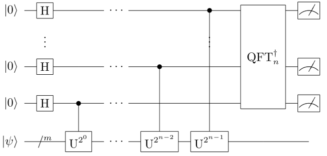

量子相位估计
####

量子相位估计（QPE）可以计算给定幺正算符U的特征值的相位，即求解 :math:`U\left|\psi\right\rangle= \ 
e^{2\pi i\varphi}\left|\psi\right\rangle` 中的 :math:`\varphi`，\
此处 :math:`\left|\psi\right\rangle` 为U的特征向量。

经典形式的QPE是在QFT的基础上构造的。

量子线路结构概览
****

假设已经构造好特征向量 :math:`\left|\psi\right\rangle`，量子相位估计包含如下步骤：

#. 通过一系列特殊旋转量子门操作将U的特征值相位分解转移到辅助量子比特的振幅上；
#. 对辅助量子比特执行IQFT，将振幅上的特征值相位转移到基向量上；
#. 对辅助量子比特的基向量分别进行测量后综合可得到特征值的相位信息。

对于幺正算符 :math:`U` 的一个特征量子态 :math:`\left|\psi\right\rangle`，可以通过特定的量子门组合将\
该量子态对应的特征值相位提取到振幅，但量子态的振幅难以有效准确地测量。

必须借助其他量子门组合将特征值相位数据进行整合，最终通过IQFT可以由振幅到基向量进行数据转化的功能将特征值转移到基向量中。

.. note:: 量子相位估计本质上是为了提取幺正算符的特征值相位，并以便于测量的形式输出。

量子线路构建
****

特征量子态与特征值相位提取
++++

由特征量子态的定义有 :math:`U\left|\psi\right\rangle = e^{2\pi i\varphi}\left|\psi\right\rangle`，

于是由幺正算符 :math:`U` 可以定义受控量子门  :math:`(C-U)` 使得

.. math::
   \begin{aligned}
   (C-U^{2^t})(a\left|0\right\rangle+b\left|1\right\rangle)\otimes\left|\psi\right\rangle \ 
   =(a\left|0\right\rangle+e^{2\pi i\varphi2^t}b\left|1\right\rangle)\otimes\left|\psi\right\rangle.
   \end{aligned}
特征值相位 :math:`\varphi` 通过这种受控变换可以提取到振幅中。

特征值相位由振幅转移到基向量
++++

选取一组初始化为最大叠加态的辅助比特，通过受控量子门可以将特征值相位提取到振幅中：

.. math::
   (C-U^{2^0})\cdots(C-U^{2^n})\frac{1}{2^\frac{n}{2}}\otimes_{t=1}^n
   (\left|0\right\rangle+\left|1\right\rangle)= (\left|0\right\rangle+e^{2\pi i\varphi2^{1-1}}\
   \left|1\right\rangle)\cdots(\left|0\right\rangle+e^{2\pi i\varphi2^{n-1}}\left|1\right\rangle).
此时辅助比特中的量子态形式与QFT的结果量子态相近，借助IQFT有如下结果：

.. math::
   \begin{aligned}
   & QFT^{-1}\frac{1}{2^\frac{n}{2}}\otimes_{t=1}^n(\left|0\right\rangle+e^{2\pi i\varphi2^{t-1}}
   \left|1\right\rangle) \\ & =QFT^{-1}\frac{1}{2^\frac{n}{2}}\mathrm{\Sigma}_{k=0}^{2^n-1}e^{2\pi i
   \varphi k}\left|k\right\rangle \\ & =\frac{1}{2^n}\mathrm{\Sigma}_{k=0}^{2^n-1}\mathrm{\Sigma}_{x=0}
   ^{2^n-1}e^{-\frac{2\pi ik}{2^n}\left(x-2^n\varphi\right)}\left|x\right\rangle.
   \end{aligned}
含特征值相位的基向量测量
++++

对得到的结果量子态进行测量，结果可以分为两类：

#. 如果存在正整数 :math:`2^n\varphi\in \mathbb{Z}`，则可以以概率 :math:`1` 测量\
   得到 :math:`\left|x\right\rangle=\left|2^n\varphi\right\rangle` 
#. 否则以至少概率 :math:`\frac{4}{\pi^2}` 得到最接近 :math:`2^n\varphi` 的整数，进而得到近似解

.. note:: 如何从最接近 :math:`2^n\varphi` 的整数反推得到 :math:`\varphi` ？（提示：连续分数展开）

测量结果得到的是相位 :math:`\varphi` 的近似解，近似解的精度与辅助比特的数目 :math:`n` 相关。\
:math:`2^n\varphi\in \mathbb{Z}` 的情况代表辅助比特的数目已经大于 :math:`\varphi` 的二进制展开小数位数，因此才\
能得到精确解。

量子线路图与代码实现
****

QPE的量子线路图如下所示

由上文中的定义，我们可以基于QPanda-2.0直接给出QPE的函数实现。

量子线路总共可以分为三个部分，特征量子态制备与辅助比特量子态初始化、特征值相位提取、\
逆量子傅里叶变换。程序实现的核心内容如下：

.. code-block:: python

   #!/usr/bin/env python

   from pyqpanda import *
   from numpy import pi

   def QPE(controlqlist, targetqlist, matrix):
      circ = QCircuit()
      for i in range(len(controlqlist)):
         circ.insert(H(controlqlist[i]))
      
      for i in range(len(controlqlist)):
         circ.insert(controlUnitaryPower(targetqlist, controlqlist[controlqlist.size() \
          - 1 - i], i, matrix))

      circ.insert(QFT(controlqlist).dagger())
      return circ

图中的参数matrix是指需要估计特征值的幺正算符 :math:`U` 对应的矩阵。

选取 :math:`U=RY(\frac{\pi}{4}),\left|\psi\right\rangle=\left|0\right\rangle+i\left|1\right\rangle` ，
对应的特征值为 :math:`e^{-i\frac{\pi}{8}}` ，验证QPE的代码实例如下

.. code-block:: python

   #!/usr/bin/env python

   from pyqpanda import *
   from numpy import pi

   if __name__ == "__main__":

      machine = init_quantum_machine(QMachineType.CPU_SINGLE_THREAD)
      qvec = machine.qAlloc_many(1)
      cqv = machine.qAlloc_many(2)
      prog = create_empty_qprog()

      # 构建量子程序
      prog.insert(H(cqv[0]))\
            .insert(H(cqv[1]))\
            .insert(S(qvec[0]))\
            .insert(RY(qvec[0], pi/4).control(cqv[1]))\
            .insert(RY(qvec[0], pi/4).control(cqv[0]))\
            .insert(RY(qvec[0], pi/4).control(cqv[0]))\
            .insert(QFT(cqv).dagger())

      # 对量子程序进行概率测量
      result = prob_run_dict(prog, cqv, -1)
      destroy_quantum_machine(machine)

      # 打印测量结果
      for key in result:
            print(key+":"+str(result[key]))

由前文可知输出结果应当以较大概率得到量子态 :math:`\left|0\right\rangle` 

.. code-block:: python

   000, 0.821067
   001, 0.0732233
   010, 0.0324864
   011, 0.0732233
