=====
量子态编码
=====

简介
----

量子态编码是一个将经典信息转化为量子态的过程。在使用量子算法解决经典问题的过程中，量子态编码是非常重要的一步。比如在使用HHL算法解如下线性方程组时

.. math:: 

    \begin{aligned}
    A=\left(\begin{array}{cc}
    1 & -1 / 3 \\
    -1 / 3 & 1
    \end{array}\right), \vec{x}=\left(\begin{array}{l}
    x_{1} \\
    x_{2}
    \end{array}\right), \vec{b}=\left(\begin{array}{l}
    1 \\
    0
    \end{array}\right)
    \end{aligned}

需要将向量b编码至线路中。而大多数量子态编码都是以 :math:`\left|0\right\rangle` 为基态进行制备，而制备后的经典信息则可以表现在量子线路的各个参数中。
本教程中我们将讨论四种量子编码的方式，包括基态编码、角度编码、振幅编码、IQP 编码。在pyqpanda中，我们内置了这四种量子编码方式至 ``Encode`` 类中。

基态编码
----

基态编码[1] ``basic_encode(qubit,data)`` 即是将一个 :math:`n` 位的二进制字符串 :math:`x` 转换为一个具有 :math:`n` 个量子比特的系统的量子态 :math:`\left|x\right\rangle=\left|\psi\right\rangle` 其中 :math:`\left|\psi\right\rangle`为转换后的计算基态。
例如，当需要对一个长度为4的二进制字符串 :math:`1001` 编码时，得到的结果即为 :math:`\left|1001\right\rangle`。实现如下所示：

.. code-block:: python

    from pyqpanda import *

    if __name__=="__main__":

        #构建全振幅虚拟机
        qvm = CPUQVM()
        qvm.init_qvm()
        x='1001'

        #申请量子比特
        qubits=qvm.qAlloc_many(4)

        #实例化编码类Encode
        cir_encode=Encode()
        
        #调用Encode类中基态编码接口
        cir_encode.basic_encode(qubits,x)
        
        #调用Encode类中内置获取编码线路接口
        prog=QProg()
        prog << cir_encode.get_circuit()

        #获取量子编码后的编码比特
        encode_qubits=cir_encode.get_out_qubits()

        #获取线路的概率测量结果
        result = qvm.prog_run_dict(prog, encode_qubits, shots)
        print(result)
        qvm.finalize()

运行结果：

    .. code-block:: python

        {'1001': 1}

角度编码
----
角度编码[1]即是利用旋转门 :math:`R_{x}` , :math:`R_{y}` , :math:`R_{z}` 的旋转角度进行对经典信息的编码。而在pyqpanda中，我们提供了两种角度编码，分别为经典角度编码 ``angle_encode(qubit, data, gate_type=GateType.RY_GATE)`` 与密集角度编码 ``dense_angle_encode(qubit,data)`` 两种方式。
其中经典角度编码则是将N个经典数据编码至N个量子比特上 

.. math::

    \begin{aligned}
    |\boldsymbol{x}\rangle=\bigotimes_{i=1}^{N} \cos \left(x_{i}\right)|0\rangle+\sin \left(x_{i}\right)|1\rangle
    \end{aligned}

其中 :math:`\left|x\right\rangle` 即为所需编码的经典数据向量。但是由于一个qubit不仅可以加载角度信息，还可以加载相位信息，因此，我们完全可以将一个长度为N的经典数据编码至 :math:`\lceil N \rceil` 个量子比特上。

.. math:: 

    \begin{aligned}
    |\boldsymbol{x}\rangle=\bigotimes_{i=1}^{\lceil N / 2\rceil} \cos \left(\pi x_{2 i-1}\right)|0\rangle+e^{2 \pi i x_{2 i}} \sin \left(\pi x_{2 i-1}\right)|1\rangle
    \end{aligned}

其中，将两个数据分别编码至量子特的旋转角度 :math:`\cos \left(\pi x_{2 i-1}\right)|0\rangle` 与相位信息中 :math:`e^{2 \pi i x_{2 i}} \sin \left(\pi x_{2 i-1}\right)|1\rangle`。下面我们以 :math:`R_{y}` 门编码一组角度 :math:`[\pi,\pi]` 为例，
介绍经典角度编码与密集角度编码。

.. code-block:: python

    from pyqpanda import *
    import numpy as np

    if __name__=="__main__":

        #构建全振幅虚拟机
        qvm = CPUQVM()
        qvm.init_qvm()
        x=[np.pi,np.pi]

        #申请量子比特
        qubits=qvm.qAlloc_many(2)

        #实例化编码类Encode
        cir_encode=Encode()
        
        #调用Encode类中经典角度编码或密集角度编码接口并输出概率
        cir_encode.angle_encode(qubits,x)
        #cir_encode.dense_angle_encode(qubits,x)
        prog=QProg()
        prog << cir_encode.get_circuit()
        encode_qubits=cir_encode.get_out_qubits()
        result = qvm.prog_run_dict(prog, encode_qubits, shots)
        print(result)
        qvm.finalize()

运行结果：

    .. code-block:: python

        {'11': 1}

可以发现，在经典角度编码中将经典数据向量 :math:`x` 向 :math:`y` 轴旋转了 :math:`\pi`。而密集角度编码结果运行结果则需要调用 ``qvm.directly_run`` 接口，运行结果如下

    .. code-block:: python

        (6.12323e-17,0)
        (-1,1.22465e-16)

振幅编码
----

振幅编码即是将一个长度为 :math:`N` 的数据向量 :math:`x` 编码至数量为 :math:`\lceil log_{2}N \rceil` 的量子比特的振幅上，具体公式如下：

.. math::

    \begin{aligned}
    \left|\psi\right\rangle=x_{0}|0\rangle+\cdots+x_{N-1}|N-1\rangle
    \end{aligned}

然而，可以发现由于处于纯态的量子系统的迹是为1的，所以我们需要将数据进行归一化处理，这在我们的编码算法中是默认调用的，同时会产生一个归一化系数，最后通过调用Encode类中的 ``get_normalization_constant`` 接口获取。
同时，一个编码算法需要考虑的通常有三点，分别为编码线路的深度，宽度(qubit数量)，以及CNOT门的数量。因此，对应以上三点，在pyqpanda中也提供了不同的编码方法。同时根据数据形式的不同也可分为密集数据编码和稀疏数据编码。

密集数据编码
^^^^
Top-down振幅编码
****

Top-down[2]的编码方式 ``amplitude_encode(qubit,data)``，顾名思义，即是将数据向量先进行处理，得到对应的角度树，并从角度树的根节点开始，依次向下进行编码，如下图所示：

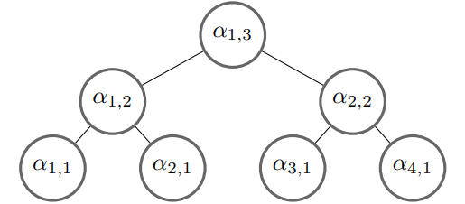
   
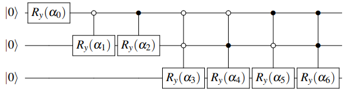

这种编码方式具有 :math:`O(\lceil log_{2} N \rceil)` 的线路宽度，以及 :math:`O(n)` 的线路深度。

Bottom-top振幅编码
****
与Top-down编码方式相反，Bottom-top[2] ``dc_amplitude_encode(qubit,data)`` 通过 :math:`O(n)` 的宽度构建一个 :math:`O(\lceil log_{2} N \rceil)` 深度的量子线路。
其中，角度树中最左子树( :math:`\alpha_{0}` , :math:`\alpha_{1}` , :math:`\alpha_{3}` )对应的量子比特为输出比特，其余为辅助比特。构建形式如下图所示：

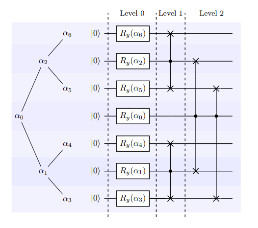

其中，level1，与level2对应的量子逻辑门为受控SWAP门，其作用为交换辅助比特与输出比特量子态。

双向振幅编码
****

双向振幅编码[2] ``bid_amplitude_encode(qubit, data, split)`` 则是综合了Top-down和Bottom-top两种编码方式，即可通过参数 :math:`split` 控制决定其线路深度与宽度。
其线路宽度为 :math:`O_{w}\left(2^{split}+\log _{2}^{2}(N)-split^{2}\right)` ，线路宽度为 :math:`O_{d}\left((split+1) \frac{N}{2^{split}}\right)` ，而在我们pyqpanda中的接口默认为 :math:`n/2`。
从 :math:`O_{w}` 和 :math:`O_{d}` 的公式可以看出当split为1时，则为Bottom-top振幅编码，当spilt为n时则为Top-down振幅编码。

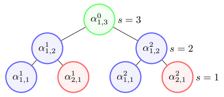

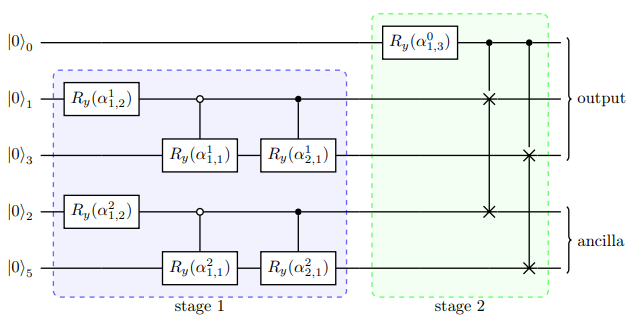

基于schmdit分解振幅编码
****
如Top-down振幅编码所示，使用 :math:`\lceil log_{2} N \rceil` 个量子比特编码长度为 ：:math:`N` 的经典数据大约需要 :math:`2^{2n}` 个受控旋转门，这极大的降低了量子线路的
保真度，然而基于schmdit分解振幅编码[3] ``schmidt_encode(qubit, data)`` 可以有效降低线路中的受控旋转门数量。首先，一个纯态 :math:`|\psi\rangle` 可以被表示为如下形式：

.. math:: 
    \begin{aligned}
    |\psi\rangle=\sum_{i=1}^{k} \lambda_{i}\left|\alpha_{i}\right\rangle \otimes\left|\beta_{i}\right\rangle
    \end{aligned}

进一步，可以表示为：

.. math::
    \begin{aligned}
    |\psi\rangle=\sum_{i=1}^{m} \sum_{j=1}^{n} C_{i j}\left|e_{i}\right\rangle \otimes\left|f_{j}\right\rangle
    \end{aligned}

其中，:math:`\left|e_{i}\right\rangle \in \mathbb{C}^{m},\left|f_{j}\right\rangle \in \mathbb{C}^{n}`。而 :math:`C` 可以进行奇异值分解(svd) :math:`C=U \Sigma V^{\dagger}`,
通过以上公式，我们可以得出 :math:`\sigma_{i i}=\lambda_{i}` ， :math:`\left|\alpha_{i}\right\rangle=U\left|e_{i}\right\rangle` ， :math:`\left|\beta_{i}\right\rangle=V^{\dagger}\left|f_{i}\right\rangle`, 
其中，:math:`\sigma_{i i}` 则是 :math:`C` 的奇异值。线路图构建如下：

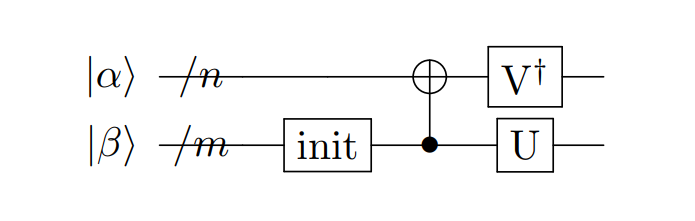

其中，:math:`U` , :math:`V^{\dagger}` 均可以通过pyqpanda中的 ``matrix_decompose`` 接口分解为单双门集合, init门则是用于将 :math:`\sigma_{i i}` 编码至线路的振幅。很明显，这个过程是一个不断递归的
过程，直至 :math:`\sigma_{i i}` 的数量小于2时，将其编码至一个量子比特的振幅上。

稀疏数据编码
^^^^
上述编码方式均用于密集数据编码，而当我们所需编码的数据为稀疏数据时，使用以上编码方式将无疑增加的线路的深度，这显然是不合适的。
因此，针对于稀疏数据，pyqpanda中提供了3种稀疏数据编码方式。

双稀疏量子态编码
****

双稀疏量子态编码[4] ``ds_quantum_state_preparation(qubit, data)`` 通过利用 :math:`n` 个辅助比特辅助构建线路。我们以编码 :math:`|001\rangle` 为例，如下图所示：

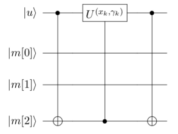

其中，:math:`|\mu\rangle` 为辅助寄存器用以作用旋转门，并受输出寄存器 :math:`|m\rangle` 控制，而当所需编码的字符下标的1的个数较多时，则需要作用多控门，而为了减少消除线路中多控门的数量，我们
通过增加一部分辅助寄存器，并利用Toffoli门进行分解，其原理如下图所示：

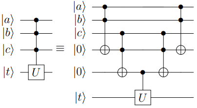

sparse_isometry编码
****

sparse_isometry编码[5] ``sparse_isometry(qubit, data)`` 不同于双稀疏量子态编码需要辅助比特去构建线路。 sparse_isometry编码首先通过将长度为 :math:`N` 稀疏数据向量中的非0元素 :math:`x` 
统一编码至前 :math:`\lceil log_2len(x) \rceil` 个量子比特上，后通过受控X门对其进行受控转化。其线路构建如下图所示：

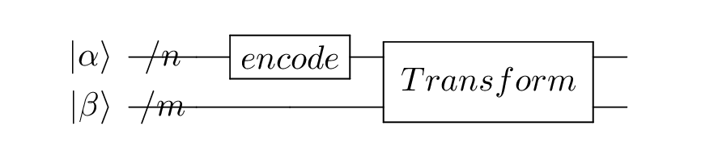

其中，:math:`n+m=\lceil log_2N \rceil` :math:`|\alpha\rangle` 为 :math:`\lceil log_2len(x) \rceil` 个非0元素的编码encode模块， 而 :math:`|\beta\rangle` 则为剩余qubit。
其中transform模块则是转化模块。

多项式稀疏量子态编码
****

多项式稀疏量子态编码[6] ``efficient_sparse(qubit, data)`` 是一种稀疏数据向量中的非0元素个数与qubit个数成线性关系的稀疏数据编码方式。其线路编码深度为 :math:`O\left(|S|^{2} \log (|S|) n\right)` 。
其中，:math:`|S|` 为非0元素个数，:math:`n` 为所需qubit个数，即为 :math:`\lceil log_2N \rceil` , :math:`N` 为稀疏数据长度。下面以编码 :math:`|x\rangle=1/\sqrt{3}(|001\rangle+|100\rangle+|111\rangle)` 为例，其线路图构建如下：

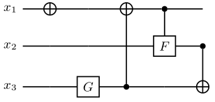

其中，F门是将 :math:`|0\rangle` 映射到 :math:`1/\sqrt{3}|0\rangle+1/\sqrt{3}|1\rangle` ，而G门则是将 :math:`|0\rangle` 映射到 :math:`1/\sqrt{3}|0\rangle+2/\sqrt{3}|1\rangle`。
由于多种振幅编码振幅编码结果是一致的。所以，这里我们以多项式稀疏量子态编码为例介绍，示例如下：

.. code:: python

    from pyqpanda import *
    import numpy as np

    if __name__=="__main__":
        machine=CPUQVM()
        machine.init_qvm()    

        data = [0,1/np.sqrt(3),0,0,0,1/np.sqrt(3),1/np.sqrt(3)]
        qubit = machine.qAlloc_many(3)
        cir_encode=Encode()
        cir_encode.efficient_sparse(qubit,data)
        prog=QProg()
        prog << cir_encode.get_circuit()
        encode_qubits=cir_encode.get_out_qubits()
        result = qvm.prog_run_dict(prog, encode_qubits, shots)
        print(result)
        qvm.finalize()

运行结果：

    .. code-block:: python

        {'001': 0.333333333,'110': 0.333333333,'111': 0.333333333}

.. note:: 
    ``amplitude_encode`` ， ``ds_quantum_state_preparation`` ， ``efficient_sparse`` ， ``sparse_isometry`` 不仅支持double类型数据编码，也支持complex类型数据编码。

IQP编码
----

IQP编码[7] ``iqp_encode(qubit, data, control_vector = None, inverse=false, repeats = 1)`` 是一种应用于量子机器学习的编码方法。将一个经典数据x编码到

.. math:: 
    \begin{aligned}
    |\mathbf{x}\rangle=\left(\mathrm{U}_{\mathrm{Z}}(\mathbf{x}) \mathrm{H}^{\otimes n}\right)^{\boldsymbol{r}}\left|0^{n}\right\rangle
    \end{aligned}

其中， :math:`r` 表示量子线路的深度，也就是 :math:`\mathrm{U}_{\mathrm{Z}}(\mathbf{x}) \mathrm{H}^{\otimes n}` 重复的次数。:math:`\mathrm{H}^{\otimes n}`
是一层作用在所有量子比特上的Hadamard门。其中， :math:`\mathrm{U}_\mathrm{Z}` 为

.. math:: 

    \begin{aligned}
    \mathrm{U}_\mathrm{Z}(\mathbf{x})=\prod_{[i, j] \in S} R_{Z_{i} Z_{j}}\left(x_{i} x_{j}\right) \bigotimes_{k=1}^{n} R_{z}\left(x_{k}\right)
    \end{aligned}

这里的 :math:`S` 是一个集合，对于这个集合中的每一对量子比特，我们都需要对它们作用 :math:`R_{ZZ}` 门。:math:`R_{ZZ}` 门的构建形式如下：

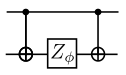

下面我们以编码 :math:`data=[-1.3, 1.8, 2.6, -0.15]` 为例介绍：

.. code:: python

    from pyqpanda import *
    import numpy as np

    if __name__=="__main__":
        machine=CPUQVM()
        machine.init_qvm()    

        data = [-1.3, 1.8, 2.6, -0.15]
        qubit = machine.qAlloc_many(4)
        cir_encode=Encode()
        cir_encode.iqp_encode(qubit,data)
        prog=QProg()
        prog << cir_encode.get_circuit()
        encode_qubits=cir_encode.get_out_qubits()
        qvm.directly_run(prog)
        result = qvm.get_qstate()
        print(result)
        qvm.finalize()

运行结果:

    .. code-block:: python

        (-0.192558,-0.159441)
        (0.245349,0.0479965)
        (-0.0297304,0.248226)
        (-0.229121,0.100017)
        (-0.0672583,-0.240783)
        (0.174177,0.179339)
        (0.177728,-0.17582)
        (0.241597,0.0642701)
        (-0.247133,-0.0377532)
        (0.235115,-0.084976)
        (0.102122,0.228191)
        (-0.145097,0.203585)
        (-0.00809583,-0.249869)
        (0.126555,0.215601)
        (0.214427,-0.128534)
        (0.219396,0.119856)

参考文献
----
::

    [1] Schuld, Maria. "Quantum machine learning models are kernel methods."[J] arXiv:2101.11020 (2021). 
    [2] Araujo I F, Park D K, Ludermir T B, et al. "Configurable sublinear circuits for quantum state preparation."[J]. arXiv preprint arXiv:2108.10182, 2021.
    [3] Ghosh K. "Encoding classical data into a quantum computer"[J]. arXiv preprint arXiv:2107.09155, 2021.
    [4] de Veras T M L, da Silva L D, da Silva A J. "Double sparse quantum state preparation"[J]. arXiv preprint arXiv:2108.13527, 2021.
    [5] Malvetti E, Iten R, Colbeck R. "Quantum circuits for sparse isometries"[J]. Quantum, 2021, 5: 412.
    [6] N. Gleinig and T. Hoefler, "An Efficient Algorithm for Sparse Quantum State Preparation," 2021 58th ACM/IEEE Design Automation Conference (DAC), 2021, pp. 433-438, doi: 10.1109/DAC18074.2021.9586240.
    [7] Havlíček, Vojtěch, et al. "Supervised learning with quantum-enhanced feature spaces." Nature 567.7747 (2019): 209-212.