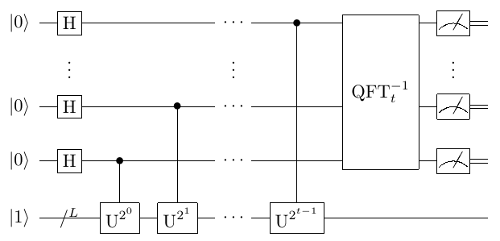

Shor算法
####

Shor算法，又叫质因数分解算法，在破解RSA加密方面有着重要意义。

问题背景
****

已知一个大整数 :math:`N=pq`，其中 :math:`p,q` 均为未知的质数，求解 :math:`p,q`。
Shor算法分为经典算法实现的公约数求解、将质因数分解转化为函数周期求解等部分，以及借助量子傅里叶变换等量子算法实现的函数周期求解共三个部分。

相对经典算法，Shor算法在计算资源耗费和计算时间复杂度两方面均有极大的降低，使经典算法无法求解的超大型质因子分解问题出现了量子算法求解的可能。

.. note:: Shor算法试图解决的极大比特数RSA问题使用经典算法在理论上所需的计算时间和空间资源是近乎无法满足的，它不再只体现了量子计算的相对优势，\
   而是揭示了特定问题上量子计算的不可取代性和绝对优势。

算法原理
****

Shor分解算法的具体步骤如下：

#. :math:`\forall 1<x<N,\ x\in\mathbb{Z}`；
#.	:math:`gcd(x,N)\neq 1`，结束；
#. 求 :math:`r` 使得 :math:`x^r mod N≡1`；
#.	:math:`r\ mod\ 2\equiv1`，回到1取 :math:`\dot{x}≠x`；
#.	:math:`x^\frac{r}{2}\ mod\ N\equiv-1`，回到1取 :math:`\dot{x}≠x`；
#.	:math:`gcd(x^\frac{r}{2}-1,N)gcd(x^\frac{r}{2}+1,N)=N`。

式中 :math:`gcd` 表示最大公约数（Greatest Common Divisor）。

以上步骤中，难点集中在第三步阶寻找问题。
将第三步转化为如下问题，并采用量子算法求解：

记 :math:`f\left(x\right)=x^a\mathrm{\ mod\ N},f\left(a+r\right)=f\left(a\right)`，求最小的 :math:`r` 。

下面介绍阶寻找问题求解的量子算法的核心内容，主要有三个部分。

#. 公式变形所需的前置引理。
#. 构造出可用的模乘量子门操作以迭代完成阶寻找问题求解。
#. 参考QPE对构造出的模乘求和形式的结果以逆量子傅里叶变换得到 :math:`x` 模 :math:`N` 的阶 :math:`r` 。

限于篇幅，第一部分中的前置引理将只作介绍而不加以证明。

前置引理
++++

定义

.. math::
   \begin{aligned}
   \left|u_s\right\rangle\equiv\frac{1}{\sqrt{r}}\Sigma_{k=0}^{r-1}e^{-\frac{2\pi\ iks}{r}}\left|x^k\ mod N\right\rangle,\ x^rmod\ N\equiv1.
   \end{aligned}
引理1：

.. math::
   \begin{aligned}
   \frac{1}{\sqrt{r}}\Sigma_{s=0}^{r-1}e^\frac{2\pi\ iks}{r}\left|u_s\right\rangle=\left|x^k\ modN\right\rangle.
   \end{aligned}
引理2：

.. math::
   \begin{aligned}
   \exists U,U\left|y\right\rangle=\left|xy\ modN\right\rangle,s.t.U\left|u_s\right\rangle=e^\frac{2\pi is}{r}\left|u_s\right\rangle.
   \end{aligned}
引理3：

.. math::
   \begin{aligned}
   \frac{1}{\sqrt{r}}\Sigma_{s=0}^{r-1}\left|u_s\right\rangle=\left|1\right\rangle.
   \end{aligned}

有了引理1、2和3，我们就可以将模指量子态、定义的特殊量子态 :math:`\left|u_s\right\rangle`、基态 :math:`\left|1\right\rangle` 
以及阶 :math:`r` 通过量子傅里叶变换/逆变换、:math:`\left|u_s\right\rangle` 的定义变换/逆变换全部关联起来。

构造模乘量子门
++++

定义量子门操作 :math:`U^j\left|y\right\rangle=\left|yx^j\ modN\right\rangle`。

对任给整数 :math:`Z`，对其进行 :math:`t` 位数二进制展开可知

.. math::
   \begin{aligned}
   U^{2^{t-1}z_{t-1}}U^{2^{t-2}z_{t-2}}\cdots U^{2^0z_0}\left|1\right\rangle\approx\left|1\ast x^z\ modN\right\rangle.
   \end{aligned}
由上式可以利用模乘量子门来实现模指操作。

求解阶寻找问题
++++

考察两个寄存器组成的量子态 :math:`\left|0\right\rangle^{\otimes t}(\left|0\right\rangle^{\otimes L-1}
\left|1\right\rangle){=\left|0\right\rangle^{\otimes t}\left|1\right\rangle}_L`，将第一个寄存器初始化为最大叠加态，有

.. math::
   \begin{aligned}
   (H^{\otimes t}{\otimes I^{\otimes L})(\left|0\right\rangle}^{\otimes t}\left|1\right\rangle_L)
   =\left|+\right\rangle^{\otimes t}\otimes\left|1\right\rangle_L.
   \end{aligned}
基于量子门操作 :math:`U^j` 可以定义受控模乘量子门 :math:`C-U^j`。取 :math:`\left|+\right\rangle^{\otimes t}` 的第j项\
作为控制比特对 :math:`\left|+\right\rangle^{\otimes t}\otimes\left|1\right\rangle_L` 执行 :math:`t` 次 :math:`C-U^{2^{j-1}}`
完成受控模指量子门操作，有

.. math::
   \begin{aligned}
   &\prod_{j=1}^{t}\left(C-U^{2^{j-1}}\right)\left(\left|+\right\rangle^{\otimes t}\otimes\left|1\right\rangle_L\right)\\
   & =\frac{1}{{\sqrt2}^t}\sum_{j=0}^{2^t-1}\left|j\right\rangle\left|x^j\ modN\right\rangle \\
   & =\frac{1}{\sqrt{r2^t}}{\Sigma_{j=0}^{2^t-1}\Sigma}_{s=0}^{r-1}e^\frac{2\pi\ ijs}{r}
   \left|j\right\rangle\left|u_s\right\rangle=:\left|\psi\right\rangle.
   \end{aligned}

对第一个寄存器进行IQFT，有

.. math::
   \begin{aligned}
   ({\rm QFT}^{-1}\otimes I^{\otimes L})\left|\psi\right\rangle=\frac{1}{\sqrt r}\Sigma_{s=0}^{r-1}
   \left|\frac{2^ts}{r}\right\rangle\left|u_s\right\rangle.
   \end{aligned}
测量第一个寄存器得到任意一个非 :math:`\left|0\right\rangle` 量子态，进而有最逼近实数 :math:`\frac{2^ts}{r}` 的整数\
:math:`[\frac{2^ts}{r}]`，对实数 :math:`\frac{[\frac{2^ts}{r}]}{2^t}` 进行连续分数展开得到 :math:`\frac{s}{r}`，\
自然可以获得分母 :math:`r`。

此处 :math:`L=n={[\log}_2N]`，如果取 :math:`t=2n+1+[log(2+\frac{1}{2\varepsilon})]`，那么可以得到二进制展开精度为
:math:`2n+1` 位的相位估计结果，且测量得到该结果的概率至少为 :math:`\frac{1-\varepsilon}{r}`。一般取 :math:`t=2n`。

量子线路图与参考代码
****

Shor算法的量子线路图如下所示

基于QPanda-2.0的Shor算法源码参见\
`QPanda-2.0下Shor算法程序源码 <https://github.com/OriginQ/QPanda-2/tree/master/QAlg/Shor>`_ \ ，\

下面是QPanda-2.0中提供的Shor算法调用接口。

.. code-block:: python

   Shor_factorization(int)

输入参数为被质因数分解的大数，返还一个2维list，内容为计算过程是否成功和分解后的质因子对list。

选取 :math:`N=15` ，
验证Shor的代码实例如下

.. code-block:: python

    #!/usr/bin/env python

    import pyqpanda as pq

    if __name__ == "__main__":

        N=15
        r = pq.Shor_factorization(N)
        print(r)

对 :math:`15` 的质因子分解结果应该是 :math:`15=3*5` ，所以应当返还算法成功标志和两个质因子 :math:`3` 和 :math:`5` 。 

.. code-block:: python

   (True, (3, 5))
